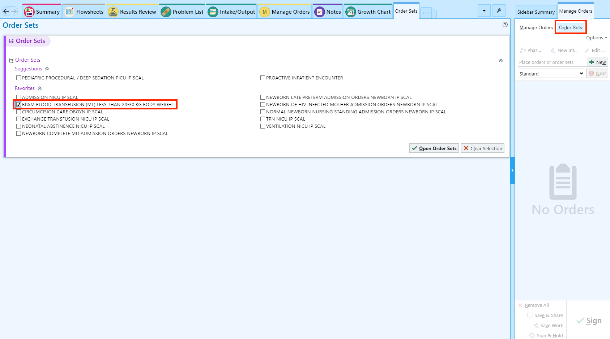
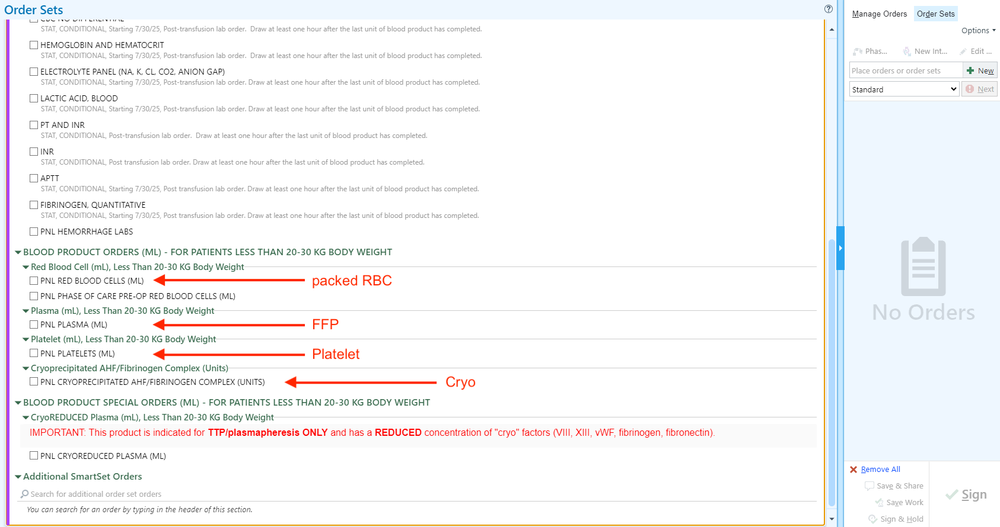
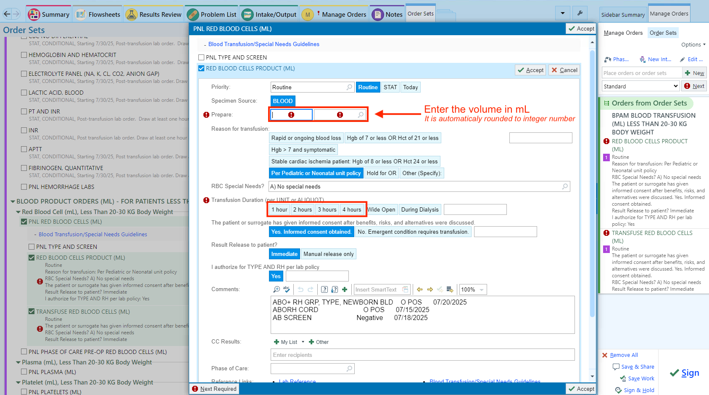
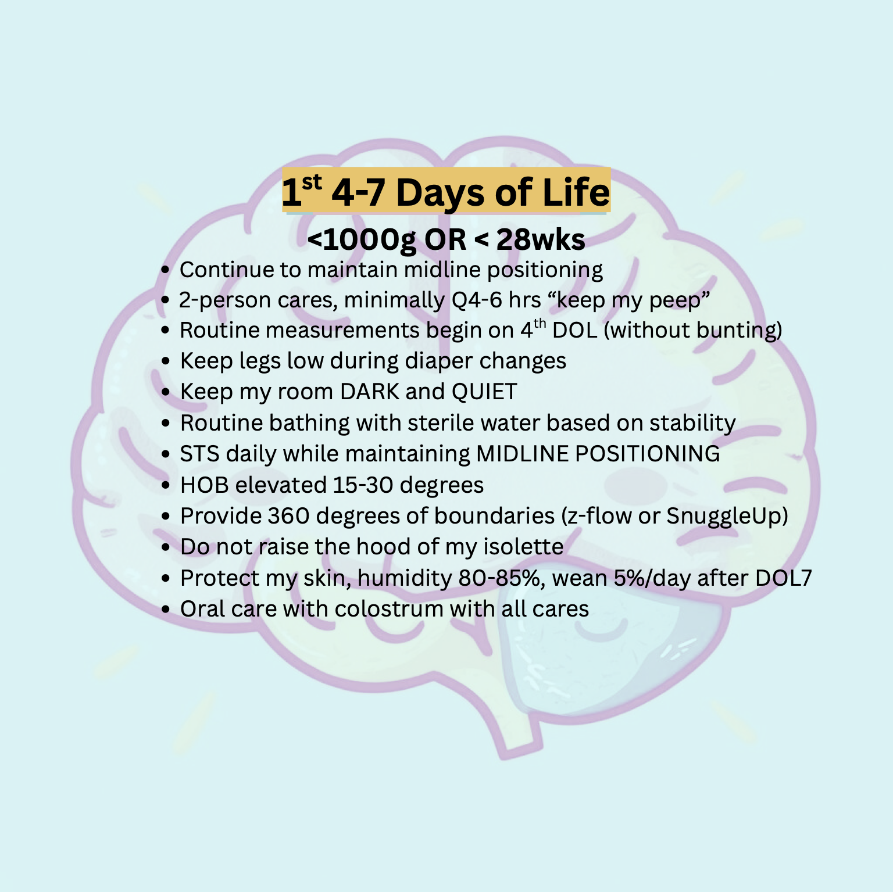

# VLBW/ELGAN/ELBW Infants

### Rouding Sheet {#sec-small-baby-rounding-sheet}

<a href='files/RIVERSIDE NICU ELGAN ROUNDING SHEET.pdf' target='_blank'>[Download the Rouding Sheet here]</a>

## Thermoregulation and Heat Loss Prevention

### Labor & Delivery / OR

* Maintain L&D/OR temperature at 70-74&#8457;
* Preheat the radiant warmer before birth and set on servo-control mode
* Use prewarmed blanket to dry the newborn during delayed cord clamping
* use prewarmed blanket to receive the newborn and dry under the warmer
* Place temperature probe as soon as baby is under the warmer
* Monitor temperature frequently (every 5-10 minutes) prior to transfer to the NICU
* Maintain axillary temperature between 36.5&#8451; - 37.5&#8451;
* Place a thermal mattress under the blanket on the radiant warmer
* Wrap the baby in a polyethylene plastic bag or wrap (<28 weeks and/or < 1,000 grams)
* Place a prewarmed hat on the baby's head (as soon as possible)
* Keep the newborn fully covered during resuscitation and stabilization

 

### NeoDrape Wrapping During Delayed Cord Clamping {#sec-neodrape}

#### Vaginal delivery

<iframe src='//players.brightcove.net/6056665225001/KSSGZDkp6_default/index.html?videoId=6138659817001' width='720' height='405' allowfullscreen frameborder=0></iframe>

#### Cesarean delivery

<iframe src='//players.brightcove.net/6056665225001/KSSGZDkp6_default/index.html?videoId=6138659818001' width='720' height='405' allowfullscreen frameborder=0></iframe>

 

### Transport

* Prewarm transport incubator
* Use warming measures such as thermal mattress during transport

 

### NICU

* Prewarm the incubator before the infant arrives in the NICU
* Keep incubator humidity at 80% (<30 weeks and/or < 1,000 grams)
* Prewarm linens and other items
* Use thermal mattress if temperature is below 36.5&#8451;
* Monitor temperature closely throughout procedures
* prewarm IV fluids
* Ensure ventilator heaters are set at a warm temperature before use

 
 


## ELGAN/ELBW Respiratory Protocol

Refer to [ELGAN/ELBW Respiratory Support Protocol for the First 72 Hrs](#sec-elgan-elbw-resp-protocol) page

 

### BPD bundle

Refer to [No-BPD Prevention Bundle](#sec-bpd-bundle) page

 
 


## ELGAN/ELBW Gut Health Protocol {#sec-elgan-elbw-gut-health}

### Probiotics (Evivo) use

Refer to [Probiotics (Evivo)](#sec-probiotics) page

::: {.callout-important}

Probiotic use is temporarily suspended until further notice.

:::

### Glycerin use

Administer 0.5 mL/kg every 12 hours until meconium is fully passed and stool transitions.

 
 


## Screening {#sec-elgan-elbw-screening}

 

### Sepsis screening and empiric antibiotic use

#### GA \< 32 weeks and BW \< 1,500g

* Blood culture
  - 1 blood culture if no central line 
  - 2 blood cultures if central line is in place
* Empiric antibiotics
  - Ampicillin and gentamicin if no other nephrotoxic medication or no signs of AKI
  - Ampicillin and ceftazidime/cefotaxime if presence of other nephrotoxic medication or has/has had AKI

#### GA ≥ 32 weeks or BW ≥ 1,500g

* Blood culture: obtain 2 from different sites
* Empiric antibiotics
  - Ampicillin and gentamicin if no other nephrotoxic medication or no signs of AKI
  - Ampicillin and ceftazidime/cefotaxime if presence of AKI
  
 

### Thyroid screening

#### Indication

-   BW ≤ 1,500g
-   Same-sex if chorionic status not known

#### Timing

-   2, 4, 6 weeks of life

#### Labs

-   TSH only

 

### Head Ultrasound

Pediatrics (2020) 146 (5): e2020029082. [https://doi.org/10.1542/peds.2020-029082](https://doi.org/10.1542/peds.2020-029082){target="_blank"}

#### Indication

-   GA \< 31 weeks or BW \< 1,500 grams

#### Timing

-   DOL7 & 30

 

### Retinopathy of prematurity

Pediatrics (2013) 131 (1): 189--195. <https://doi.org/10.1542/peds.2012-2996>

#### Indication

-   GA \< 31 weeks or BW ≤ 1,500 grams
-   GA ≥ 31 weeks or BW \> 1,500 grams with risk factors

#### Timing

| Gestational Age at Birth, wk                                                                                   | Age at Initial Examination, wk |
|------------------------------------------------------|------------------|
| Postmenstrual                                                                                                  | Chronologic                    |
| 22 (a)                                                                                                         | 31                             |
| 23 (a)                                                                                                         | 31                             |
| 24                                                                                                             | 31                             |
| 25                                                                                                             | 31                             |
| 26                                                                                                             | 31                             |
| 27                                                                                                             | 31                             |
| 28                                                                                                             | 32                             |
| 29                                                                                                             | 33                             |
| 30                                                                                                             | 34                             |
| Older gestational age, high-risk factors (b)                                                                   |                                |
| Shown is a schedule for detecting prethreshold ROP with 99% confidence, usually before any required treatment. |                                |

::: callout-note
a.  This guideline should be considered tentative rather than evidence-based for infants with a gestational age of 22 to 23 wk because of the small number of survivors in these postmenstrual-age categories.
b.  Consider timing based on severity of comorbidities.\
:::

 

## Blood transfusion {#sec-blood-transfusion}

### For all ELGAN and ELBW infants

- Obtain Type & Screen with confirmation ON ADMISSION
  - one specimen from cord blood
  - one speciment from umbilical line during line placement
- Obtain blood transfusion consent ON ADMISSION

### Ordering blood product

1. Use the BPAM orderset

::: column-page-right

:::

2. Select the blood product type

::: column-page-right

:::

3. Enter the volume and the duration

::: column-page-right

:::

    

## Prophylaxis

 

### Systemic fungal infection

Fluconazole 3mg/kg/dose twice weekly for 6 weeks (42 days) or until central line removed, whichever comes first.
 
    

## Neuroprotective Care

 

### First 72 hrs of life

### 4 to 7 days of life

