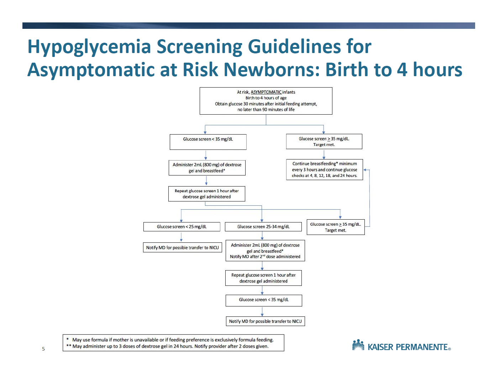
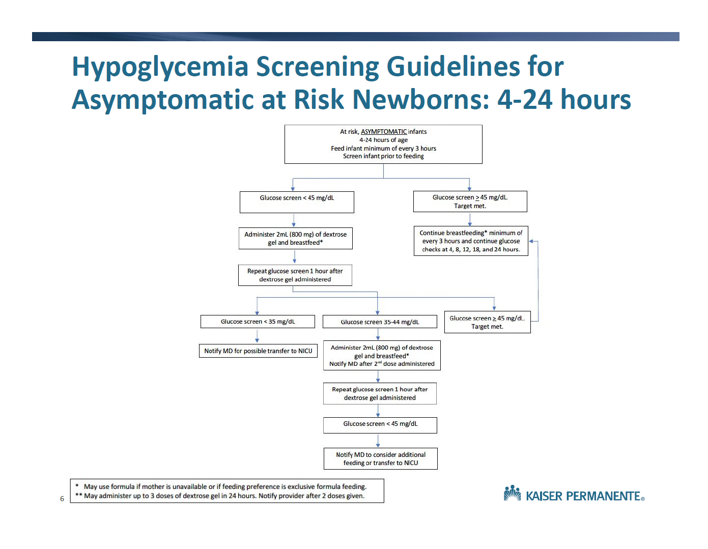

# Endrocrinology

## Hypoglycemia

<br/>

### Hypoglycemia definition {#sec-hypoglycemia-definition}

Age-dependent criteria (based on regional agreement):

* Birth to < 48 hrs of life: 45mg/dL
* &ge; 48 hrs of life: 60mg/dL

<br/>

### Family Care Center approach to hypoglycemia screening

[<a href="files/dextrogel.pdf" target="_blank">Download</a>]

#### Target population

* GA < 37 weeks
* BW ≥ 4,000g
* BW ≤ 2,500g
* IDM
* Other infants identified at the discretion of the provider

#### 0-4 hours of life

Goal: [Glucose ≥ 35 mg/dL]{style="color:red"}

:::{.column-screen-right}



:::

#### 4-24 hours of life

Goal: [Glucose ≥ 45 mg/dL]{style="color:red"}

:::{.column-screen-right}



:::

<br/>

### Critical labs for refractory hypoglycemia {#sec-critical-labs}

#### Indication
Consider obtaining critical laboratory tests for infants requiring a glucose infusion rate greater than 10 mg/kg/min, when, based on gestational and chronological age, they would not typically require intravenous fluids.

<br/>

#### Laboratory tests to order

* Tier 1

| **#ID** | **Code** | **Description**          | **Tube**       | **Volume** |
| ------- | -------- | ------------------------ | -------------- | ---------- |
| 1       | 82947A   | Serum glucose            | PST4 green top | 0.4ml      |
| 2       | 83525B   | Insulin                  | GLD6 gold top  | 0.4ml      |
| 3       | 82533A   | Cortisol                 | GLD6 gold top  | 0.4ml      |
| 4       | 82010A   | Beta-hydroxybutyric acid | GLD6 gold top  | 1ml        |
| 5       | 83003B   | Human growth hormone     | RED7 red top   | 1ml        |
| 6       | 80051P   | Electrolyte panel        | PST4 green top | 0.2ml      |

* Tier 2

| **#ID** | **Code** | **Description**               | **Tube**                                          | **Volume** |
| ------- | -------- | ----------------------------- | ------------------------------------------------- | ---------- |
| 1       | 84210B   | Pyruvic acid                  | _Special tube/handling instructions:<br/>contact lab_ | 1ml        |
| 2       | 82140B   | Ammonia                       | _Special tube/handling instructions:<br/>contact lab_ | 0.4ml      |
| 3       | 82024B   | ACTH                          | _Special tube/handling instructions:<br/>contact lab_ | 1ml        |
| 4       | 82533U   | Cortisol, Neonatal            | RED7 red top                                      | 0.4ml      |
| 5       | 84443B   | TSH                           | GLD6 gold top                                     | 0.4ml      |
| 6       | 84439B   | T4, free                      | GLD6 gold top                                     | 0.4ml      |
| 7       | 82725B   | Free fatty acids              | RED7 red top                                      | 0.6ml      |
| 8       | 82017B   | Acylcarnitine profile, plasma | GRN5 green top                                    | 1ml        |
| 9       | 82139C   | Amino acids, plasma           | GRN5 green top                                    | 2ml        |
| 10      | 83918C   | Organic acids, urine          | Urine container                                   | 15ml       |

* Tier 3

    Blood gas for pH, BE, and lactate

<br/>

#### Possible blood specimen source

Capillary:  

* Heel stick

Venous:  

* Freshly placed PIV
*	UVC
* PowerPICC (not routinely seen in our NICU)

Arterial:  

*	Radial/ulnar artery puncture
*	UAC
*	PAL

<br/>

#### Procedure for inducing hypoglycemia (need to discuss further)

1. Identify the lab tests, verify order entry.
2. Determine the total volume needed.  
    *Physicians should be mindful of the practicality of the exsanguinated volume.*
3. Identify the source of blood specimen.
4. D10W 2mL/kg bolus syringe available at bedside.
5. Discontinue IV fluid.
6. Check POC glucose every 30min until level < 55mg/dL.
7. Check POC glucose every 15min until level < 45mg/dL.
8. Obtain blood specimen.
9. Check POC glucose. If < 40mg/dL, administer D10W 2mL/kg bolus once.
10. Restart IV fluid.
11. Check POC glucose every 30min until > 60mg/dL.

<br/>

### Sliding scale for IV dextrose weaning {#sec-sliding-scale}

<span style="color:red;">*Need consensus*</span>

* Wean by 2ml/hr for AC POC Glucose >80 (or 75)
* Wean by 1mL/hr for AC POC Clugose 70-80 (or 65-75)
* Increase by 1mL/hr for AC POC glucose 50-60 (or 45-55)
* Increase by 2mL/hr for AC POC Glucose < 50 (or <45), and notify MD
* Once off IV, continue to check sugars until >60 on 3 consecutive checks.


<br/>
<br/>



## Secondary Screening for Neonatal Thyroid Conditions

<br/>

### Indications and Screening  

<style type="text/css">
.tg  {border-collapse:collapse;border-spacing:0;}
.tg td{border-color:black;border-style:solid;border-width:1px;font-family:Arial, sans-serif;font-size:14px;
  overflow:hidden;padding:10px 5px;word-break:normal;}
.tg th{border-color:black;border-style:solid;border-width:1px;font-family:Arial, sans-serif;font-size:14px;
  font-weight:normal;overflow:hidden;padding:10px 5px;word-break:normal;}
.tg .tg-1wig{font-weight:bold;text-align:left;vertical-align:top}
.tg .tg-0lax{text-align:left;vertical-align:top}
</style>
<table class="tg">
<thead>
  <tr>
    <th class="tg-1wig">Indication   </th>
    <th class="tg-1wig">Screening needed   </th>
  </tr>
</thead>
<tbody>
  <tr>
    <td class="tg-0lax">Monochorionic twins/Multiple (Same-sex if chorionic status not known)    </td>
    <td class="tg-0lax">TSH at 2 weeks of age   </td>
  </tr>
  <tr>
    <td class="tg-0lax"><span style="font-weight:bold">ANY </span>congenital heart disease diagnosis (exclude PDA) with infant hospitalized to at least day 14</td>
    <td class="tg-0lax">TSH at 2 weeks of age   </td>
  </tr>
  <tr>
    <td class="tg-0lax">Very low birth weight (≤ 1500 grams)   </td>
    <td class="tg-0lax">TSH at 2, 4, and 6 weeks of age if still hospitalized   </td>
  </tr>
  <tr>
    <td class="tg-0lax">Down syndrome   </td>
    <td class="tg-0lax">TSH at 2 weeks    </td>
  </tr>
  <tr>
    <td class="tg-0lax">Mother with history of or active hyperthyroidism/Graves disease   </td>
    <td class="tg-0lax">See: Managing Neonatal Graves Disease flowchart   </td>
  </tr>
  <tr>
    <td class="tg-0lax">Signs or symptoms of hypothyroidism (e.g., unexplained lethargy, bradycardia, jaundice, or constipation; abnormal neck imaging)   </td>
    <td class="tg-0lax">TSH and Free T4 as soon as symptoms are recognized    </td>
  </tr>
  <tr>
    <td class="tg-0lax">Signs or symptom of central hypothyroidism or hypopituitarism (e.g.,   craniofacial/midline defects, certain genetic syndromes, recurrent   hypoglycemia, recalcitrant hypotension, micropenis)     </td>
    <td class="tg-0lax">TSH   and free T4 along with other pituitary tests when signs or symptoms are   recognized    </td>
  </tr>
  <tr>
    <td class="tg-0lax">Mother with hypothyroidism or Hashimoto thyroiditis and no history of Graves disease   </td>
    <td class="tg-0lax">Routine newborn screen only   <br></td>
  </tr>
</tbody>
</table>

:::{.callout-important}

* **Screening TSH ≥10 mIU/L is abnormal**: immediately repeat TSH adding free T4 as well and discuss results once available with endocrinology promptly.  
* If the test will be performed as outpatient, please order the test and document under problem list thyroid disorder screening V77.0A  
* Consider TSH only in premature infants (without reflex free T4). Appropriate Health Connect Order: TSH, NO REFLEX (order 84443O).   
* If considering tests for strong suspicion of hypothyroidism or hypopituitarism, discussion with endocrinology is recommended for all results. If suspicion for pathology is low, discuss with endocrinology if results are outside reference range.  
:::

<br/>

### Guide for interpretation of thyroid function studies  

:::{.callout-note}
Normal values are not fully established in the first 2 months of life and interpretation may differ if tests are done for screening or for symptomatic/diagnostic purposes.  Free T4 levels may be less in NICU due to illness unrelated to thyroid disease. Significant topical iodine exposure may transiently alter thyroid function tests. Interpret with caution.
:::

#### Asymptomatic screening (0-60 days old)

:::{.grid}
:::{.g-col-6}
***TSH***

* Hypothyroidism screening: < 10mIU/L
* maternal Graves/hyperthyroidism: use lab-provided reference

:::

:::{.g-col-6}
***Free T4***

* Use lab-provided reference  

:::
:::

#### Symptomatic/diagnostic testing  

:::{.grid}
:::{.g-col-6}
***TSH***

* Newborn ≤ 3 days old: 1-20 mIU/L
* Newborn > 3 days old: use lab-provided reference

:::

:::{.g-col-6}
***Free T4***

* Newborn ≤ 14 days old: 1.4-2.8 ng/dL
* Newborn > 14 days old: use lab-provided reference

:::
:::


## Screening Guidelines for Neonatal Graves Disease

:::{.column-screen-right}

```{mermaid}
flowchart TD
  A["Mom with Graves Disease (hyperthyroidism) or history of Graves disease (hyperthyroidism)"] --> B["Obtain Thyroid Receptor Ab (TR Ab) or TSI in 2<sup>nd</sup>/3<sup>rd</sup> Trimester"]
  B --> C["Positive or unknwon TR Ab/TSI or<br>Negative TR Ab but active maternal hyperthyroidism<br><em>and/or</em><br>Treated with anti-thyroid drugs (PTU/methimazole)"]
  B --> D["NO current anti-thyroid treatment<br><em><u>and</u></em><br>NEGATIVE TR Ab/TSI in 2<sup>nd</sup>/3<sup>rd</sup> Trimester"]
  C --> E[High risk neonate]
  D --> F[No screening needed]
  E --> G["Obtain TR Ab/TSI in cord blood or nursery<br><em>If not done</em>: Order TR Ab/TSI, freeT4, TSH for outpatient draw in first 7 days of life"]
  G --> H["+ TR Ab/TSI = High risk neonate<br><em>(Observe for clinical symptoms of hyper/hypothyroidism)</em>"]
  G --> I["Negative TR Ab/TSI = Low risk neonate"]
  H --> J["Draw TSH and free T4 at 3-7 days<br><em>(if not done prior, or if symptomatic)</em>"]
  I --> K["No further work-up necessary"]
  J --> L["Abnormal results: send Dr. Advice to Peds Endo<br><em>(TSH < 1mIU/ml and/or free T4 > 2ng/dl is abnormal)</em>"]
  J --> M["Normal TSH, free T4 for age"]
  M --> K
```

:::

:::{.callout-note}
Though TSI is acceptable it is preferred to screen with TR Ab (TSH receptor binding antibody)
:::

<br/>
<br/>



## Ambiguous Genitalia

### Physical findings

* Micropenis (< 2cm when stretched)
* Clitoromegaly (> 0.7cm)

### Blood tests

* 17-OHP
* ACTH 
* Lytes 
* Chromosome karyotyping and/or FISH for *SRY* gene

### Imaging

* Pelvic ultrasound

### Consultation

* Pediatric endocrinology

### Congenital adrenal hyperplasia (CAH) treatment

* Hyodrocortisone
* Fludrocortisone


<br/>
<br/>



## Undescended Testicle {#sec-undescended-testicle}

<br>

### For <u>unilateral</u> undescended (or non-palpable) testicle

* No need to order ultrasound
* Refere to Peds Urology for evaluation (there is a new hire at Fontana)
* May wait until 3 months of age to refer as some will descend by that time
* If there are othe rmalformations of the external genitalia (hypospadias) with undescended testicle(s), obtain labs as below an refer to Peds Urology without waiting until 3 months.

<br/>

### For <u>bilateral</u> undescended (or non-palpable) testicle

:::{.column-page-inset-right}

```{mermaid}

flowchart TD

A["Perform exam carefully and  
   repeatedly in a warm, relaxed state"] --> C["Yes"]
A --> B["No"]
B --> D["If the exam is unclear or uncertain,  
         it is best to <strong>obtain ultrasound</strong>  
         first, per Peds Endo"]
           
D --> E["If true bilateral undescended testes  
         on ultrasound report, endocrine work-
         up should be ordered next."]
         
C --> F["If the provider is comfortable  
         in making the clinical assessment 
         without aid of ultrasound, then  
         endocrine workup should be 
         ordered next."]
        
F --> G["<div align='left';>
        1. Testosteron, pediatric
        2. LH, pediatric
        3. FSH
        4. AMH (anti-Mullerian hormone)
        5. Karyotype
        6. 17-OH progesterone
            
        Call Peds Endo. 
        
        Do NOT discharge baby or give sex assignment  
        until workup evaluated by Peds Endo.
        </div>
"]

E --> G

D --> H["If testes are high scrotum or   
         low in the inguinal canal,  
         refer to Peds Urology for exam   
         and follow-up.  
         Newborn screen for CAH."]  
```

:::