# NICU Admission

## Birth size measurements

### Weight for subtraction {#sec-weight-for-subtraction}

**Bundle for All ELBW/ELGAN Resuscitations**  

| Item                                      | Weight                   | Image |
|-------------------------------------------|--------------------------|-------|
| Thermal mattress                          | do not include in weight |   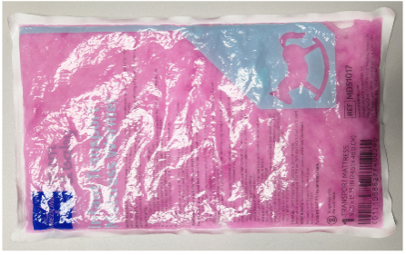   |
| XS bunting                                | 43g                      |   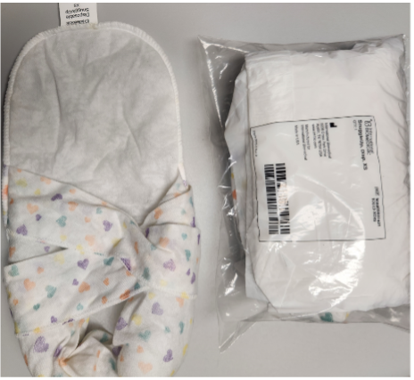     |
| Small Neo Help                            | 28g                      |   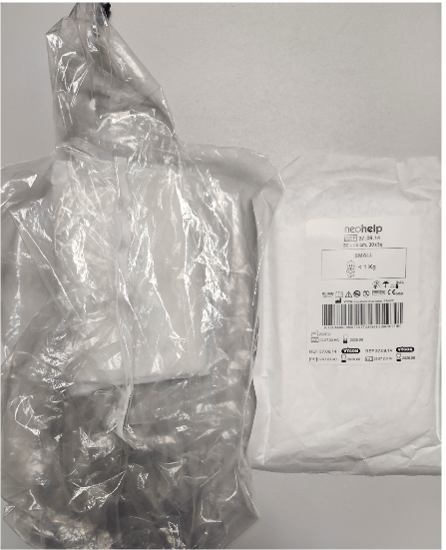    |
| Beanie (regular size, not preemie)        | 13g                      |   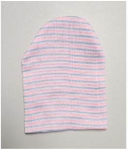    |
| **Total**                                 | **84g**                  |       |

: {tbl-colwidths="[30, 35, 40]"}

**Additional thermoregulation products to be used as needed for any baby at risk for hypothermia**  

| Item              | Weight | Image |
|-------------------|--------|-------|
| Sterile Neo Drape | 18g    |  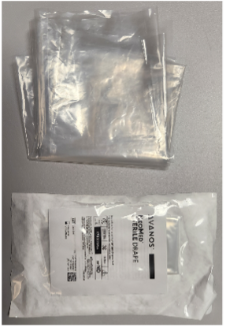     |
| Plastic lined hat | 20g    |  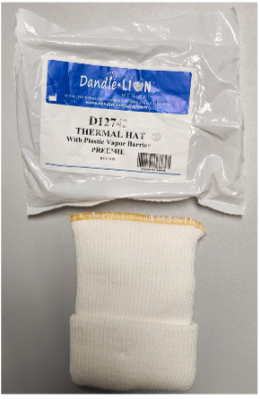     |
| RAM cannula       | 10g    |  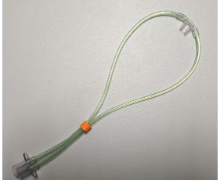     |

: {tbl-colwidths="[30, 35, 40]"}


<br/><br/>

## Central line placement

### UVC Placement

Criteria for UVC:

```{mermaid}

flowchart TD

A["Birth GA"] --> B["<28 weeks"]
A --> C["&ge;28 weeks"]
B --> D["UVC placement"]
C --> E["Birth weight"]
E --> F["<1,250g"]
F --> D
E --> G["&ge;1,250g"]
G --> H["<div align='left'>Clinically indicated:<ul><li>Severe respiratory disease</li><li>Clinically unstable</li><li>IUGR</li>etc...</ul></div>"]
H --> D
```


Initial fluid

* Port 1: 
    - D10AA or D5AA
      - 0.5U/mL heparin at 1mL/hr
      - 1U/mL heparin at 0.5mL/hr
* Port 2: 
    - NaAce 77mEq/L or 154mEq/L 
        - 2U/mL heparin at 0.3mL/hr
        - 1U/mL heparin at 0.5mL/hr
        - 0.5U/mL heparin at 1mL/hr

### UVC Securement {#sec-uvc-securement}

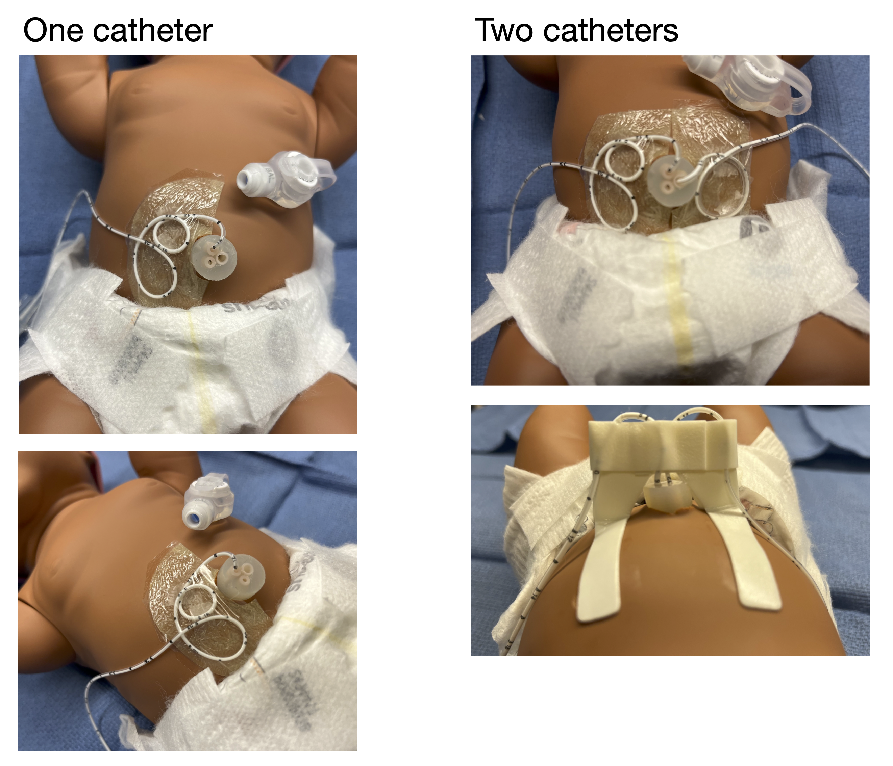

<br/>
<br/>



### UAC Placement

#### Indication

* Frequent blood draw 
* Hemodynamic monitoring

<br/>

#### Important Note

##### Connect UAC to the Split Septum Micro T-Connector:

* The Hummi Micro-Draw Blood Transfer Device allows the nurses the ability to draw blood from the UAC with reduced clearance and NS flush volumes, minimized infection risk, and decreased alteration in cerebral hemodynamics during the blood sampling process.  
* The neonatologists are to prime (with the sterile normal saline) and attach **the Split Septum Micro T-Connector** under sterile conditions during the initial UAC placement:

**The Split Septum Micro T-Connector**  
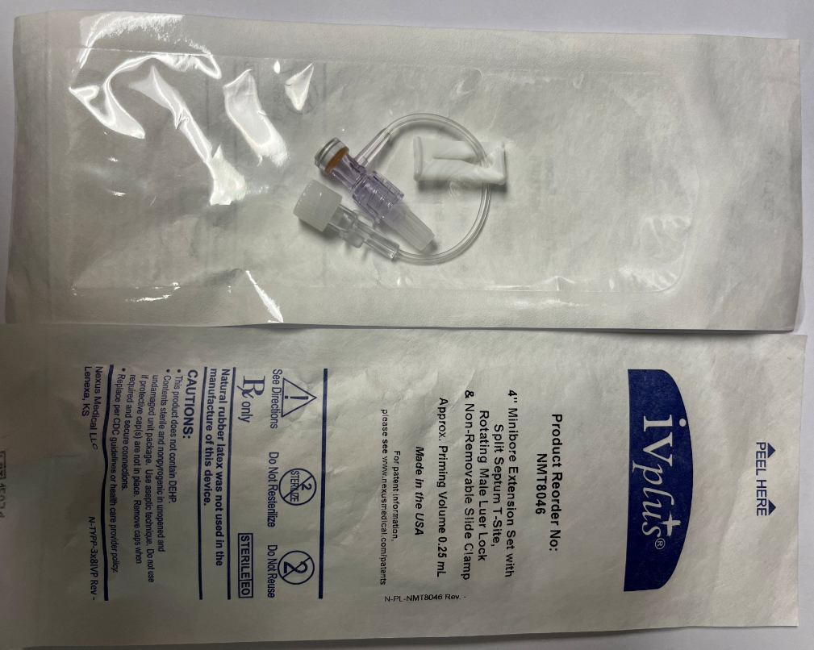{width="450"}

<br/>

**UAC with stopcock attached**  
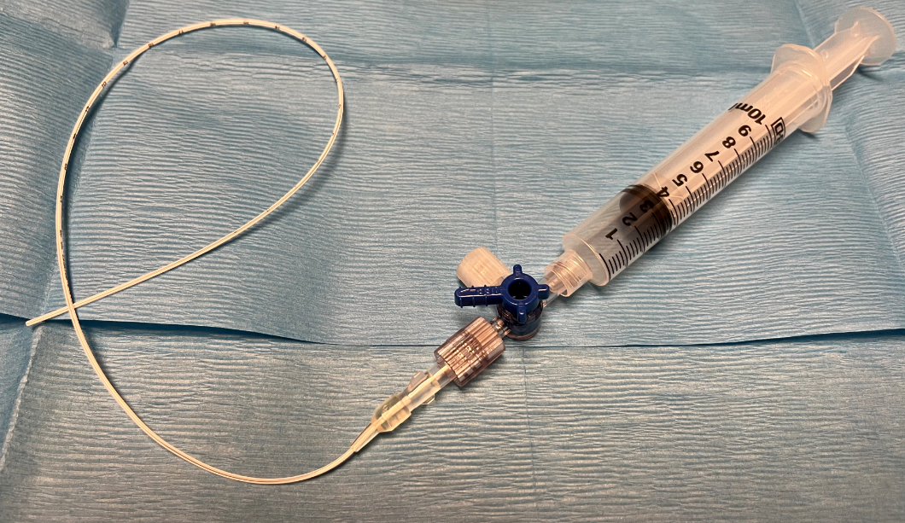{width="450"}

<br/>

**UAC with the T-connector attached**  
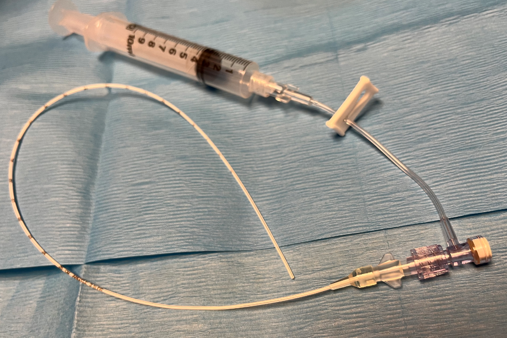{width="450"}


<br/>
<br/>



### PICC placement

* Order number: 36568A
* Confirm tip position:
  * Obtain both AP and cross-table views upon placement
  * Obtain an AP view q Monday

<br/>

### Closed NS flush system{#sec-central-line-ns-flush}

Close NS flush system is to be ordered when a central line is in place:

To order, type "**closed**" in the order search box to search for the order:
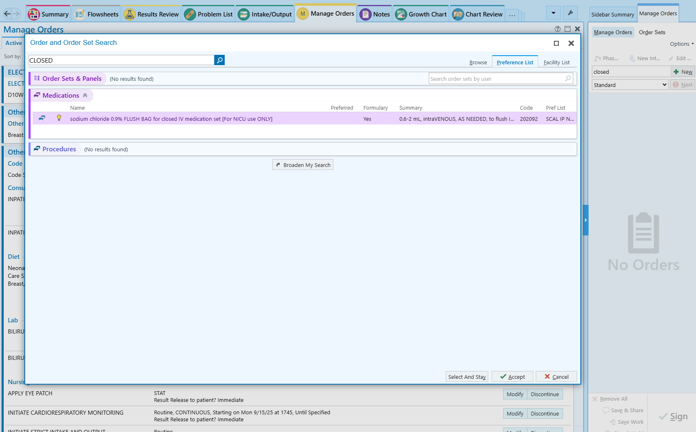

Do not change any parameters in the order, including the range of the flush dose:
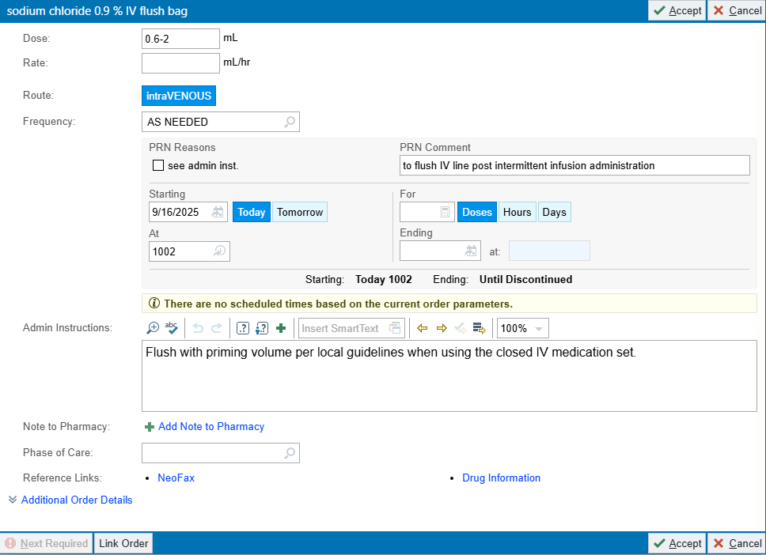

<br/>
<br/>



## Re-Admission After FCC Discharge

<br/>

### From home

Instruct family to bring infant to the Emergency Department for RSV, Flu, and COVID-19 screening with a rapid antigen test before admission.

<br/>

### From clinic

Screen for RSV, Flu, and COVID-19 with a rapid antigen test before direct admission to the NICU


<br/>

### Re-admission through ED {#sec-admit-thru-ED}

Any time an infant is moved from the ED to the NICU, you must place an ‘**Admit to Inpatient**’ order (Order #244425).

> That action automatically reclassifies the patient from Emergency to Inpatient in Health Connect, so nurses won’t need to use workarounds outside their scope when the proper admission order is missing.

<br/>

### Re-admission for hyperbilirubinemia

May ask the NICU staff to bring bili-blank and formula to the clinic/ED to begin therapy while waiting for screening test results

<br/>
<br/>



## Care of the Safely Surrendered Infant {#sec-safe-surrender}

The provider will consider the following guidelines (if not already completed) when admitting the Safely Surrendered Infant:

1. Obtain newborn screen. Complete paperwork with the name and demographic information of the CPS worker. On the Comments section of the paperwork, indicate Safe Surrender. If the screen has already been completed, the Genetics Division needs to be notified to change the contact person's name to the CPS worker.
2. Obtain urine drug screen – initiate neonatal abstinence scoring as indicated.
3. Obtain total bilirubin at least once, and repeat if infants is jaundiced.
4. Obtain additional labs as indicated: ABO/Rh, direct Coombs test, random glucose blood culture, CBC/D, HBsAg, RPR, HIV rapid test.
5. Medications:
    a. Phytonadione 1mg IM if the administration status is unknown.
    b. Erythromycin 0.5% ophthalmic ointment, 1cm to both eyes if the administration status is unknown.
    c. Hepatitis B vaccine 0.5mL (10mcg) intramuscularly to right thigh if the administration status is unknown.
    d. HBIG 0.5mL intramuscularly to left thigh if indicated. CPS worker’s information is to be included in the state Perinatal Hepatitis B Prevention Program form.
6. Perform a hearing screen if the infant has been admitted to the NICU.
7. Any significant medical history obtained from the Medical History Questionnaire will be entered manually into the Safely Surrendered Infant’s Problem List/medical record. If known, significant maternal laboratory results may be manually entered on the Safely Surrendered Infant’s medical record with the consent of the mother.
8. If the Safely Surrendered Infant was already receiving care in a hospital unit such as NICU, Postpartum, or FCC, essential components of the infant’s history may be recorded on the Safely Surrendered Infant’s chart without reference to the mother.
9. Any necessary consent must be obtained from CPS unless they are for urgent/emergent procedures.

When the Safely Surrendered Infant is discharged, discharge the infant into the care of CPS (and adoptive mother if applicable) following established policies. Provide the following paperwork to CPS and contact Social Services:  

1. After Visit Summary (AVS).
2. Include on the AVS instructions that a copy of the Safely Surrendered Infant’s medical record may be obtained through Medical Records.
3. Copy of the completed Medical History Questionnaire, if available.
4. Photocopy of the Safely Surrender Bracelet.


<br/>
<br/>

