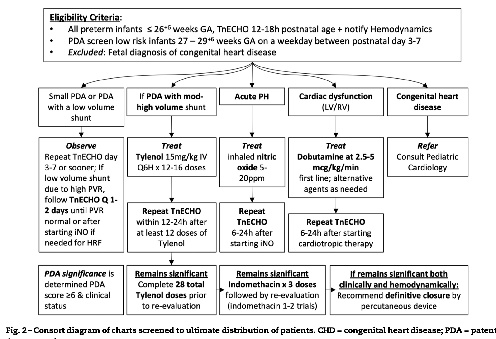

# Cardiovascular

 
 



## Persistent Pulmonary Hypertension of Newborn (PPHN) {#sec-pphn}

 

### Oxygenation index

$Oxygenation\ index\ (OI)\ =\ \frac{FiO_{2}\times{MAP}}{PaO_{2}}$

Severity:

* 5-15: Mild
* 15-25: Moderate
* 25-40: Severe
* \>40: Consider ECMO if all interventions exhausted

 

### Diagnosis modality

* Clinical suspicion: high oxygen needs, labile $SpO_{2}$ (huge swing)
* Pre- and post-ductal $SpO_{2}$ differential > 10mmHg
* Echocardiography STAT

 

### Oxygen therapy (intentional use of increased FiO~2~)

- Oxygen is the first-line therapy for PPHN.
- If an infant has the following documented in the ECHO report, it is reasonable to keep FiO~2~ at 0.4-0.6 (or higher if needed) with a post-ductal SpO~2~ goal of ³ 92-95% for 24-48 hrs until a repeat ECHO for reassessment is performed:
  - Estimated right ventricular (RV) pressure \> 2/3 of systemic mean blood pressure (SBPmean) taken at the time of the ECHO study, (and/or)
  - Bidirectional PDA shunt. 
  
  _Note: PDA in an infant &ge; 35 weeks' GA with severe PPHN may serve as a pop-off valve and therefore should not be managed the same way as a PDA in a very preterm infant with significant respiratory support requirement._

- If oxygen therapy is the only intervention for PPHN, consider discontinuing when RV pressure is \< 1/3 of SBPmean:
  - Oxygen acts as a local pulmonary vasodilator and thus helps to improve V/Q mismatch.
  - It will become evident that oxygen therapy is working in this respect when the pre-ductal and post-ductal SpO~2~ show decreasing discrepancy and eventually equate to each other. This point signifies that shunting from right to left across the PDA has essentially been counterbalanced by pulmonary vasodilation.
  - One of the major goals of any PPHN intervention is to equalize pre-ductal and post-ductal SpO~2~ (within 2 points).

 

### Airway management 

- All infants &ge; 35 weeks' GA needing FiO~2~ \> 0.8 for over 1 hr should be intubated and arterial access secured in anticipation of requiring iNO therapy and frequent blood tests while receiving iNO therapy.

  _iNO therapy is not indicated in infants \< 35 weeks' GA per unit policy._

 

### Hemodynamic support

- Infants with clinical suspicion of PPHN must have an ECHO done as soon as possible but should not wait for ECHO to initiate oxygen therapy.
  - Initial ECHO is also used to rule out congenital heart disease, shunting, and left ventricular (LV) function (see contraindications).
- Infants with ECHO-confirmed PPHN should have serial ECHOs every 24-72 hours until complete resolution of PPHN.
- Correct pH to \> 7.30. Maintaining pH as close to physiological range as possible is crucial for achieving hemodynamic stability. Forced alkalosis does not lead to further improvement.
- SBP may need to be much higher than the infants' GA to achieve hemodynamic stability.
- Hemodynamic instability may be due to two categories of causes:
  - Hypotension/hypoperfusion
  - Cardiac dysfunction
- For hypotension/hypoperfusion, consider the following order in choosing a vasopressor:
  - **Dopamine (may be considered for first line therapy)**:
    - Begin at 5mcg/kg/min, increase by 1-2mcg/kg/min q 15min until BP goal is achieved. The typical maximum dose is 10mcg/kg/min. If BP goal is still not achieved, consider a second agent.
    - Note that dopamine is reported to have a vasoconstrictive effect on the pulmonary vasculature, so it may potentially make PPHN worse, where a higher SBP will be required to overcome the pressure gradient.
    - Because of the stronger α effect at a dose \> 10mcg/kg/min, it is generally discouraged to exceed this limit, unless for transient use.
  - **Epinephrine (may be considered as first line therapy)**:
    - May initiate at 0.02mcg/kg/min, increase by 0.01-0.02 mcg/kg/min q 15min until BP goal is achieved. Typical maximum dose is 0.2mcg/kg/min.
  - **Hydrocortisone** :
    - May load with 2mg/kg, followed by 1mg/kg q6-8hr. Keep in mind that hydrocortisone effect takes time (usually 3-4 hours).
    - Recommended when infant requires 2 pressor drips, especially if a plan has been made to transfer the infant to a higher-level unit.
  - **Vasopressin** :
    - Contracts vascular smooth muscle via V1 receptors stimulating the release of vasoconstrictive calcium. In coronary, mesenteric, and cerebral circulations, the V1 receptor may lead to vasodilation via increased cyclic AMP, resulting in increased intracellular nitric oxide (source: University of Iowa Neonatology Handbook).
    - May decrease pulmonary vascular resistance and increase systemic vascular resistance. The evidence reported in the literature is less comprehensive than for other pressors.
    - May initiate at 0.1 milliunit/kg/min (0.0001 unit/kg/min), increase by doubling the dose. Typical maximum dose is 1.2 milliunit/kg/min (0.0012 unit/kg/min), but some studies reported maximum dose of 2.0 milliunit/kg/min.
    - Potential side effects include: decreased urine output, hyponatremia, elevated lactate, severe vasoconstriction.
- For cardiac dysfunction, consider using milrinone once the BP goal has been achieved with the vasopressors listed above:
  - **Milrinone** :
    - Begin at 0.25-0.33 mcg/kg/min. Do NOT administer bolus. May increase to a maximum dose of 0.75 mcg/kg/min.
    - Hypotension may occur due to its vasodilatory effect but is typically transient. Once cardiac function improves, blood pressure should also improve. To avoid any hypotensive side effects, consider having a vasopressor available at the bedside or start a low-dose infusion before administering milrinone.

In general, infants requiring two cardiac medication drips should be considered for transfer to a higher-level facility with 24-hr inpatient pediatric cardiology coverage.

- Note: normal saline bolus(es) or hydrocortisone are not considered as drips.

 

### Sedative/paralytic support

- Opioids as the first line for sedation:
  - **Morphine** :
    - Bolus: 0.05-0.1 mg/kg/dose q2-4hr PRN.
    - Continuous drip: may start at 0.01-0.02 mg/kg/hr, increase by 0.01-0.02 mg/kg/hr. Typically, \>0.06 mg/kg/hr is considered a high dose.
    - Consider additional sedative when approaching the maximum dose.
  - **Fentanyl** :
    - Bolus: 0.5-1 mcg/kg/dose administered over 5 min with slow push q1-2hr PRN
    - Continuous drip: may start at 0.5 mcg/kg/hr, increase by 0.1-0.2 mcg/kg/hr to a maximum dose of 2 mcg/kg/hr. Consider additional sedative when approaching the maximum dose.
    - Note: fentanyl is 50-100 times more potent than morphine.
    - Be careful about rigid chest syndrome.
      - Antidote is naloxone (0.01mg/kg/dose, repeat q 2-3 min until the desired degree of reversal is achieved).
- Benzodiazepine can be added for a synergistic effect:
  - **Midazolam** (Versed):
    - Bolus: 0.05 – 0.1mg/kg/dose q2-4hr PRN
    - Continuous drip: may start at 0.01-0.02 mg/kg/hr, increase by 0.01-0.02 mg/kg/hr until desired degree of sedation is reached. Typically, \>0.06 mg/kg/hr is considered a high dose.
    - If administered as a drip, the dose may need to be increased q 2-3days due to tachyphylaxis effect.
- Paralytics can be added with a goal of reducing oxygen consumption by the muscle tissue, because of decreased metabolic demand.
  - **Vecuronium** :
    - Bolus: 0.1 mg/kg/dose.
    - Continuous drip: 0.05-0.1 mg/kg/hr.

- Assessment of the depth of paralysis using N-PASS:

Goal score: mostly -1 and occasionally 0 (too deep if -2)

| Assessment Criteria                    | Sedation                                                         | Sedation                                                             | Normal                                               | Pain / Agitation                                                                 | Pain / Agitation                                                                                              |
|----------------------------------------|------------------------------------------------------------------|----------------------------------------------------------------------|------------------------------------------------------|----------------------------------------------------------------------------------|---------------------------------------------------------------------------------------------------------------|
|                                        |     -2                                                           |     -1                                                               |     0                                                |     1                                                                            |     2                                                                                                         |
|     Crying / Irritability              |     No cry with painful stimuli                                  |     Moans or cries minimally with painful stimuli                    |     Appropriate crying       Not irritable           |     Irritable or crying at intervals       Consolable                            |     High-pitched or silent-continuous cry       Inconsolable                                                  |
|     Behavior State                     |     No arousal to any stimuli      No spontaneous movement       |     Arouses minimally to stimuli      Little spontaneous movement    |     Appropriate for gestational age                  |     Restless, squirming        Awakens frequently                                |     Arching, kicking       Constantly awake, or       Arouses minimally / no movement (not sedated)           |
|     Facial Expression                  |     Mouth is lax      No expression                              |     Minimal expression with stimuli                                  |     Relaxed        Appropriate                       |     Any pain expression intermittent                                             |     Any pain expression continual                                                                             |
|     Extremities Tone                   |     No grasp reflex      Flaccid tone                            |     Weak grasp reflex       &darr; muscle tone                       |     Relaxed hands and feet       Normal tone         |     Intermittent clenched toes, fists or finger splay       Body is not tense    |     Continual clenched toes, fists, or finger splay.      Body is tense                                       |
|     Vital Signs (HR, RR BP, SpO~2~)    |     No variability with stimuli      Hypoventilation or apnea    |     < 10% variability from baseline with stimuli                     |     Within baseline or normal for gestational age    |     ­10-20% from baseline      SpO~2~ 76-86% with stimulation - quick &uarr;     |     ­&uarr; >20% from baseline       SpO~2~ &le; 75% with stimulation - slow T       Out of sync with vent    |

 

### Inhaled nitric oxide (iNO) 

#### Indications

iNO, in conjunction with ventilatory support and other appropriate agents, is indicated for the treatment of hypoxic respiratory failure associated with clinical suspicion or echocardiographic evidence of pulmonary hypertension when FiO~2~ \> 0.8 for \> 1 hour, where it improves oxygenation, reduces the need for extracorporeal membrane oxygenation (ECMO), and decreases free radical tissue toxicity. The patients must meet the following criteria:

- Diagnostic Categories: **reversible disease process**
  - Persistent pulmonary hypertension of the newborn (PPHN)
  - Congenital diaphragmatic hernia (CDH) with echocardiographic evidence of normal LV function (iNO use should be guided by a cardiologist)
  - Sepsis or pneumonia
  - Non-immune hydrops
  - Asphyxia at birth
  - Pulmonary hypoplasia (may not always respond to iNO, use with caution, discontinue promptly if no response)
  - Treatable congenital heart disease (iNO use should be guided by a cardiologist)

  *Note: iNO should not be administered to an infant with a chronic underlying pathology that may qualify him/her for an iNO trial.*

- One of the following values:
  - Alveolar-arterial difference of oxygen (AaDO~2~) \> 599 torr by two arterial blood gas (ABG) 30 minutes apart.
  - FiO~2~ \> 0.8 for \> 1 hr while receiving invasive mechanical ventilation.
  - Oxygen index (OI) \> 25 may be used to guide iNO initiation, but its cut-off value should not be used as the only information for decision-making.
  
  $\LARGE{OI\ =\ \frac{MAP\times{FiO_{2}(\%)}}{PaO_{2}}}$

  Where MAP is mean airway pressure, FiO~2~ is the fractional oxygen concentration in the unit of percent (%), and PaO~2~ is the partial pressure of oxygen as appeared in ABG.

  - MAP \> 15 cmH~2~O

  _Example: MAP 15 on FiO~2~ of 1 with PaO~2~ 60 gives OI of 25)_

#### Contraindications

- iNO should not be used in the treatment of neonates known to be dependent on right-to-left shunting (present in many forms of congenital cardiac disease).
- Severe left ventricular dysfunction.
- Non-pulmonary terminal illness.
- Elevated MET-Hgb to \> 10%.

#### Initiation

- Start iNO at 20 ppm. iNO can be used in conjunction with various invasive modes of mechanical ventilation.
- A response should be seen within one hour of starting iNO and is defined as tolerating FiO~2~ to \< 0.8 with SpO~2~ ≥ 95% with a pre- and post-ductal SpO~2~ difference \< 5.
  - A response may also be noted via the following: an increase in the SpO~2~ by \> 5%, pre- and post-ductal saturations becoming approximating one another, or increasing PaO~2~.
- If there is a failure to respond to iNO therapy, therapy should be discontinued within 1 hr of initiating to avoid developing dependence.
- Continue iNO at 20 ppm until FiO~2~ is at 0.4-0.6 (see weaning iNO below).
- Samples for methemoglobin (MET-Hgb) will be recorded 4 hours after initiation of treatment. Repeat MET-Hgb with each arterial blood gas:
  - If the MET-Hgb levels are above 5% or rising with each measurement, contact the physician.
  - If the MET-Hgb level exceeds 10% by volume, the attending physician may discontinue iNO therapy or elect to treat with methylene blue.

#### Weaning FiO~2~

- While on iNO, wean FiO~2~ by 1-5% every 1-2 hours to a minimum of 0.4-0.6 while maintaining pre-ductal saturations of ≥ 95% and post-ductal SpO~2~ of \> 90%.
  - Unsuccessful attempt to wean – return to previous FiO~2~ and attempt to wean FiO~2~ after 12 hours.

#### Weaning iNO

- After successful weaning of FiO~2~ to 0.4-0.6, wean iNO by 5ppm q 6hr until 5ppm is reached, then wean in increments of 1ppm q 6hr until off.
  - Unsuccessful iNO wean – pre-ductal SpO~2~ \< 92% or pre-ductal versus post-ductal difference of \> 5% with FiO~2~ \> 0.6, then return to previous effective iNO concentration and attempt to wean after 12 hours.
  - Successful iNO wean – pre-ductal SpO~2~ ≥ 92% AND pre-ductal versus post-ductal difference of \< 5% with FiO~2~ ≤ 0.6.
- Do Not wean FiO~2~ during iNO weaning unless instructed by the physician.
- When iNO is discontinued keep iNO vent at bedside until the end of the following 12-hr shift.
- Other considerations:
  - If there are 2 unsuccessful weans in a 12-hour period, hold weaning for 24 hours.
  - Do not make ventilator changes while performing iNO weaning trials unless ordered by physician.

 

### Transferring to a higher-level facility

Consider transfer to an outside facility with 24-hr inpatient pediatric cardiology support and/or ECMO support when:

- Inability to begin weaning iNO 48 hr after initiation, and ECHO shows no improvement.
- Failed iNO wean x2, and ECHO shows no improvement.
- Escalation of support while on iNO.

 

### Reference

2024/06/18 Grand Rounds Presentation by Dr. Satyan

[Right-click to download slides](files/PPHN-Kaiser-2024.pptx)

<iframe src="https://mysp-cloud.kp.org/personal/clara_h_song_kp_org/_layouts/15/embed.aspx?UniqueId=e42539a2-9b7c-402f-8470-d2af8665034a&embed=%7B%22ust%22%3Atrue%2C%22hv%22%3A%22CopyEmbedCode%22%7D&referrer=StreamWebApp&referrerScenario=EmbedDialog.Create" width="640" height="360" frameborder="0" scrolling="no" allowfullscreen title="Neonatal-Perinatal Medicine Grand Rounds-20240618_122556-Meeting Recording 5.mp4"></iframe>

 
 



## Supraventricular Tachyarrhythmia

 

### Treatment

#### Acute
* Ice on face
* **Adenosine** 50mcg/kg/dose quick push followed by NS flush.

#### Long-term
* **Propranolol** 0.25 to 1 mg/kg/dose orally every 6 hours.
* **Flecainide** 2mg/kg q12h PO.

 
 



## Patent Ductus Arteriosus

 

### Screening

* Routine screening on DOL7, sooner if clinically indicated
* Iowa's early echo protocol (Dr. Patrick MacNamara)

 

### Treatment

* IV acetaminophen (Tylenol) 15mg/kg q6hrs for 3 days. May repeat one course.

 
 



## Duct-dependent cyanotic CHD

 

### Treatment

* Alprostadil 2mcg/mL in D5W 25mL IV Soln
* Starting dose: 0.05 mcg/kg/min

