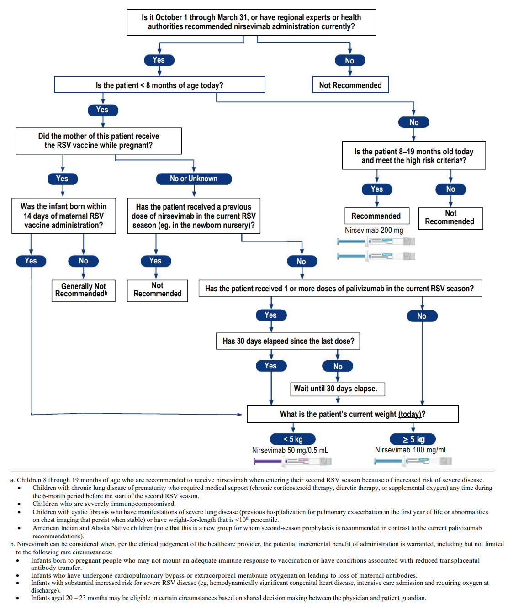
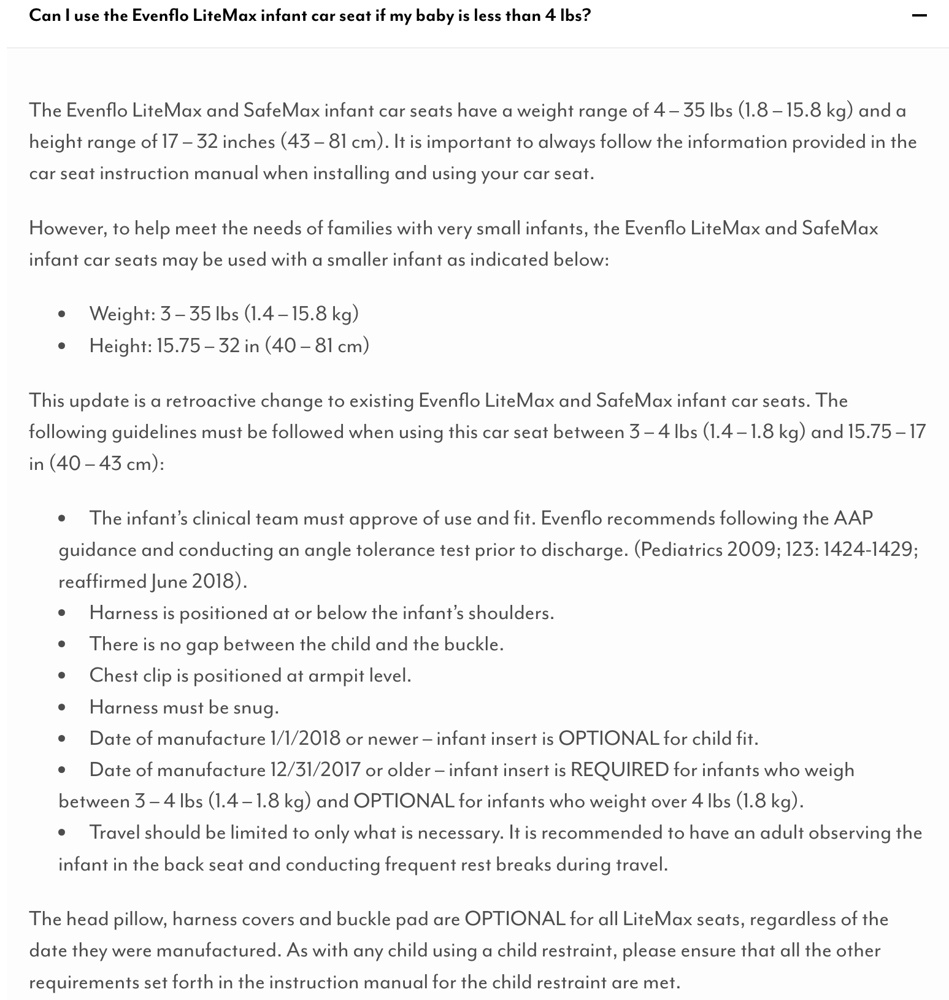

# Discharging an Infant {#sec-introduction}

## General Discharge Criteria (preliminary) {#sec-discharge-criteria}

 

### Respiratory

* In room air for at least 24 hrs, or
* If discharged home on oxygen:
  * All DME and supplies have been delivered, and parental education has been completed by the vendor
  * CXR and blood gas within 1 week of discharge date available in baby's chart

 

### Dietary

* Off IV fluid with post-IVF glucose levels within age-appropriate normal range
* On-demand feeds of at least 150ml/kg/day for 24 hrs if CGA &ge; 36 weeks, or 48 hrs if CGA < 36 weeks
* On discharge feeding regimen for at least 24 hrs

 

### Thermoregulation

* In open crib swaddled with one layer of clothes for at least 24 hrs with normal temperature

  


  
## Discharge Diet

 

### Weight-based diet for discharge {#sec-discharge-diet}

#### <u>Considerations for Discharge diet:</u>

1. Breast Milk with Human Milk Fortifier (HMF):

    * Fortified breast milk with HMF should be prioritized as the primary source of nutrition whenever possible to support optimal growth and development.

2. Fortified Feeds:

    * If exclusive breastfeeding is not feasible, the discharge diet may include:

      * Similac Neosure or Enfamil Enfacare (available in retail stores)

      * Specialty Formulas: SSC24 or SSC30 (not available in retail stores)

3. Case-by-Case Evaluation:

    * The discharge diet plan will be individualized based on the infant’s growth trajectory, feeding tolerance, medical history, and nutritional requirements.

    * Adjustments will be finalized 24 hours prior to discharge to ensure sufficient time to test the discharge regimen in the NICU for tolerance.

#### <u>22KCal for BW 1,800g - 2,500g</u>

##### *Parents may consider one of the following feeding options:*

##### <u>Option 1</u>: Exclusively Breast Milk Feeding: 

Provide 4 breast milk feeds fortified with Human Milk Fortifier (HMF) to 22kcal/oz per day.  The remaining feeds can be either direct nursing or expressed breast milk (EBM). 

*	4 cases of Human Milk Fortifier (HMF) will be provided at time of discharge.  Add 1 packet of HMF to every 50 ml of breast milk to make 22 kcal. 
*	Once the HMF is depleted, switch to Neosure powder or Enfacare powder to fortify breast milk to 22 kcal, at the discretion of the primary care provider.

##### <u>Option 2</u>: Mix of Formula and Breast Milk Feeding:

Give 3 feeds of Neosure 22Kcal daily. The remaining feeds can be either direct nursing, expressed breast milk, or additional Neosure/Enfacare, depending on the mother's milk supply.

*	2 cases of Neosure formula will be provided at discharge, which may last for 1-2 months, based on the volume used.
*	Neosure can be purchased over the counter if needed, at the discretion of the primary care provider.

 

#### <u>24KCal for BW \< 1,800g</u>

##### *Parents may choose one of the following feeding options*:

##### <u>Option 1</u>: Exclusively Breast Milk Feeding: 

Provide **4-6** breast milk feeds fortified with Human Milk Fortifier (HMF) to 24kcal/oz per day. The remaining feeds can be either direct nursing or expressed breast milk (EBM). 

*	**4-6** cases of Human Milk Fortifier (HMF) will be provided at time of discharge.  Add 2 packets of HMF to every 50 ml of breast milk to make 24 kcal. 
*	After the HMF is depleted, switch to Neosure powder or Enfacare powder to fortify breast milk to 24 kcal, at the discretion of the primary care provider.

##### <u>Option 2</u>: Mix of Formula and Breast Milk Feeding:

Give 3 feeds of SSC30 daily.  The remaining feeds can be either direct nursing, expressed breast milk, or Neosure/Enfacare depending on the mother' milk supply (caloric density range 23.7- 25kcal).

*	4 cases of SSC30 and 1 case of Neosure22 will be provided at discharge.  These supplies may last for 2-3 months.  Parents can purchase additional Neosure/Enfacare at retail store while the baby is receiving SSC30.

 

### Instruction for PCP

If an infant continues to require 24Kcal after depleting SSC30 or HMF (at the discretion of the PCP), fortify with Neosure or Enfacare powder to maintain 24Kcal. If 24Kcal is no longer necessary, begin weaning to 22Kcal for 1-2 months, then reduce to 20Kcal once the baby's actual weight reaches 3500 gm or at the 25^th^ percentile for weight, length, and head circumference.

The recipes will be structured as below:

**22Kcal feeds using Neosure or Enfacare powder:**

* Add 1 teaspoon unpacked, level of Neosure or Enfacare powder to 5 oz of breastmilk to make 22KCal.  
* Add 1 unpacked, level scoops of Neosure or Enfacre powder to 2 oz of water to make 22Kcal.  
 
**24Kcal feeds using Neosure or Enfacare powder:**

* Add 2 teaspoons unpacked, level of Neosure or Enfacare powder to 5 oz of breastmilk to make 24Kcal.  
* Add 5 unpacked, level scoops of Neosure or Enfacre powder to 9 oz of water to make 24Kcal.  
* Add 1/2 teaspoon of Neosure or Enfacare powder to 3 oz of ready-to-feed Neosure/Enfacare to make 24Kcal.  

::: callout-note
Enfamil Enfacare formula 22KCal is comparable to Neosure 22KCal formula. It would be helpful to include Enfamil Enfacare as an option for parents. in the event, parents cannot procure Neosure supply at retail stores, they can obtain Enfamil Enfacare as a solution.
:::

### Term infants

Do not need to test infants on regular infant formula unless clinically indicated (e.g., specialized formula) prior to discharge from the NICU.

 
 



## Donor Breast Milk – Home Ordering Information {#sec-donor-milk-home-ordering}

[Download Donor Breast Milk - Home Ordering Information](files/donor-milk-home-ordering.pdf){target="_blank"}

 

- **Ordering Without Prescription**: Families can contact milk banks directly to order up to 40 ounces of donor milk without a prescription.
- **Additional Milk**: If more donor milk is needed, families should follow up with their pediatrician.
- **Eligibility**: All patients are eligible to receive a maximum of 40 ounces without a prescription by contacting the milk bank and completing electronic consent forms.
- **Mothers’ Milk Bank Contact**:
  - Email: [recipient.coordinator@mothersmilk.org](mailto:recipient.coordinator@mothersmilk.org)
  - Phone: (408) 638-2822
  - Website: [https://mothersmilk.org/request-milk/for-a-newborn/](https://mothersmilk.org/request-milk/for-a-newborn/)
- **Ni-Q Contact**:
  - Phone: 844-305-7674
  - Electronic Form: [https://www.ni-q.com/direct-to-family/](https://www.ni-q.com/direct-to-family/) (response within 24 hours)
- **Prescription for More Than 40 Ounces**: Patients needing more than 40 ounces must have a doctor complete the San Jose Mothers’ Milk Bank Prescription form, specific to the milk bank and attached to this document.
- **Insurance Coverage**:
  - San Jose Milk Bank is contracted with Tri-Care and Medi-Cal insurance only.
  - Patients with Tri-Care or Medi-Cal may receive Pasteurized Donor Human Milk (PDHM) via insurance, but prior authorization is required.
  - Patients with other insurance providers will pay out of pocket and can discuss possible reimbursement with their provider.
- **Delivery**:
  - Patients can schedule overnight delivery to their homes.
  - Mothers’ Milk Bank ships nationwide, with a cutoff for overnight deliveries at 11 AM.

   



## Multivitamin for discharge

 

### Based on birth GA

-   Birth GA \< 37 weeks: multivitamin with iron
-   Birth GA ≥ 37 weeks: multivitamin without iron

   



## Circumcision {#sec-circumcision}

 

### Timing

* May be performed by the on-call Family Care Center pediatrician if the infant is < 30 days old.
* Circumcision usually takes place the day before or on the day of NICU discharge.
* If the infant is ≥ 30 days old, the procedure will be performed by a urologist as outpatient.
  - Route note to the following nursing pool: P OBGRIRIV CIRC (P 19729).  
  - There must be a statement stating that the patient is medically cleared for circumcision.  
  - The patient must have received IM Vitamin K prior to the procedure.  **Oral Vitamin K will not be accepted**.  
* **Dr. Josephine Hidalgo-Tamola** may be willing to operate up to 3 months of age. 

 

### Consultation and consenting

* Neo consults family on circumcision
* Document Circumcision Consultation in Problem List. Use [.circconsent](#sec-dotphrase-circconsent) to populate the consultation content.
* Family watches a video online regarding circumcision
* Family signs consent

 

### Procedure

* Neo order circumcision supplies (order set: CIRCUMCISION CARE OBGYN IP SCAL)
* Remind RN to notify FCC/pediatrician the day before discharge

 

### Post-circumcision care

* Teaching will be provided by RN prior to discharge
* Monitor for 2 hrs before discharge

## RSV Prevention after Discharge

 

### nirsevemab (Beyfortus&reg;) information {#sec-nirsevemab}

#### ACIP and AAP recommendations for nirsevimab

[Click to read the announcement on AAP RedBook website](https://publications.aap.org/redbook/resources/25379/ACIP-and-AAP-Recommendations-for-Nirsevimab){target="_blank"}  

 

#### Clinical guide

[Click to download PDF](https://shiny.nicugrowth.app/rmc-nicu-manual/www/nirsevemab/Nirsevemab-Visual-Guide_Final.pdf){target="_blank"}  

::: {.column-page-inset-right}

:::

 

#### AAP Frequently Asked Questions {#sec-nirsevimab-aapfaq}

[Click to open](https://www.aap.org/en/patient-care/respiratory-syncytial-virus-rsv-prevention/nirsevimab-frequently-asked-questions/){target="_blank"}

 

#### Counseling highlight

* We have had a monoclonal antibody to protect from RSV for more than 20 years, but it was expensive and only approved for high risk infants. 
* The new drug will be more widely available, but it is in short supply and high demand. 
* It is an injection that protects from an infection, it is NOT technically a vaccine, because it does not provoke a response from the immune system:
  * Down side: the protection is not durable
  * Up side: side effects are very few - no fevers have been reported from nirsevimab, not have any severe reactions been seen 
* If parents don’t take advantage of the opportunity to get nirsevimab in the hospital, it is very likely that we will NOT have it available later on in clinic.  
* It is NOT a human blood product like IVIG. It is produced in Chinese Hamster ovary cells. This should be acceptable to Jehovah’s Witnesses.  

 

#### Consenting & administration

NICU

* Parental informed consent required.
* In general, administer within 24 h of discharge.
* If given on the day of NICU discharge, monitor for 2 hrs prior to disharge.

FCC  

* No written or documented consent is required - administration of nirsevimab is covered by the Conditions of Admission that is signed at the time of hospitalization.  
* Verbal consent is required from parents/guardians (similar to vitamin K or Hep B vaccine).
* Administer on the day of FCC discharge. No observation required after administration.

 

#### Information sheets

[Immunization Information Statement from CDC](https://shiny.nicugrowth.app/rmc-nicu-manual/www/nirsevemab/Immunization-Information-Statement.pdf){target="_blank"}  
[Kaiser Permanente Drug FAQs for Clinicians](https://shiny.nicugrowth.app/rmc-nicu-manual/www/nirsevemab/nirsevimab (Beyfortus) ClinicianFAQs FINAL_20231016.pdf){target="_blank"}  
Kaiser Permanente Drug FAQs for Members [[English](https://shiny.nicugrowth.app/rmc-nicu-manual/www/nirsevemab/nirsevimab (Beyfortus) MemberFAQs FINAL_20231016.pdf){target="_blank"}] [[Spanish](files/Nirsevimab (Beyfortus) MemberFAQs FINAL_20231026_SP.pdf){target=_blank}] [[Chinese](files/Nirsevimab (Beyfortus) MemberFAQs FINAL_20231026_CHT.pdf){target=_blank}]  
 

### Criteria for Synagis {#sec-synagis}

#### AAP guidelines

Pediatrics (2014) 134 (2): 415--420.\
<https://doi.org/10.1542/peds.2014-1665>

Summary of Guidance (direct copy/paste from the above source)

-   In the first year of life, palivizumab prophylaxis is recommended for infants born before 29 weeks, 0 days' gestation.

-   Palivizumab prophylaxis is not recommended for otherwise healthy infants born at or after 29 weeks, 0 days' gestation.

-   In the first year of life, palivizumab prophylaxis is recommended for preterm infants with CLD of prematurity, defined as birth at \<32 weeks, 0 days' gestation and a requirement for \>21% oxygen for at least 28 days after birth.

-   Clinicians may administer palivizumab prophylaxis in the first year of life to certain infants with hemodynamically significant heart disease.

-   Clinicians may administer up to a maximum of 5 monthly doses of palivizumab (15 mg/kg per dose) during the RSV season to infants who qualify for prophylaxis in the first year of life. Qualifying infants born during the RSV season may require fewer doses. For example, infants born in January would receive their last dose in March.

-   Palivizumab prophylaxis is not recommended in the second year of life except for children who required at least 28 days of supplemental oxygen after birth and who continue to require medical intervention (supplemental oxygen, chronic corticosteroid, or diuretic therapy).

-   Monthly prophylaxis should be discontinued in any child who experiences a breakthrough RSV hospitalization.

-   Children with pulmonary abnormality or neuromuscular disease that impairs the ability to clear secretions from the upper airways may be considered for prophylaxis in the first year of life.

-   Children younger than 24 months who will be profoundly immunocompromised during the RSV season may be considered for prophylaxis.

-   Insufficient data are available to recommend palivizumab prophylaxis for children with cystic fibrosis or Down syndrome.

-   The burden of RSV disease and costs associated with transport from remote locations may result in a broader use of palivizumab for RSV prevention in Alaska Native populations and possibly in selected other American Indian populations.

-   Palivizumab prophylaxis is not recommended for prevention of health care-associated RSV disease.

 

### Administraion

When an infant who met criteria is expected to be dicharged from the NICU within the next **72 hrs**.

   



## Carseat for Infants < 4lbs {#sec-carseat-less-than-4lbs}

### Screenshot from Evenflo FAQ page 

<https://www.evenflo.com/pages/faq>

 

### Handout for parents

<a href='files/Car Seat Safety for Preterm or Low Birth Weight Babies Handout.docx' target="_blank">Click here to download</a>

   



## Inland Regional Center Early Start Program {#sec-irc}

 

### Eligibility criteria for children ages 0-36 months:

#### Developmental delay

A significant delay is a 33% delay in one or more developmental areas. the developmental areas are: cognitive, communication, physical/motor, social/emotional and adaptive skills.

#### Established risk

A condition which has a high probability of resulting in a developmental delay such as Down syndrome or cerebral palsy.

#### High risk

A combination of **two or more** medical factors that requires early intervention services based on evaluation and assessment. Some of these factors include (*list not exhaustive*)

-   Prematurity \< 32 weeks gestation and/or low birth weight of \< 1,500 grams.\
-   Assisted ventilation for 48 hours or longer during the first 28 days of life.\
-   Prenatal substance exposure.\
-   Infants born to a parent with a developmental disability.\
-   [Total pre-phototherapy bilirubin level \>20mg/dL]{style="color:blue"}

[https://www.inlandrc.org](https://www.inlandrc.org){target="_blank"}

 

### Short list of criteria

* Hypoglycemia with IV > 48 hrs [?]{style="color:red"}
* Bilirubin > 20 mg/dL
* Intubated for > 24 hrs
* APGAR <5 at 5 mins

   



## High-Risk Infant Follow-Up {#sec-hrif}

 

### Eligibility criteria (long list)

All infants with birth weight ≤ 1,500g or birth GA \< 32 weeks meet criteria.

For infnats with birth weight \> 1,500g and birth GA ≥ 32 weeks, one of the following criteria is required:

-   pH \< 7.0 on an umbilical blood sample or a blood gas obtained within 1 hr of life.
-   Apgar score ≤ 3 at 5 mins or \< 5 at 10 mins.
-   An unstable infant manifested by hypoxia, acidemia, hypoglycemia, and/or hypotension requiring pressor support.
-   Persistent apnea which required caffeine or other stimulant medication for the treatment of apnea at discharge.
-   Required oxygen for more than 29 days of hospital stay and had radiographic finding consistent with chrnonic lung disease (CLD).
-   Infants placed on ECMO.
-   Infants who received **iNO for \> 4 hrs**, and/or treatment during hospitalization with **sildenafil** or other pulmonary vasodilatory medications for pulmonary hypertension.
-   Congenital heart disease requiring surgery or minimally invasive intervention.
-   History of observed clinical or electroencephalographic (EEF) seizure activity or receiving antiepileptic medication(s) at time of discharge.
-   Evidence of intracranial pathology, including but not limited to, intracranial hemorrhage (grade II or worse), white matter injury including periventricular leukomalacia (PVL), cerebral thrombosis, cerebral infarction or stroke, congenital structural central nervous system (CNS) abnormality or other CNS problems associated with adverse neurologic outcome.
-   Clinical history and/or physical exam findings consistent with neonatal encephalopathy.
-   Other documented problems that could result in neurologic abnormality, such as: history of CNS infection, documented sepsis, bilirubin at excessive levels concerning for brain injury as determined by NICU medical staff ([total pre-phototherapy bilirubin level \>25mg/dL]{style="color:blue"}), history of cardiovascular instability as determined by NICU medical staff due to: sepsis, congenital heart disease, PDA, NEC, other documented conditions.

 

### Short list of criteria

* Bilirubin > 25 mg/dL
* pH < 7.0
* Congenital heart defect requiring surgical correction
* Intubated for > 48 hrs

 
 


## Screening for Developmental Dysplasia of Hip

Pediatrics (2016) 138 (6): e20163107.  
<https://doi.org/10.1542/peds.2016-3107>{target="_blank"}

 

### Risk factors

* Breech position
* Female sex
* Incorrect lower-extremity swaddling
* Positive family history

### Timing of US screening

6 weeks to 4 months of age

 
 



## Home Health {#sec-home-health}

* Term: Case-by-case
* Late preterm infants (GA 34-36 weeks): Home health x1
* Preterm infants < 34 weeks: Home health x2

 
 



## Discharge with Home Oxygen Use {#sec-home-o2}

The following steps may be followed to complete the process of discharge with home oxygen use:

1. Contact Dr. Kyle McCallin (peds pulm) regarding discharge with home oxygen

2. Dr. McCallin does not like to discharge on lower than 1/8 LPM (120 mL), 100% FiO2

3. Per Dr. McCallin: obtain baseline gas, +/- repeat CXR if most recent CXR prior was abnormal (air trapping, diphragmatic flattening, atelectasis, etc.). Inquire if additional meds needed/ recommended (ie., pulmicort, albuterol, etc.)

4. Contact NICU case manager (CM) to arrange DME order and delivery to patient's home. CM at Moreno Valley can call the CM at Fontana for the details if s/he needs assistance. 

5. Once supplies have been delivered to the mother's home, the baby may be discharged with a portable oxygen tank. (In this case, the supplier left mother with a large tank, a medium tank, and multiple small tanks). 

6. Ensure RT teaches mother proper usage of the tank or other supplies (ie. nebulizer)

7. Peds pulm generally likes follow up 2-4 weeks post discharge, Dr. McCallin always wants the babies to see their actual PCP first.

  **Keep in mind that this can be a rather quick process (<24 hours), so keep abreast of CM's progress so as to be able to plan for the discharge accordingly**

 
 



## Discharge Workflow on Health Connect {#sec-discharge-workflow-hc}

 

### Step 1: Reconcile Medications

Go into the discharge navigator &rarr; Click on **MD med/order reconciliation** in left menu bar &rarr; Complete the medical reconciliation:  

1. Discontinue what is not needed, add whatever else infant needs as outpatient
2. Order Poly-Vi-Sol for birth GA &le; 37 weeks, or Poly-Vi-Sol with Iron for birh GA < 37 weeks
3. Order **discharge diet** and enter [appropriate diet](#sec-discharge-diet)
   * Make sure to copy/paste recipes for making 22kcal/oz or 24kcal/oz with Neosure or Enfacare 22kcal/oz to the Discharge Diet order
4. Order **discharge activity** and enter the back to sleep information by using the dot-phrase [.back1](#sec-dotphrase-back1)
5.	Any other outpatient referrals

 

### Step 2: Reconcile Problem list

Resolve/update problems no longer relevant (ie. Receiving tube feedings)  

 

###	Step 3: Discharge summary

Template:  

* Use **DISCHARGE (CCS) SUMMARY NOTE NICU IP SCAL** in the smart text box for infants discharged home or transferred out of Kaiser foundation hospitals
* Use **TRANSFER OUTGOING TRANSFER NICU IP SCAL** for infants transferred to another Kaiser foundation hospital

Content:  

* **Reason for admission**: copy H&P note from the beginning of note up to and including admission physical exam and paste here
* **Pertinent past hx**: usually just “newborn” is sufficient
* **Pertinent points in ROS**: from most recent progress note, copy and paste the assessment/plan section of all organ systems up to “social” (exclude the social history)
* **Update new and thorough physical exam**. Be sure to do eye exam and hip exam
* **Treatment/ care given**: CPAP, NIMV, antibiotics, etc (may use the dot-phrase [.treatment](@sect-dotPhrase-synopsis))
* **Brief Synopsis**: free text brief hospital course (may use the dot-phrase [.synopsis](@sec-dotPhrase-synopsis))
* **Discharge activity, diet and medications**: should all auto-populated if you completed these in Step 1 above
* Sign D/C summary

 

### Step 4: Route D/C Summary

Find your signed D/C summary within the Notes tab and click once:  

1. Find the **Route** icon to the right, on top of your D/C summary (in the same menu where **Addendum**, **Copy**, are found
2. Route to PCP: Select **+ PCP** and the patient's PCP will populate in the **send-to** section
3. Route to the pediatric provider seeing baby after NICU discharge if not the PCP
4. Cut and paste brief synopsis in comment section
5. If infant's birth GA <32 weeks or birth BW < 1,500g, D/C summary also needs to be routed to HRIF
    * Route D/C summary to **Nicole Ann Hutson** and **Pheba Joseph**
6. If infant is a candidate for Synagis^&reg;^, also route D/C summary to **Robyn Gerome**

 

### Step 5: Patient Instructions

Go to discharge navigator &rarr; select **Patient Instructions** in the AVS documentation on the left menu bar  

1. From D/C summary, cut and paste from “brief synopsis” to “D/C summary”

 

### Step 6: Place discharge order

Change the name of the discharging physician to the person who signs the D/C summary  
Make sure the discharge order is a **CONDITIONAL** order

 

### Step 7:	Home Health follow up

If a patient is a candidate for Home Health (see @sec-home-health), place order in the INPATIENT orders for the appropriate number of visits  

 

### Step 8:	IRC follow up

If a patient is a candidate for IRC (see @sec-irc), place a **social work referral/consult** order on the day of discharge (this is an INPATIENT order)

 

### Step 9: HRIF follow up

There is no need to order this and will be done automatically. Refer to the eligibility criteria in @sec-hrif.
