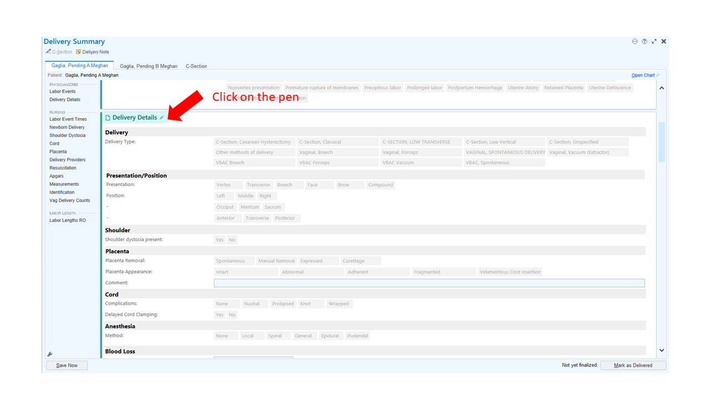
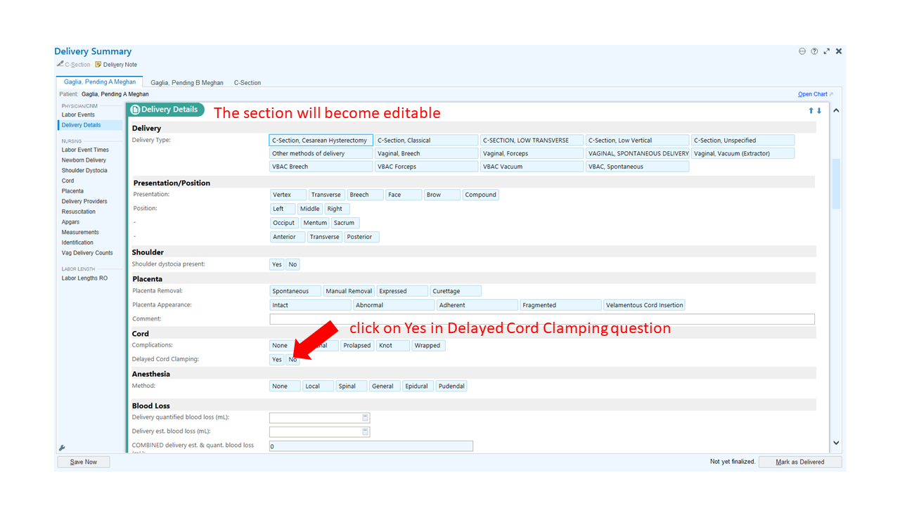
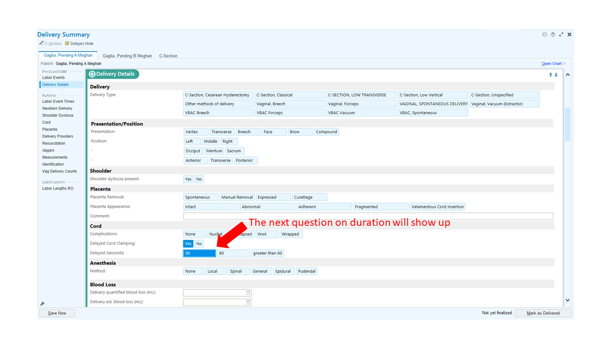
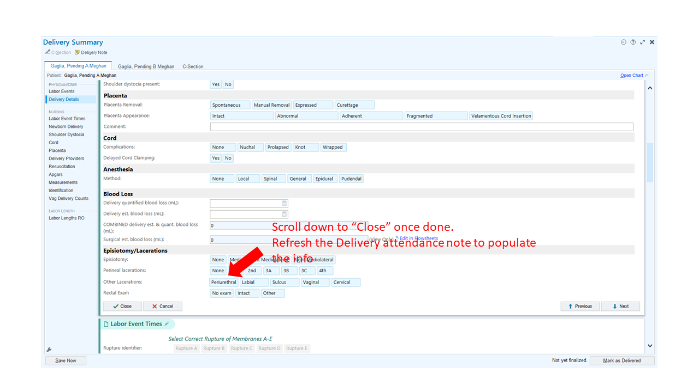
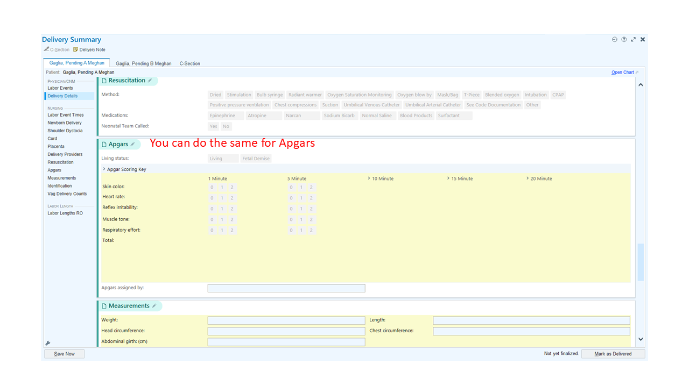
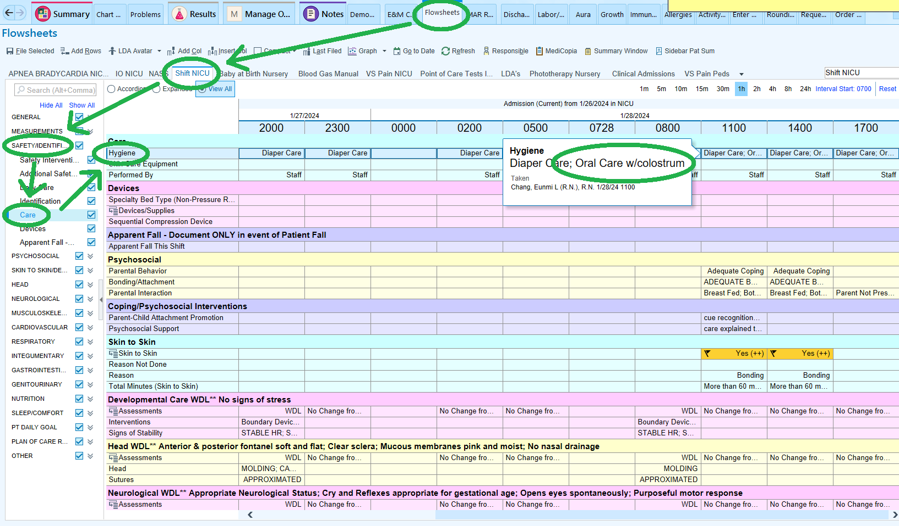
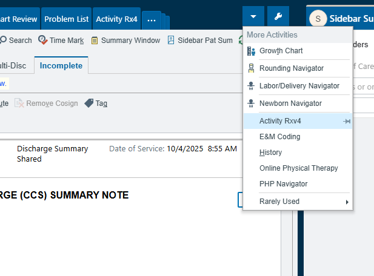
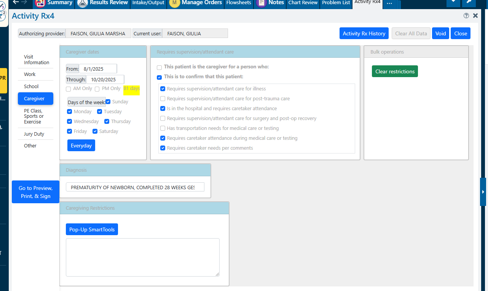
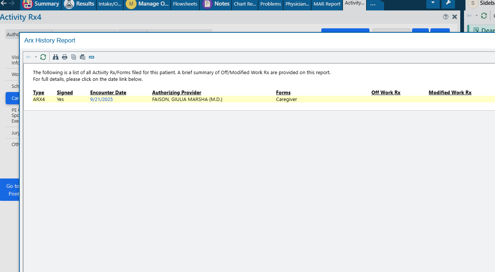

# Documentation

## Consent

 

### Blood transfusion {#sec-blood-transfusion}

Prior to blood transfusion, a discussion between the neonatalogist and the parents must occur, followed by parental consenting. the discussion should be documented in the neonatologist's admission H&P or daily progress note.

[dotPhrase](#sec-dotPhrase-blood-transfusion)

 

### Donor breast milk

Refer to @sec-donor-breast-milk for details.

[dotPhrase](#sec-dotPhrase-donor-breast-milk)

 

### Circumcision

Refer to @sec-circumcision for details.

[dotPhrase](#sec-dotphrase-circconsent)

  

## Daily Progress Note Component Reminder {#sec-daily-progress-note}

 

### PICC {#sec-picc}

When a PICC is in place and is working properly, document the following in the daily progress note:

> Central line/dates: peripherally inserted central catheter: date placed: MM/DD/YYYY. **PICC central line assessed today, is functioning well with no signs of inflammation. Plan: Will continue the use of the catheter fo rlong-term paretneral nutrition and/or blood draw.**

[dotPhrase](#sec-dotPhrase-picc)

 

### Skin-to-skin {#sec-skin-to-skin}

Parents are expected to do at least 1 hr of kangaroo care (skin-to-skin, STS) with the infant each day of their visit.

A [nursing communication order](#sec-dotphrase-skin-to-skin) should be placed on admission to encourage skin-to-skin, One an order is placed, it should be documented in the progress note as follows:

> **Skin-to-skin order placed**.

[dotPhrase](#sec-dotphrase-skin-to-skin)

  

## Discharge Summary Component Reminder {#sec-discharge-summary}

 

### TREATMENT/CARE GIVEN/COURSE OF HOSPITAL STAY

Examples:

-   Status post enteral and parenteral nutrition\
-   Status post respiratory support for hyperMg and TTN
-   CARDIORESPIRATORY EVENTS requiring Caffeine
-   Status post antimicrobial therapy for rule out sepsis (blood c/s negative to date )
-   CRANIAL ULTRASOUND negative\
-   Status post phototherapy for non-hemolytic jaundice

 

### Brief Synopsis

Example:

> 30.3 wks AGA male infant admitted to NICU on 9/18 via transfer from FKP for continuation of care for prematurity (high census) and received the following care:
>
> -   NG feeding, Status post TPN/IL\
> -   Anemia treated with Epogen and Iron\
> -   Monitoring for cardiorespiratory events\
> -   Status post circumcision\
> -   History of antimicrobial therapy with negative Blood c/s at FKP\
> -   History of respiratory support for TTN at FKP
>
> Post discharge follow up needs: nutrition using discharge diet of SSC 30 KCal/oz x 2 feedings/day, remainder mother's bmilk 20 KCal/oz or Neosure 22KCal/oz, follow up with HIGH RISK INFANT F/U CLINIC/ INLAND REGIONAL, Dynamic hip US 6 wk - 4 months old, follow up Anemia.

  

## Deferred Cord Clamping

Deferred cord clamping (DCC) can be documented in the mother's chart by going to the "**Delivery Summary**" tab before it is signed by an OB physician.

Below are screenshots from Health Connect to locate the DCC section:

::: {.callout-important}
For multiple gestation, each infant has his/her own section to fill out.
:::

  

## Checking Oral Care Documentation {#sec-oral-care}

- Step 1: Click "Flowsheets" tab
- Step 2: Click "Shift NICU" tab
- Step 3: Open drop-down list "Safety/Identification/Care"
- Step 4: Click on "Care"
- Step 5: In "Hygiene" row, hover your mouse over boxes to see if “Oral Care w/ colostrum" was documented.
 
  **IMPORTANT**: It must include the "Oral Care w/ colostrum" for it to count for our metric. If it only says “Oral Care” but does not include “w/ colostrum,” it will not count.
 
- Step 6: document in progress note

  

## Family and Medical Leave Act (FMLA) Document Preparation {#sec-fmla}

- Step 1: Click on arrow near the wrench for the drop down menu and locate "Activity Rx4"
  

- Step 2: Once on this page, select the "caregiver" button on the left
  

- Step 3: Fill out the appropriate dates you would like for FMLA, the requirements of the caregiver, and the diagnosis

- Step 4: Select "Go to Preview, Print, & Sign." Print if the parent is requesting a copy. Otherwise, ok to just e-sign.

- Step 5: This process is then documented in the patient's chart, where social work, case managent, etc. can locate the document ad lib:
  
