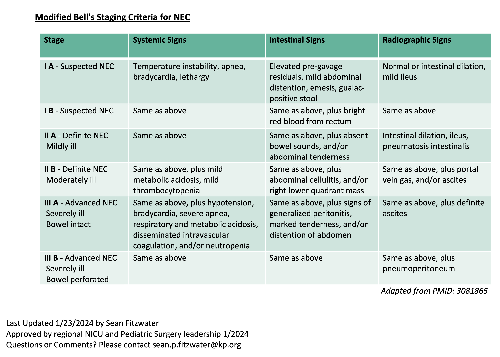
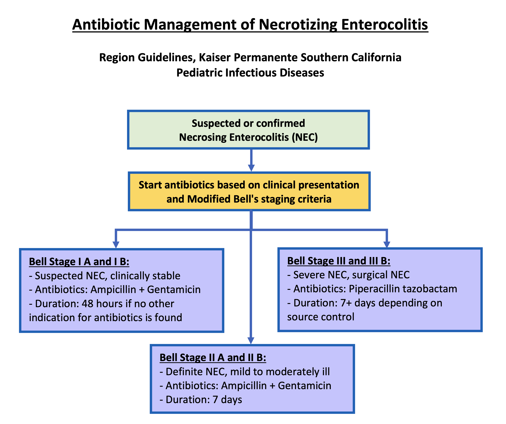

# Gastroenterology

 
 


## Cholestasis

 

### Workup

#### Imaging

* Abdominal US
* Spine x-ray for butterfly vertebrae (50-80% thoracic or lumbar spine in Alagille syndrome)
* HIDA scan (5 days of phenobarbital 5mg/kg/day bid)

#### Labs

* Total/direct bilirubin
* liver function tests (AST/ALT, GGT, ALP, INR, PTT)
* TSH
* Urine organic acid
* Plasma amino acid
* Acylcarnitine profile
* AM Cortisol
* Alpha-1-antitrypsin
* bile acids
* urine/blood CMV
* urine reducing substance
* immunoreactive trypsinogen
* HSVPCR
* UA and urine culture

#### Treatment

* Actigall (ursodiol): 20-30mg/kg/day
* ADEK vitamins

 
 


## Gastro-Esophageal Reflux Disease (GERD)

 

### Diagnosis

* Flex laryngoscope showing erosion in the larynx
* pH meter study
* Frequent emesis resulting in poor weight gain / malnurishment

 

### Treatment

* Omeprazole 0.5-1.5mg/kg/dose once daily

 
 


## Necrotizing Enterocolitis (NEC) {#sec-nec}

 

### Moditified Bell's criteria

 

### Workup

* CBC/D
* CRP
* Chemistry
* Blood Culture - Repeat culture at time of surgery if an infection is present
* Serial KUB

 

### Antibiotics Use

 

**Further Considerations**

- Antibiotic dosing should be based on the patients age, weight, and gestation age.
- If clinical worsening occurs the Bell stage classification should be re-evaluated.
- If peritonitis or purulence is noted during surgery, consider sending cultures to guide antibiotic
management.
- Antibiotics should be modified based on blood culture or sterile site culture results.
- Patients with bacteremia typically require evaluation for meningitis with a lumbar puncture. If
meningitis is confirmed Pediatric Infectious Diseases should be contacted.
- Duration of antibiotics for severe and perforated NEC is dependent on extent of infection,
severity of illness, and if adequate source control was obtained.
- For worsening severity of illness despite surgical management and treatment with Piperacillin
tazobactam, consider discussing broadening antibiotic therapy with Pediatric Infectious
Diseases.
- Consider using ceftazidime in place of gentamicin in patients with recent or extensive prior
exposure to gentamicin.
- Consider starting vancomycin in septic patients with central lines to cover methicillin resistant
Staphylococcus species. If started, consider stopping vancomycin if cultures are negative at 48
hours.

 

### Resources

<a href='files/NEC NICU-Dr.Fitzwater 2023.pptx' target='_blank'>Dr. Fitzwater's Presentation Slides</a> (Right clikc to save link as...)