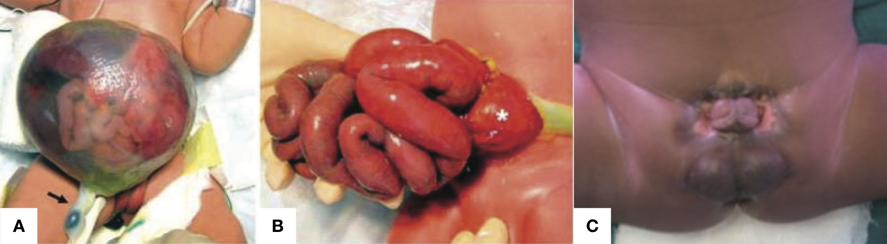
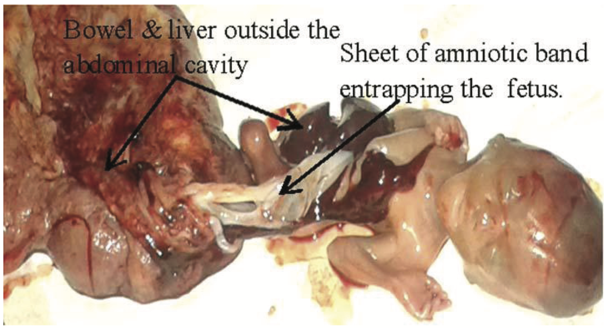
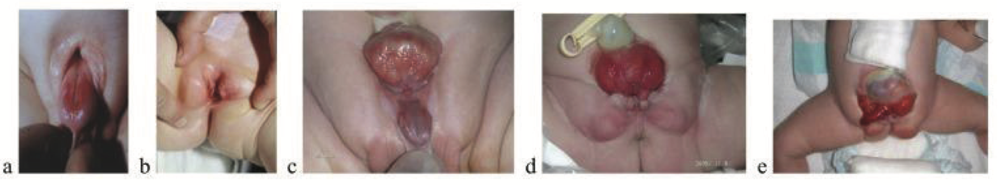
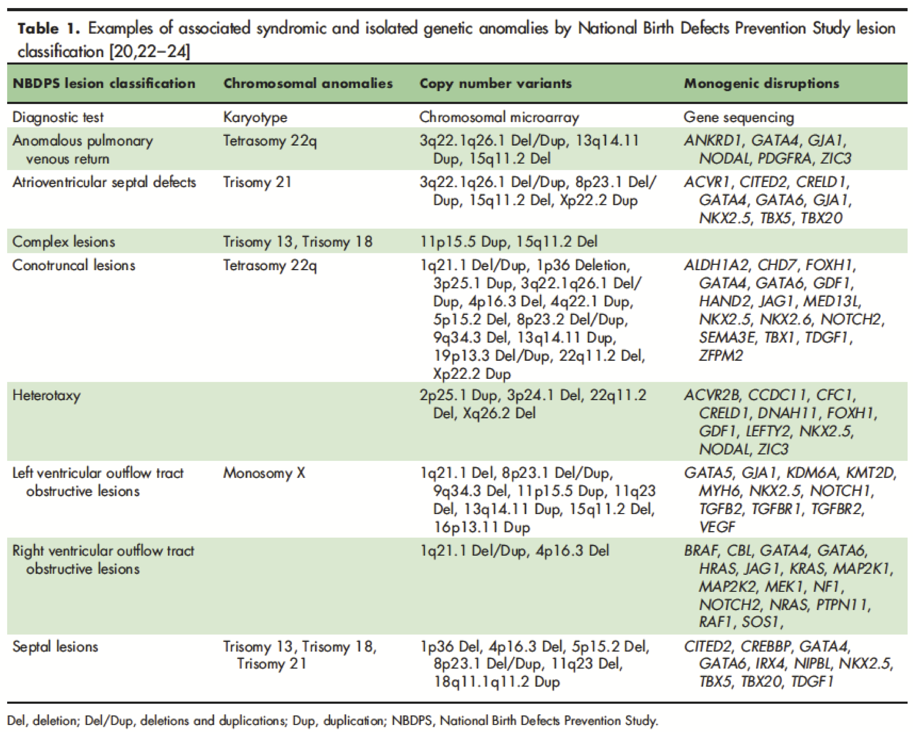
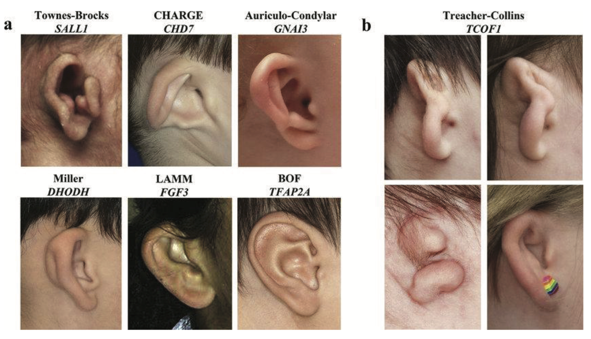
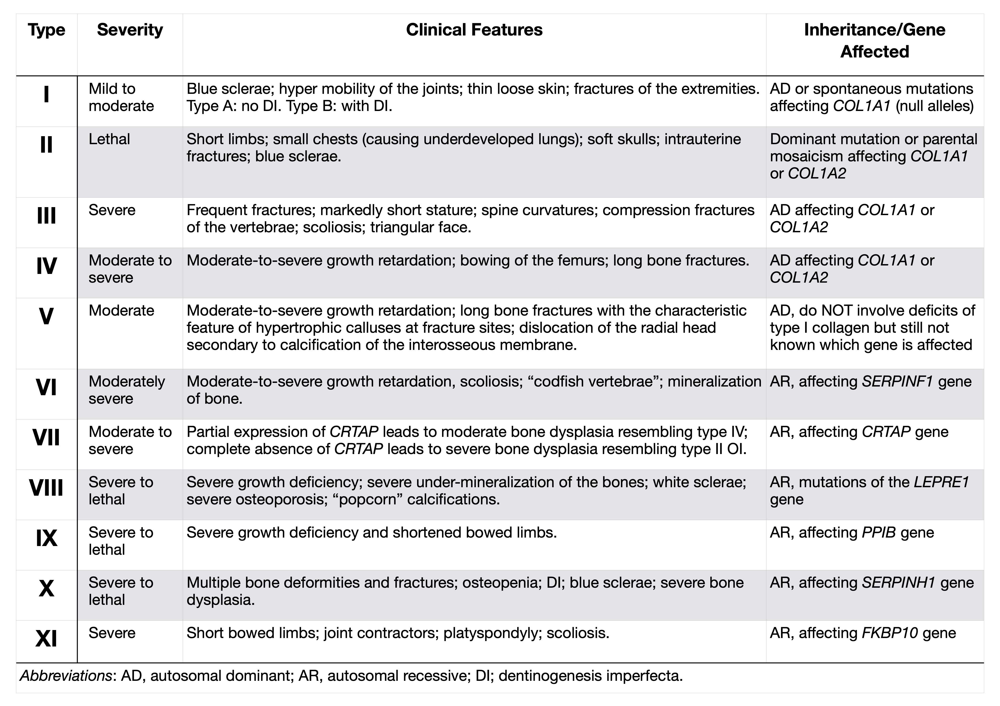
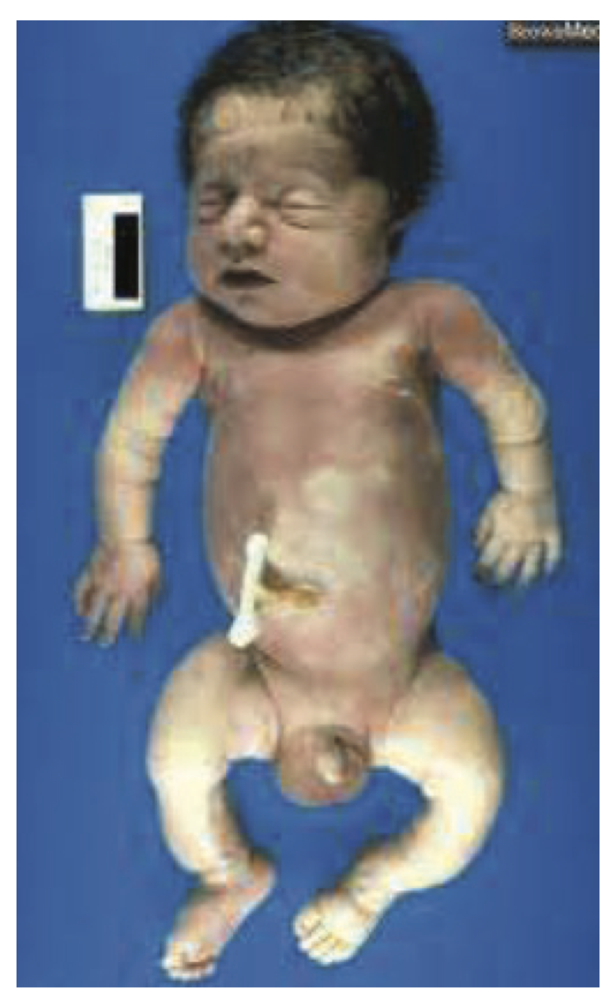

# Genetic Disorders (LLUCH NICU Manual)


*Authored by Drs. Robin Clark and Jose Camacho*  

## Evaluating an Infant with Congenital Anomalies

<br></br>
**Ask These Five Questions**  

1. Does the baby have dysmorphic features?  
2. Does the baby have more than one congenital anomaly?  
    * Include low birth weight as an anomaly.  
3. Is there a positive family history?
    * Interview and examine the parents before you say no.  
    * Ask about consanguinity, history of stillbirth or miscarriage.  
4. Was the baby exposed to a teratogen in utero?  
    * Include infection, fever, maternal diabetes, alcohol, high-risk medications (isotretinoin, valproic acid).  
5. Is there unexplained neurological impairment (poor feeding, seizures, hypotonia, encephalopathy) or a significant risk of death?  
* If you answer YES to any of these five questions, the chance of a syndrome is increased, and you should proceed to the **Basic Genetics Work-Up**.  

<br></br>
**Basic Genetics Work-Up**  

* Review the mother’s chart:  
    * Read the Care Coordination Note.  
    * Review Genetic counseling notes under the *Letters* tab.  
    * Note prenatal genetic test results (check *Bookmarks*).  
* Perform a detailed physical exam, documenting:  
    * Major AND minor anomalies.  
    * Specific dysmorphic features: ptosis, downslanting, long or short palpebral fissures, widely or closely spaced eyes, smooth philtrum, thin upper lip, preauricular pit, webbed neck, excess posterior nuchal skin, pigmented or hypopigmented macules, clinodactyly, small fingernails.  
    * Neurological examination/status:  
        * Examine baby uncovered in an open space, then ask, *does the baby attain a quiet alert state?* (ideal for neuro exam).  
    * Start with the head in the midline.  
    * Examine head/fontanelle (size and shape), skull shape/deformities, visual fixation and tracking, extraocular movements, high arched palate, suck, signs of spinal dysraphism, muscle/joint contractures.  
    * Note axial and appendicular tone (vertical and horizontal suspension), asymmetries, general movements (poor repertoire, atypical stereotyped movements/postures), tremor, myoclonus, persistent thumb adduction, Moro, DTRs, reactivity to stimulation.  
* Survey major organs for other anomalies:  
    * Echocardiogram, Abdominal US, Head US/MRI.  
    * Ophthalmology and hearing/audiology exam when neuro status is abnormal or intrauterine infection is suspected.  
* Order Chromosome microarray as soon as possible.  
    * Purple (EDTA) top or yellow top. *Note*: results may take up to 8-10 days.  
    * Contact Genetics with any abnormal results.  
    * Leftover DNA is usually available for further/future testing for several months, so if in doubt as to what else to order, draw an extra tube and send two tubes for microarray.  
    * Order Chromosome analysis (not microarray) when a particular trisomy (T13, T18, T21) is suspected.  
    * Order FISH when a rapid diagnosis is needed. *Note*: specify the probe needed for aneuploidy (13, 18, 21, X, Y), 22q, etc..  
* Obtain a Family history by personally interviewing the family:  
    * Ask about consanguinity, infertility, miscarriages, affected relatives.  
        * *Do not copy and paste from the mother’s OB note*!  
    * Examine parents for relevant signs.  
        * Tip: a parent who is slow or dysmorphic is a clue to the diagnosis. Lean in!  
* Take photographs & upload them to the patient’s chart in the *Media* Tab:  
    * Overall, whole baby view – front and side views, without diaper or blanket, if possible.  
    * Face – frontal view (directly straight on, not at an angle) and profile, showing chin and ears, without tape or tubes (if possible).  
    * Close up views of any unusual features.  
    * Hands and feet – take individual views if necessary to show thumbs, palms, soles, nails.  
    * Any areas of concern: skin changes, genital anomalies.  
* Worst-Case-Scenario (or on nights/weekends):  
    * Draw blood first and then call Genetics (preferably Mon-Fri and in the morning).  
        * 1-5 mL in green-top tube (sodium heparin): for white cell-based studies (FISH or chromosome analysis).  
        * 1-5 mL in a purple-top (EDTA) or yellow-top (Acid Citrate) tube: for DNA-based studies (microarray).  
    * Request autopsy.  
        * If declined, ask for a limited autopsy of the relevant organ (e.g., post mortem percutaneous renal biopsy).   
* Take and upload photos.  

<br></br>
**Utilize Resources on Rare Disorders**  

* AAP guidelines, GeneReviews, OMIM, reference books (Smith’s Recognizable Patterns of Human Malformation, Genetic Consultations in the Newborn).  
* Request inpatient Genetics consult when the following 3 criteria are met: 
    * Criteria 1:  
        * There are two or more anomalies, *or*  
        * There is one anomaly and a postivie family history, *or*  
        * There is an unexpected pathogenic microarray or newborn screening result.  
    * Criteria 2:   
        * Basic work-up listed above is complete, *or*
        * There is an urgent or life-threatening situation.  
    * Criteria 3:  
        * The main objective is establishing a diagnosis for optimal management.  

<br></br>
**Outpatient Genetics Evaluation**  

* Baby is stable, *and*
* The main objective is **reproductive** counseling, *and*
* Microarray is pending and/or Basic work-up listed above is incomplete at the time of discharge.  

<br></br>
**Other Management**  

* Order a Neuro consult when the baby is acutely symptomatic (for example, encephalopathy, seizures) or requires acute management.  
* Order High-Risk Infant / Neonatal Neurology consult when:  
    * Baby is stable, there are questions relating to long-term neurodevelopmental disabilities, and baby can be seen in 1-2 weeks.  
    * If not seen before discharge, directly refer for an outpatient Neurology appointment.  
    
<br></br>

## Abdominal Wall Defect

<br></br>
**Background**  

* Abdominal wall defects are generally of three types:  
    * **Omphalocele** (Figure \@ref(fig:abd-wall-defect) Panel A), a central defect in which abdominal contents remain in the cord.  
    * **Gastroschisis** (Figure \@ref(fig:abd-wall-defect) Panel B) an open defect to the right of the umbilicus through which bowel protrudes.  
    * **Exstrophy of cloaca/bladder** (Figure \@ref(fig:abd-wall-defect) Panel C), in which there is a failure of septation of the early GU and GI tracts, and the urethra and bladder open onto the perineum.  
```{r abd-wall-defect, fig.cap="Types of Abdominal Wall Defect", fig.align='center', out.width="100%", warning=FALSE, echo=FALSE, message=FALSE}

library(tidyverse)

```

* Gastroschisis Incidence of 4 per 10,000:  
    * Male:female ratio: 1:1.  
    * 10-15% association with congenital anomalies such as cardiac (VSD), cleft palate, and intestinal atresia.  
    * 40% are premature/SGA.  
    * <u>Rarely</u> associated with an underlying syndrome.  
* Omphalocele Incidence of 3 per 5,000:  
    * Male:female: 1.5:1.  
    * >70% associated with congenital anomalies such as bowel atresia, imperforated anus.  
    * Look for a syndromic etiology in infants with omphalocele:  
        * Maternal diabetes mellitus.  
        * Tetrasomy 12p (Pallister-Killian syndrome).  
        * Paternal uniparental disomy 14 (UPD14pat).  
        * Trisomy 13, 18, 21.  
        * Beckwith-Wiedemann syndrome (BWS).  
        * CHARGE and other syndromes.  
        * Pentalogy of Cantrell (supraumbilical defect).  

<br><br>
**Family History**  

* Ask about consanguinity, parental ages.  
    * Advanced maternal age increases the chance of aneuploidy and uniparental disomy.  
* Ask about other relatives with congenital anomalies: when males are affected in the maternal lineage, suspect X-linked omphalocele.  
* Document parental birth weights:   
    * If parents were LGA consider BWS, which has a positive family history in 15%.  

<br><br>
**Pregnancy History**  

* Ask about *in vitro* fertilization (increases the risk for BWS), polyhydramnios, twins, maternal diabetes.  
* Obtain placental histology: mesenchymal dysplasia and long cord are associated with BWS.  

<br><br>
**Imaging Studies**  

* CXR: **Coat hanger ribs** (a sign of **UPD14pat**).  
* Echocardiogram.  
* Abdominal US.  
* Head US.  
* Other GI or GU imaging as requested by surgery.  

<br><br>
**Physical Rxamination**  

* Examine for dysmorphic features: macroglossia, ear creases, and/or posterior indentations (BWS).  
* Describe the abdominal wall defect, including the location of the defect, size of the defect, contents of sac if present, umbilical cord size, vessels.  
* When a massive abdominal wall defect (Figure \@ref(fig:massive-defect)) is associated with encephalocele, or amniotic bands, limb anomalies, and severe scoliosis, consider Limb-Body Wall defect, a lethal and sporadic disorder.  
```{r massive-defect, fig.cap="Massive Abdominal Wall Defect", fig.align='center', out.width="100%", warning=FALSE, echo=FALSE, message=FALSE}

library(tidyverse)

```
* When there is disruption of bladder, genital and anal anatomy, consider Exstrophy-Epispadias Complex (EEC) or Bladder-Exstrophy-Epispadias Complex (BEEC) or Omphalocele-Exstrophy-Imperforate Anus and Spine anomalies (OEIS) (Figure \@ref(fig:ECC-OEIS)).  
```{r ECC-OEIS, fig.cap="Omphalocele with Disruption of Genitourinary Anatomy", fig.align='center', out.width="100%", warning=FALSE, echo=FALSE, message=FALSE}

library(tidyverse)

```

<br><br>
**Orders**  

* Chromosome analysis if Trisomy is suspected otherwise, chromosome microarray.  
* When an infant is LGA or has macroglossia or ear creases with omphalocele, consider genetic testing for Beckwith-Wiedemann syndrome (methylation for 11p15.5).  
* Other genetic testing can be considered based on the pattern of anomalies.  

<br><br>
**Consults**  

* Peds Surgery consult.  
* Urology, GI, Nephrology as needed.  
* **Request inpatient Genetics consult when there are additional anomalies or a positive family history**.  
* **Refer for outpatient Genetics appointment when the abdominal wall defect is isolated, and family history is negative**.  
    
<br></br>

## Arthrogryposis {#arthrogryposis}

<br></br>
**Background**  

* Arthrogryposis is a *descriptive* term used for multiple joint contractures.  
* There are hundreds of different types of arthrogryposis, grouped in these general categories:  
    * Neurological: central or peripheral nervous system disease leading to decreased fetal movements.  
    * Maternal illness: myasthenia gravis, myotonic dystrophy.  
    * Connective tissue/skeletal: Larsen syndrome; diastrophic dysplasia.  
    * Teratogenic/environmental: vascular insufficiency.  
    * Intrauterine constraint/deformation: multiple gestations, bicornuate uterus, extrauterine pregnancy.  
* Prevalence is approximately 1:3,000 livebirths.  
* Often associated with decreased fetal movement.  

<br></br>
**Family History**  

* Ask about family members with joint contractures, club feet, dislocations, congenital hip dislocation, document other
anomalies (cleft palate) and sex of affected relatives.   
* Hyperlaxity of joints and connective tissue disorders.  
* Examine parents, especially mother, for myotonic dystrophy (myopathic facies, slow grip release – shake her hand) and myasthenia (ptosis).  

<br></br>
**Pregnancy History**  

* Document quality of fetal movements, and if they decreased, when did it start.  
* Fever during pregnancy and which gestation.  
* Multiple gestation and anomalies of the uterus.  
* Amniotic leak and oligohydramnios.  

<br></br>
**Physical Examination**  

* Examine for cleft palate, jaw, including when intubated o Alert, tone, reflexes, fasciculations.  
* Position and number of contractures.  
    * Policeman’s tip position of arms: extended elbow, internally rotated at the shoulder, and flexed at the wrist is typical of amyoplasia, a clinical diagnosis that responds well to physical therapy.  
* Document presence/absence of flexural creases.  
    * Distal arthrogryposis is a group of disorders with more severe involvement of distal joints and relative sparing of hips and shoulders.  
* Note the active and passive movement.  
* Foot and hand deviation.  
* Examine skin for dimples, webs/contractures, and amniotic bands:  
    * Escobar syndrome causes multiple pterygia with normal intelligence.  

<br></br>
**Imaging Studies**  

* Seek anomalies in other organ systems, especially brain and spinal cord.  
    * Order **MRI of the brain and spinal cord**.  
* Skeletal survey if concerns for keletal dysplasia, chondrodysplasia.  

<br></br>
**Orders**  

* TORCH titers and PCR and other congenital infections.  
* CK.  
* SNP chromosomal microarray.  
* Prioritize PT, OT Avoid immobilizing joints.  

<br></br>
**Genetics Consult**  

* Request inpatient Genetics consult when:
    * Severe involvement of several joints, positive family history, the microarray is abnormal, anomalies in other organ systems are present.  
* Refer an outpatient Genetics appointment when:  
    * Mild presentation.  
    * Family history is negative, and the microarray is pending.  

<br></br>
**Other Consult**  

* Consider Neuro consult:
    * Especially when contractures are segmental or generalized, or other neuro abnormalities are present.  

<br></br>

## Congenital Heart Disease (CHD) {#congenital-heart-disease}

<br></br>
**Background**  

* Congenital heart defects are the most common congenital anomaly, affecting 1% of live births.  
* Incidence ~ 7 per 1000 live births.  
    * CHD increased among premature infants, IDM, SGA.  
* Genetic diagnosis is important:  
    * Correlates with postsurgical outcomes.  
    * **Over half** of congenital heart defects have an unknown cause.  
* Etiology varies with the specific cardiac anomaly, so document the type of cardiac defect and use that to build the differential diagnosis.  
* CHD can be isolated, non-syndromic, and syndromic (Mendelian monogenic, multifactorial, teratogenic).  
    * Perform a comprehensive assessment for other major (extracardiac) and minor anomalies.  
    * Note dysmorphic features, low birth weight, poor feeding out of proportion to cardiac status.  
    * Consider established syndromes:  
        * **Aneuploidies**: trisomies 13, 18, 21, Turner syndrome.  
            * Consider Turner syndrome in any female with a left-sided heart defect, including bicuspid aortic valve.  
        * **Copy number variants**: 22q11.2 deletion, Williams syndrome.  
        * **VATER association**: similar anomalies among infants with Diabetic embryopathy and among infants conceived by IVF.  
        * **CHARGE syndrome**: facial palsy, ear anomalies, colobomas, choanal atresias, male genital hypoplasia.  
        * **Heterotaxy, primary ciliopathies**: situs ambiguus, polysplenia/asplenia.  
        * **Holt Oram syndrome**: septal defects with thumb anomalies.  
        * **Noonan syndrome and other RASopathies**: webbed neck, downslanting palpebral fissures, cardiomyopathy or right-sided cardiac lesions.  
        * **Smith-Lemli-Opitz syndrome**: SGA, microcephaly, ptosis, cleft palate, genital ambiguity, hypoplastic thumbs, Y-shaped syndactyly of toes 2-3.  

<br></br>
**Family History**  

* *Personally*, take a three-generation family history and ask about:
    * Parental ages, health status, ethnicity.  
    * Consanguinity.  
    * Infertility, miscarriage, stillbirth.  
    * Early deaths.  
    * Congenital anomalies, especially cardiac anomalies.  
    * Intellectual disability or developmental delay.  
* Ask about family members who died young, required surgery in childhood, or anyone with unexpected sudden death.  
* Examine **parents** for dysmorphic features and anomalies.  
    * A first-degree relative with CHD is found in 2-3% of cases.  
* Phrase questions carefully, ask in more than one way:  
    * *Example*: Team reported a negative family history of CHD but when asked this way, “Has anyone ever had heart disease in your family?” the response was, “Oh, Dad had cardiomyopathy, but he had a transplant, so he is OK now!!”  
    
<br></br>
**Pregnancy History**  

* Document prenatal testing, screening, and fetal imaging/ultrasound:  
    * Maternal serum screening, NIPS (cell-free fetal DNA), amniocentesis.  
    * Gestational age when CHD was identified on the fetal US.  
    * Increased nuchal translucency value, hydrops, other anomalies, IUGR.  
* Ask whether the conception was natural vs. IVF (gamete donor, surrogate).  
* Document multiple gestations.  
    * Monozygotic twins have a 3 fold increased risk for CHD.  
* Document teratogen exposures including medications (over the counter and prescribed), recreational drug use, tobacco, and alcohol, especially early in pregnancy before pregnancy was identified.  
* Document maternal illness.  
    * Infections for viral disorders such as rubella and CMV, fever, rash, ill contacts during pregnancy, contact with cat litter or feces.  
    * Maternal SLE (associated with arrhythmia), history of maternal PKU.  
    * Diabetes mellitus: document insulin use, glucose levels, glycosylated hemoglobin level in early pregnancy.  

<br></br>
**Physical Examination**  

* Annotate growth parameters with percentiles and Z-scores based on sex and gestational age.  
* Examine for dysmorphic features and compare with parents.  
* Note extra-cardiac major and minor anomalies.  

<br></br>
**Imaging Studies**  

* Abdominal US, Head US.  
* When skeletal anomalies are present, order a skeletal survey.    
* Ophthalmology exam, especially in all infants with suspected CMV, or with ear anomalies, facial palsy, choanal atresia.  

<br></br>
**Orders**  

* Consider the type of cardiac lesion, extracardiac anomalies, and family history in determining the best testing strategy. See Table below:  
```{r chd-syndromes, fig.cap="Associated Syndromes in Congenital Heart Disease", fig.align='center', out.width="100%", warning=FALSE, echo=FALSE, message=FALSE}

library(tidyverse)

```
Source: Geddes GC, et al.. *Curr Opin Pediatr*. 2018 Dec;30(6):707-713. [[Link]](10.1097/MOP.0000000000000682)  

* SNP chromosomal microarray is the first-line genetic test for all patients with complex or syndromic CHD, including patients with HLHS and heterotaxy.  
* Conventional chromosome analysis is the first-line genetic test for all patients suspected of aneuploidy, with reflex testing for microarray if normal.  
    * Add FISH for aneuploidy for rapid results.  
    * *Note*: In the absence of Trisomy 13, 18, 21, and Monosomy X, the yield for conventional chromosome analysis in CHD is low: 1.6%.  
* Consider single gene analysis when the pattern of anomalies suggests a particular monogenic disorder. Examples:  
    * Order gene analysis for TSC1 and TSC2 for Tuberous sclerosis when there is a congenital intracardiac rhabdomyoma.  
    * Order gene analysis for DHCR7 for Smith Lemli Opitz syndrome when anomalies suggest Smith Lemli Opitz syndrome and 7-dehydrocholesterol is elevated.  
    * Order gene analysis for TAZ for Barth syndrome in a male with neutropenia and an X-linked pattern of familial cardiomyopathy.  
* Consider a Cardiogenetic gene panel for heterotaxy and when a syndromic form of CHD is not suspected or when CHD is familial.  
* Consider Genomic testing (whole exome or whole genome) when microarray results are normal or nondiagnostic, and a pattern of multiple anomalies suggests an uncharacterized syndrome.  
* **Consider metabolic workup for infants with unexplained cardiomyopathy**.  
* Parental echocardiograms are recommended for the families of infants with left ventricle outflow tract obstruction (LVOTO) disorders.  
* Prior to surgery or ECMO, draw blood for DNA extraction to be saved for future testing for the family.  

<br></br>
**Genetics Consult**  

* Request an inpatient consult when:  
    * CHD is complex or life-limiting, the microarray is abnormal, or dysmorphic features and/or extracardiac anomalies are present that pose a challenge for diagnosis or management.  
    * *Note*: **inborn errors of metabolism** are responsible for about 5% of **neonatal cardiomyopathy** in general, and about 25% of neonates with **hypertrophic cardiomyopathy**.  
* Refer to an outpatient Genetics appointment when:
    * CHD is mild or non-syndromic, and microarray is normal or pending, or a genetic diagnosis has been established that requires Genetics counseling.  
    
<br></br>
**References**  

* Geddes GC, Earing MG. Genetic evaluation of patients with congenital heart disease. *Curr Opin Pediatr*. 2018 Dec;30(6):707-713.  [[Link]](https://dx.doi.org/10.1097%2FMOP.0000000000000682)  
* Geddes GC, et al. Genetic Testing Protocol Reduces Costs and Increases Rate of Genetic Diagnosis in Infants with Congenital Heart Disease. *Pediatr Cardiol*. 2017 Oct;38(7):1465-1470. [[Link]](https://doi.org/10.1007/s00246-017-1685-7)  
* Geddes GC, Syverson E, Earing MG. Three-year experience of a clinical cardiovascular genetics program for infants with congenital heart disease. *Congenit Heart Dis*. 2019 Sep;14(5):832-837. [[Link]](https://doi.org/10.1111/chd.12817)  

<br></br>

## Choanal Atresia/Stenosis {#choanal-atresia}

<br></br>
**Background**  

* Narrowing or blockage of the rear of nasal passage, usually bony, sometimes membranous o Associated anomalies are seen in about 50%.  
* The prognosis depends on the underlying anomalies/syndrome.  

<br></br>
**Family History**  

* Examine parents for dysmorphic features, a single central incisor, other microforms of holoprosencephaly.  

<br></br>
**Pregnancy History**  

* Ask about prenatal methimazole exposure, poorly controlled maternal diabetes mellitus.  

<br></br>
**Physical Examination**  

* Check for other anomalies: coloboma, heart disease, choanal atresia, growth retardation, genital anomalies, and ear anomalies (CHARGE syndrome), hypotelorism, microcephaly, cleft lip, absent midline frenulum (holoprosencephaly), craniosynostosis (Apert/ Crouzon syndromes).  

<br></br>
**Imaging Studies**  

* Consider Maxillofacial CT – if so, look for a single central median maxillary incisor – a microform of holoprosencephaly.  

<br></br>
**Orders**  

* Chromosome microarray.  
* Check electrolytes:  
    * When hypernatremia occurs with choanal stenosis, suspect diabetes insipidus.  

<br></br>

## Club Foot {#clubfoot}

<br></br>
**Family History**  

* Ask about consanguinity, family history of Marfanoid or connective tissue disorders, club feet, other anomalies.  
* Examine the mother for slow grip release (myotonic dystrophy).  

<br></br>
**Pregnancy History**  

* Document first pregnancy, early amniocentesis or chorionic villous sampling, bicornuate uterus, poor or restricted fetal movement, breech delivery, oligohydramnios, twin or multiple gestations, maternal diabetes, maternal obesity, tobacco or other teratogen exposure.  

<br></br>
**Physical Examination**  

* Note the sex of the patient.  
    * Club foot is more common and more often **an isolated and sporadic finding in males**, more often **syndromic in females**.  
* Distinguish a club foot (rigid, fixed, usually in equinus) from a positional deformity such as metatarsus adductus (much more common than club foot; can be passively corrected to the midline) and vertical talus (rocker-bottom foot). Muscle mass in calves is usually small with a club foot.  
* Examine for other joint involvement (arthrogryposis), arachnodactyly or aortic dilatation (Marfan syndrome), cleft palate or craniosynostosis (Loeys-Dietz syndrome), abnormal neuro status, hydrocephalus, hypotonia or hypertonia (NTD, myotonic dystrophy), skeletal dysplasia (diastrophic dysplasia).  

<br></br>
**Imaging Studies**  

* Radiographs of the feet not usually necessary.  
* Seek anomalies in other organ systems with head US, abdominal US, echocardiogram. Consider skeletal survey if concerned about a bone dysplasia (dwarfism); radiographs or US of the spine if concerned about neural tube defect, neurogenic bladder, sacral dysgenesis.  

<br></br>
**Orders**  

* Chromosome microarray.  
* Orthopedics consult.  
* Physical therapy.  

<br></br>
**Consults**  

* Request inpatient Genetics consult when:  
    * Microarray is abnormal.  
    * There are other associated anomalies, SGA or neuro status is abnormal.  
* Refer for an outpatient Genetics clinic appointment when:  
    * The infant is dysmorphic but has no other congenital anomalies.  
    * Family history is positive.  
* When clubfoot is isolated and sporadic:  
    * Recurrence risk is 4% after the birth of an affected male with an isolated club foot.  
    * Risk is higher when the proband is **female**, or the family history is **positive**.  
    
<br></br>



## Aneuploidy Syndromes {#aneuploidy}

<br></br>


### Patau Syndrome (Trisomy 13) {#patau-syndrome}

**Background**  

* Incidence ~ 1/5000 live births; The 3^rd^ most common aneuploidy.  
* It is associated with advanced maternal age.  
* Morbidity and mortality are very high.  
* 75% caused by an extra copy of chromosome 13 causes; ~ 20% due to Robertsonian translocation 13; 5% due to other chromosome 13 anomalies.    
* Very poor prognosis (median survival time is 7-10 days): 
        * > 50% fetal *in utero* demise.  
        * 25% of live borns die in the first few days.  
        * ~ 10% survive one year.  

<br></br>
**Family History**  

* A molecular diagnosis is important for appropriate recurrence risk counseling.  
* Robertsonian translocation and chromosome anomalies are associated with higher recurrence risks.  
* Evaluate the family history of multiple miscarriages, birth defects, stillborn, or other Trisomy 13 cases in the family, indicating the rare possibility of inherited form.
* Recurrence risk for full Trisomy 13 is low; 1% over maternal age-related risk for aneuploidy.  
* Refer to prenatal Genetics counseling in future pregnancies.  

<br></br>
**Prenatal History**  

* 2⁄3 of cases detected prenatally on ultrasounds as early as 10 weeks gestation.  
* Maternal serum screen (1^st^ and 2^nd^ trimester) may NOT indicate a risk for Trisomy 13.  
* Check for nuchal translucency ultrasound abnormalities.  
* Cell-free fetal DNA (cff-DNA) sensitivity is 96 % for Trisomy 13, and a false positive rate of < 0.06%:  
    * Less accurate and lower PPV than Trisomy 21 and Trisomy 18.  
* Evaluate for associated anomalies for Trisomy 18 on detailed ultrasound.  
* Obtain a copy of results confirming diagnostic on prenatal diagnostic testing: Amniocentesis or CVS is the **gold standard**.  

<br></br>
**Imaging Studies**  

* Obtain a copy of prenatal imaging studies, including anatomy scan and fetal echocardiogram, if available.  
    * Abnormal > 3.5 mm nuchal translucency; ~5-10% have cystic hygroma.  
    * IUGR; holoprosencephaly or other variants; omphalocele; genitourinary abnormalities; including renal abnormalities leading to polyhydramnios or oligohydramnios.  
    * Cardiac defects (> 90%): dextrocardia, ASD or PDA.  
    * Fetal ultrasounds are rarely normal for the affected fetus.  
    * Evaluate for fetal demise.  

<br></br>
**Physical Examination**  

* Document the physical features of the infant:  
    * Birth weight < 2,500g.  
    * Facial features:  
        * Coarse facial features and bulbous nasal tip.  
        * Deep-set eyes with small and short palpebral fissures.  
        * Holoprosencephaly with or without cyclopia.  
        * Midline oral cleft and absence of the premaxilla, bilateral cleft lip/palate is common.  
    * 50% have scalp defects: *Cutis aplasia*.  
    * Postaxial polydactyly in ~50%; rocker-bottom feet in ~8%.  
    * Document any fetal abnormalities noted on prenatal imaging: GI/GU, renal and cardiac defects.  
    * CNS abnormalities:  
        * Holoprosencephaly.  
        * Microcephaly.  
        * Ventriculomegaly.  
        * Agenesis of the corpus callosum.  
        * Spinal defects.  

<br></br>
**Orders**  

* Collect postnatal samples (cord blood or placental biopsy from the fetal side) for chromosome analysis (karyotype). FISH provides a rapid diagnosis. Only consider microarray if karyotype is normal.  
* Parental karyotype and counseling are recommended if rare translocation or other chromosomal abnormalities are observed.  
* Support groups and bereavement services are important and helpful to families.  

<br></br>
**Management**  

* Evaluate all major organs to identify a range of anomalies.  
* Communication with family as soon as the diagnosis is known is essential. Communicate to family clearly and in patient-friendly language about the prognosis, diagnosis, and services to be involved. Establish rapport and offer support and offer bereavement and palliative care services.
* Prenatal diagnosis is helpful for a multidisciplinary team approach and family counseling about prognosis. Present a balanced approach of options, including the family’s wishes.  
* There are no specific treatment for Trisomy 13. Each patient should be evaluated individually, and a multidisciplinary team set up based on findings.  
* Genetics consultations can help guide management when the family decision is to pursue treatment and/or mosaic cases.  

<br></br>
**References**  

1. Carey JC. Perspectives on the care and management of infants with Trisomy 18 and Trisomy 13: striving for balance. *Curr Opin Pediatr*. 2012;24(6):672-678. [[Link]](https://doi.org/10.1097/mop.0b013e3283595031)  
2. Kroes I, Janssens S, Defoort P. Ultrasound features in trisomy 13 (Patau syndrome) and trisomy 18 (Edwards syndrome) in a consecutive series of 47 cases. *Facts Views Vis Obgyn*. 2014;6(4):245-9. [[Link]](https://www.ncbi.nlm.nih.gov/pmc/articles/PMC4286865/)  

<br></br>

### Edwards Syndrome (Trisomy 18) {#edwards-syndrome}

**Background**  

* Incidence ~ 1/5000 live births: 2^nd^ most common aneuploidy.  
* \> 90% caused by an extra copy of chromosome 18. ~ 10%: due to mosaic/partial/translocation of chromosome 18.  
* Associated with advanced maternal age.  
* 3:1 female predominance.  
* Poor prognosis: 50% fetal *in utero* demise. 50% of live borns die in the first few weeks, and 5-10% survive one year.  

<br></br>
**Family History**  

* Most cases are sporadic.  
* Evaluate the family history of multiple miscarriages, stillborn, or other Trisomy 18 cases in the family, indicating the rare possibility of inherited form.  
* Recurrence risk for Trisomy 18 is low; 1% over maternal age-related risk for aneuploidy.  
* Mosaic Trisomy 18: better prognosis and variable recurrence risks.  
* Refer to prenatal Genetics counseling in future pregnancies.  

<br></br>
**Prenatal History**  

* Maternal serum screen (first and second trimester) may indicate elevated risk for Trisomy 18.  
* Check for nuchal translucency ultrasound abnormalities.  
* Cell-free fetal DNA (cff-DNA) sensitivity is 97 % for Trisomy 18 and a false positive rate of < 0.041%.  
* Evaluate for associated anomalies for Trisomy 18 on detailed ultrasound.  
* Obtain a copy of results confirming diagnostic on prenatal diagnostic testing: Amniocentesis or CVS.  

<br></br>
**Imaging Studies**  

Obtain a copy of prenatal imaging studies, including anatomy scan and fetal echocardiogram, if available.  

* Abnormal > 3.5 mm nuchal translucency at 10-14 weeks.  
* IUGR; choroid plexus cyst; cleft lip-palate; omphalocele; diaphragmatic hernia; tracheoesophageal fistula; clenched fists with overlapping fingers (2 over 3 and 5 over 4).  
* Obtain fetal echocardiogram and consider postnatal echocardiogram: Cardiac defects (> 50%).  
* Brain abnormalities: Dandy-Walker malformation and variants.  

<br></br>
**Physical Examination**  

Document the physical features of the infant:  

* Facial features: Petite, triangular face with a high nasal bridge, small-mouth, high forehead; fawn shaped wind swept ear.  
* Flexed elbows, radial hypoplasia, hypoplastic nails, clenched fists, and reduced/absent finger flexion creases.  
* Document any fetal abnormalities noted on prenatal imaging: most frequent are heart and kidney anomalies.  
* Central apnea, cardiac issues, feeding problems, ventilation problems, and other factors lead to mortality.  

<br></br>
**Orders**  

* Collect postnatal samples (cord blood or placental biopsy from the fetal side) for chromosome analysis (karyotype).  
* Parental karyotype and counseling are recommended if rare translocation or other chromosomal abnormalities are observed.  
* Recommended vaginal delivery: operative delivery does not increase survival.  
* Multidisciplinary cardiac, GI, and pulmonary management are indicated based on findings and the decision to pursue treatment.  
* Referral: Support groups (SOFT) and bereavement services are important and helpful to families.  

<br></br>
**Management**  

* Termination of pregnancy is an option for families and should be based on diagnostic testing and NOT based on screening tests and ultrasounds alone.  
* Older individuals with Trisomy 18 have severe intellectual disability and multiple medical concerns.  
* Prenatal diagnosis is helpful for a multidisciplinary team approach and family counseling about prognosis.  
* There are no specific treatments for Trisomy 18. Which treatments are used depends on the individual condition.  
* Controversy: Trisomy 18 was known as a uniformly lethal condition; however, life expectancy is extended with intensive and invasive surgeries and support. Severe intellectual disability is a *certainty* with this condition.  
* Genetics consultations can help guide management when the family decision is to pursue treatment and/or mosaic cases.  

<br></br>
**References**  

1. Bacino CA, Lee B. Cytogenetics. In: Kliegman RM, St. Geme JW, Blum NJ, Shah SS, Tasker RC, Wilson KM, eds. Nelson Textbook of Pediatrics. 21st ed. Philadelphia, PA: Elsevier; 2020:chap 98.  
2. Madan-Khetarpal S, Arnold G. Genetic disorders and dysmorphic conditions. In: Zitelli BJ, McIntire SC, Nowalk AJ, eds. Zitelli and Davis’ Atlas of Pediatric Physical Diagnosis. 7th ed. Philadelphia, PA: Elsevier; 2018:chap 1.  

<br></br>

### Down Syndrome (Trisomy 21) {#down-syndrome}

**Background**  

* Down syndrome (DS) is the most common aneuploidy, with an incidence of 1 in 629.  
* 95% have an extra copy of chromosome 21: For example 47, XX,+21, trisomy 21.   
    * Trisomy 21 is sporadic, with a recurrence risk of about 1% more than maternal age-related risk.  
    * Parents do not need chromosome analysis.  
* 2-3% have a Robertsonian translocation caused by fusion of the long arm of two acrocentric chromosomes: For example 46,XX,der(14;21)(q10;q10),+21.  
    * Most translocations are *de novo*, but approximately 3-4% are familial, and one parent is a carrier of the balanced version of the translocation.  
    * Parents need chromosome analysis.  

<br></br>
**Family History**  

* Ask about other relatives with Down syndrome. Be aware that sometimes a relative with intellectual disability due to another cause is reported as having Down syndrome.  
* Positive family history can increase the recurrence risk.  

<br></br>
**Pregnancy History**  

* Document maternal and paternal ages.  
* Document results of maternal screening tests: maternal serum state screening, nuchal translucency measurement, non-invasive prenatal screeing (NIPS), or prenatal diagnostic testing such as a chorionic villus sampling (CVS) or amniocentesis and obtain a copy of those test results.  

<br></br>
**Imaging Studies**  

* Prenatal studies: Possible fetal US findings in Down syndrome include:  
    * Abnormal > 3.5 mm nuchal translucency at 10-14 weeks.  
    * Soft markers (present in ~50% of cases): absent nasal bones, short long bones, **echogenic bowel**, nuchal thickening, pleural effusion, ventriculomegaly, pyelectasis, echogenic intracardiac focus. The risk for Down syndrome increases when several soft signs are present.  
    * Cardiac defects (40-50%), particularly AVSD.  
    * Duodenal atresia or “double bubble”.  
    * Hydrops is a common cause of late fetal demise.  
* Echocardiogram on every chid with DS prior to discharge, whether they have a murmur or not.  

<br></br>
**Physical Examination**  

* Head: Microcephaly, brachycephaly, central hair whorl, large fontanels, accessory (third) fontanel, excess skin at the nape of the neck.  
* Face: round, upslanting palpebral fissures, epicanthal folds, flat midface, small ears (<3^rd^ percentile) with an overfolded superior aspect of the helices, open mouth, downturned corners of the mouth, protruding tongue, **theatrical grimace**.  
* Eye: strabismus, lacrimal duct obstruction, congenital cataract (5%).  
* Hands: 5^th^ finger clinodactyly, single flexion crease (do not use the term simian crease), and short middle phalanx, broad hand with transverse palmar crease.  
* Feet: sandal gap, deep plantar crease o GI anomalies: Duodenal atresia (3%), Hirschsprung disease, imperforate anus.  
* Neuro: hypotonia.  

<br></br>
**Orders**  

* Order chromosome analysis (NOT chromosome microarray) to identify Trisomy vs. translocation type of Down syndrome.  
* Order FISH for aneuploidy for rapid confirmation.  
* Anticipate complications: feeding difficulties, oral/pharyngeal dysfunction, GE reflux, hearing loss (15%).  
* Order CBC: transient myeloproliferative disorder (TMD) (10-30%) esp with hepatosplenomegaly, rash, hydrops, or life-threatening illness.  
    * Most resolve spontaneously, but 20% progress to acute megakaryocytic leukemia (AML) or myelodysplastic syndrome (MDS).  
* Follow American Academy of Pediatrics’ health supervision guidelines for DS. [[Ref]](https://pediatrics.aappublications.org/content/128/2/393)  
* Use syndrome-specific growth and developmental charts.  
* Monitor for hypothyroidism, sleep apnea, respiratory and middle ear infection.  
* Tell the family that DS is suspected and testing is in the process as soon as possible.  
    * Meet with both parents together to review the diagnosis and straightforwardly explain the results with a focus on strengths and abilities.  
* **Utilize the Down syndrome toolkit available at the Genetics portal**. [[LLU Internal Link]](https://one.lluh.org/vip/Departments/LLUHC-Departments/m2p2/Reference/Medical)

<br></br>
**Consults**  

* Request an inpatient Genetics consultation when:  
    * Features are atypical, and chromosome analysis revealed a translocation; there is a positive family history of Down syndrome.  
    * Request the consult after obtaining chromosome analysis results because Genetics counseling depends on those results.  
        * When a chromosome translocation is present, parents need to be tested.  
* Refer to an outpatient Genetics counseling appointment when:  
    * Features are typical; family history is negative, chromosome analysis reveals typical DS.  

<br></br>
**References**  

1. Marilyn J. Bull, the Committee on Genetics Health Supervision for Children With Down Syndrome. Pediatrics. Aug 2011;128 (2) 393-406 [[Link]](https://doi.org/10.1542/peds.2011-1605)  

<br></br>

### Turner Syndrome (45,X) {#turner}

**Background**  

* Incidence 1 in 2500 livebirths.  
* Only 50% are pure 45,X.  
    * The others are mosaic: 45,X/46,XX; 45,X/46,X,del(X), 45,X/46,X,i(X)(q).  
    * 5-10% have a Y chromosome: 45,X/46,X,idic(Y).  
* Only 1/3 infants with Turner syndrome (TS), usually those with lymphedema, are diagnosed in the newborn period.  
* Birth weight is lower by an average of 600 grams.  
* Cardiovascular anomalies (40-50%) are usually left-sided outflow tract obstruction defects (LVOTO).  

<br></br>
**Family History**  

* Usually sporadic.  
* Not related to advanced maternal age.  
* The missing sex chromosome is of paternal origin in 70%.  

<br></br>
**Pregnancy History**  

* Prenatal features may include cystic hygroma, increased nuchal translucency, hydrops fetalis, LVOTO cardiac defects, IUGR.  

<br></br>
**Physical Examination**  

* Short stature, nuchal webbing, cupped ears, low posterior hairline, coarctation of the aorta or other LVOTO defect such as HLHS, shield-shaped chest, increased carrying angle at the elbows, short fourth metacarpals, pedal edema o Most girls with Turner syndrome are NOT diagnosed at birth.  
* DO NOT discount the diagnosis of Turner syndrome just because there is no pedal edema or nuchal webbing.   

<br></br>
**Imaging Studies**  

* Echocardiogram: note that coarctation may be difficult to visualize when PDA is patent.  
* Renal US.   

<br></br>
**Orders**  

* Consider Turner syndrome in all females with LVOTO defects or other suggestive anomalies.  
    * *Note*: Females with Turner syndrome can manifest X-linked recessive disorders such as hemophilia, Duchene muscular dystrophy.  
* Chromosome analysis is the preferred test.  
    * Add FISH for X and Y chromosomes when the cytogenetic result is pure 45,X to rule out a Y-bearing cell line, which increases the risk for gonadoblastoma unless gonads are removed.  
    * The microarray can detect deletions but may miss mosaicism or balanced translocations.  
* Evaluate for cardiac and renal anomalies.  
* Refer to Pediatric Endocrinology for management of short stature, hypothyroidism, and secondary sexual changes.  
* Utilize AAP [[Link]](https://doi.org/10.1542/peds.2017-2626) and Pediatric Endocrine Society [[Link]](https://pedsendo.org/sig/turner-syndrome/) clinical practice guidelines and consensus statements for management.  

<br></br>
**Genetics Consult**  

* Request an inpatient consult when:  
    * There are atypical physical features that suggest another diagnosis may be present or when there is a complex chromosome result.  
* Refer for outpatient Genetics counseling when:  
    * The diagnosis is clear, and the physical features are typical and consistent with the diagnosis.  

<br></br>

### Klinefelter Syndrome (47,XXY) {#klinefelter}

**Background**  

* Occurs in males with an extra X chromosome:  
    * The extra X chromosome is maternally derived in 50%.  
    * 90% have 47,XXY.  
    * 7% have mosaicism with a normal cell line: 46,XY/47,XXY.  
    * 3% have rare, more severe variants: 48,XXXY/48,XXYY/49, XXXXY.
* Classic features of Klinefelter syndrome (KS):  
    * Near puberty: hypogonadotropic hypogonadism, tall stature.  
    * In adulthood: azoospermia, infertility.  
    * Intelligence is usually **normal** though it can be 9-10 points lower than unaffected siblings.  
    * Behavioral (shyness, anxiety, depression, low self-esteem) & learning problems (reading/language disability, memory), ADHD, executive dysfunction, and motor delays are common.  
* Early androgen therapy may be helpful.  

<br></br>
**Family History**  

* KS is not inherited. It is sporadic and occurs *de novo*.  

<br></br>
**Pregnancy History**  

* Non-invasive prenatal testing or screening (NIPS) identifies otherwise asymptomatic infants with sex chromosome aneuploidy, including KS.  
    * NIPS was initially offered to women for advanced maternal age (AMA) and is now commonly offered to all pregnant women.  
* A positive NIPS test should be confirmed with chromosome analysis, either prenatally, with invasive testing by amniocentesis or chorionic villous sampling, or postnatally, with a blood sample.  

<br></br>
**Physical Examination**  

* Infants with KS are usually healthy and nondysmorphic. They may present with non-specific findings such as weak muscles, slow motor development, speech delays, and undescended testicles.  
* **Feeding difficulties**, which may be the earliest evidence of oral motor dyspraxia in KS, have been seen in almost half of a cohort of prenatally diagnosed infants with 47,XXY.  

<br></br>
**Imaging Studies**  

* None are recommended.  

<br></br>
**Orders**  

* Order chromosome analysis (with increased cell count to rule out mosaicism) if not done prenatally.  
    * DO NOT order a chromosome microarray unless there are other anomalies not consistent with KS.  
* Refer to Pediatric Endocrinology for long term follow-up and consideration of early androgen therapy.  

<br></br>
**Genetics Consult**  

* Request inpatient Genetics consultation when:  
    * Other birth defects are present that are not consistent with KS or other anomalies identified on chromosome analysis.  
* Refer to an outpatient Genetics clinic appointment when: 
    * Presentation is typical without other anomalies.  
    
<br></br>

### Trisomy X Syndrome (47,XXX) {#trisomy-x}

**Background**  

* Also known as Triple X syndrome, and 47,XXX syndrome.  
    * It is characterized by an additional X chromosome in each of a female’s cells.  
    * Most have 47,XXX.  
    * 10% have mosaicism: 46,XX/47,XXX or 47,XXX/48,XXXX, or in combinations including Turner syndrome cell lines such as 45,X/47,XXX or 45,X/46,XX/47,XXX.  
    * Increased risk of learning disabilities, delayed development of speech and language skills, motor skills, hypotonia, and behavioral and emotional difficulties.  
        * These vary widely among affected girls and women.  

<br></br>
**Pregnancy History**  

* Noninvasive prenatal testing or screening (NIPS) identifies sex chromosome aneuploidy, including Trisomy X in otherwise asymptomatic fetuses.  
    * NIPS was initially offered to women for advanced maternal age (AMA) and is now commonly offered to pregnant women of all ages.  
* A positive NIPS test should be confirmed with chromosome analysis, either prenatally, with invasive testing by amniocentesis or chorionic villus sampling, or postnatally, with a blood sample.  

<br></br>
**Physical Examination**  

* Most infants with 47,XXX have a normal physical exam.  
* Minor physical findings: epicanthal folds, hypertelorism, upslanting palpebral fissures, clinodactyly, overlapping digits, pes planus, and pectus excavatum.  
* Seizures or kidney abnormalities, such as unilateral kidney and renal dysplasia, occur in about 10%.  
* Congenital heart defects include ASD, VSD, pulmonic stenosis, and aortic coarctation.  

<br></br>
**Imaging studies**  

* Renal US.  
* Echocardiogram.  

<br></br>
**Orders**  

* Order chromosome analysis with increased cell counts to rule out mosaicism, if not done prenatally.  
    * DO NOT order a chromosome microarray unless other anomalies not consistent with the diagnosis are identified, as additional variants of unknown significance may be identified.  
* Comprehensive developmental evaluation with special emphasis on language, motor, and social development.  
* Early developmental stimulation, speech therapy, occupational therapy and/or physical therapy should be considered.  

<br></br>
**Genetics Consult**  

* Request an inpatient Genetics consult when there are other birth defects not consistent with Trisomy X syndrome, or other anomalies are identified on chromosome analysis; otherwise, refer for an outpatient Genetics appointment for Genetics counseling.  

<br></br>

### Jacob’s Syndrome (47,XYY) {#jacob-syndrome}  

**Background**  

* It is characterized by an extra Y chromosome in each of a male’s cells.  
    * It is usually detected incidentally in the prenatal period.  
* Increased risk of learning disabilities and delayed speech and language skills and motor skills.  
* Signs and symptoms include hand tremors or other motor tics, seizures, and asthma.  
* Increased risk of behavioral, social, and emotional difficulties compared with their unaffected peers, including ADHD, depression, anxiety, bipolar disorder, and an autism spectrum disorder.  

<br></br>
**Pregnancy History**  

* Noninvasive prenatal testing or screening (NIPS) can identify sex chromosome aneuploidy, including 47,XYY syndrome in otherwise asymptomatic male fetuses.  
    * NIPS initially offered to women for advanced maternal age (AMA), is now routinely offered to pregnant women of all ages.  
* A positive NIPS test should be confirmed with chromosome analysis, either prenatally, with invasive testing by amniocentesis or chorionic villus sampling, or postnatally, with a blood sample.  

<br></br>
**Physical Examination**  

* Most infants with 47,XYY have a normal physical exam.  
    * Many males may never be diagnosed as the signs and symptoms may not be noticeable.  
* Physical features reported in 47,XYY syndrome vary widely:  
    * Increased belly fat, macrocephaly, macrodontia, malar flattening, low set ears, hypertelorism, pes planus, clinodactyly, tall stature, hypotonia, and scoliosis.  
    * Seizures and tremors may develop in childhood or later on in life.  

<br></br>
**Imaging**  

* None recommended.  

<br></br>
**Orders**  

* Order chromosome analysis with increased cell counts to rule out mosaicism, if not done prenatally.  
    * DO NOT order a chromosome microarray, unless other anomalies not consistent with the diagnosis are identified.  

<br></br>
**Consults**  

* Request an inpatient Pediatric Genetics consult when additional anomalies not consistent with 47,XYY syndrome are identified or if mosaicism is identified on chromosome analysis; otherwise, refer the family for an outpatient Genetics counseling appointment.  

<br></br>



## Microdeletion Syndrome {#microdeletion}

<br></br>

### Wolf-Hirschhorn Syndrome (4p-)

**Background**  

* Contiguous gene deletion of distal chromosome 4p ranging from 2 to > 20 megabases in size.  
    * Classical deletion: 200 Kb at 4p16.3.  
* Incidence between 1 in 20,000 to 50,000 live borns.  
* Female predominance with female:male ratio of 2:1.  
* Two critical regions exist: proximal WHSCR1 (genes WHSC1 and WHSC2) and distal WHSCR2.  
* The common cause is due to unbalanced translocation of chromosome 4p, or *de novo* deletion of 4p.  
* Prognosis: ~17% infant mortality, ~21% mortality by 2 years of age.  

<br></br>
**Family History**  

* Obtain detailed family history, including birth defects, seizure, intellectual disability, multiple miscarriages, stillborns, or other family members with a diagnosis of WHS.  
* 45% of WHS is caused by unbalanced translocation when one parent carries a balanced translocation. Recurrence risk is high for balanced translocation carriers.  
* A molecular diagnosis with a **microarray** of affected relatives and parents important for accurate recurrence risks.  
* 55% of WHS are *de novo* mutations or other rare chromosomal 4 defects.  

<br></br>
**Prenatal History**  

* Ultrasound findings: Microcephaly, congenital heart disease in 50%, IUGR, oral clefting, and other structural anomalies.  
* Obtain NT ultrasound reports.  
* Non-invasive prenatal testing/screening (NIPS) can detect microdeletion syndrome, including WHS; however, poor sensitivity (~75%) and positive predictive values.  
- Chromosome microarray on Amniotic fluid/CVS is the gold standard.  
- Obtain a pregnancy history to evaluate for a history of birth defects and miscarriages.  

<br></br>
**Physical Examination**  

*Document the physical features of the infant*  

* Low birth weight in 81% of infants.  
* Facial features: Microcephaly, hypertelorism, prominent eyes, arched eyebrows, broad nose, Greek warrior helmet (Broad high nasal bridge and long nose flow into a prominent glabella), short philtrum, thin upper lip, tented mouth, downturned corners, and oral clefting (30%).  
* Hypotonia, delayed development, conductive hearing loss, exotropia, optic nerve defects, or coloboma. Sleep apnea is common.  
* GI, feeding issues, and failure to thrive, G tube may be required.  
* GU malformations and skeletal structural defects.  
* Late-onset: > 90% have seizures, 65% have severe intellectual disability, delayed developmental delays, poor expressive language.  

<br></br>
**Imaging Studied**  

* Obtain a copy of prenatal imaging studies, including anatomy scan and fetal echocardiogram, if available.  
* Obtain a Fetal MRI if available. ~80% have structural brain anomalies.  
* Obtain postnatal imaging and evaluation for cardiac, renal, abdominal US.  

<br></br>
**Orders**  

* Collect postnatal samples for chromosome microarray to identity appropriate breakpoints. FISH may miss 5% of deletions detectable on the microarray.  
* Follow up with karyotype if microarray fails to detect translocation WHS.  
* **Sleep study**.  
* Evaluate for syndromic features as required: ECG; Abdominal US; BUN,cr, analysis; dilated Eye exam. Refer to appropriate specialists as needed.  

<br></br>
**Management and Consults**  

* Multidisciplinary conference for management with family.  
* Measurement of growth parameters and plotting on growth charts.  
* Evaluation of cognitive, language, and motor development and social skills.  
* Consultation with a clinical geneticist and/or Genetics counselor.  
* Monitor for **immunodeficiency** associated with frequent hospitalizations.  
* Provide the family with early intervention/infant development programs, Genetics counseling, and <a href="http://4p-supportgroup.org/" target="_blank">4p- Support Group</a> information.  

<br></br>
**References**  

* Battaglia A. Deletion 4p - Wolf-Hirschhorn syndrome. In: Cassidy SB, Allanson JE, eds. Management of Genetic Syndromes. Hoboken, NJ: Wiley-Liss and Sons Inc. 2010;249-61.  
* Ho KS, et al. Chromosomal microarray testing identifies a 4p terminal region associated with seizures in Wolf–Hirschhorn syndrome. Journal of Medical Genetics. 2016;53(4),256-263. [[Link]](https://doi.org/10.1136/jmedgenet-2015-103626)  

<br></br>

### Cri du Chat Syndrome (5p-)  

**Background**  

* Deletion of distal chromosome 5p ranging 560 Kilobase > 40 megabase in size.  
* Incidence 1 in 15,000 to 50,000 live borns.  
* Female predominance with female:male ratio of 2:1.  
- Facial dysmorphology and intellectual disabilities associated with genes involved in 5p15.2.  
- **5p15.32 deletion** is associated with a high-pitched cat-like cry.  
- *De novo* terminal deletion is the most common 80-90%.  
- Life expectancy is normal when major organs are not involved.  

<br></br>
**Family History**  

* Obtain detailed family history, including birth defects, seizure, intellectual disability, multiple miscarriages, stillborns, or other family members with a diagnosis of 5p deletion syndrome.  
* Deletion is usually *de novo* with low recurrence risks. ~80-90% are terminal deletions. Rare cases of familial terminal deletions of 5p reported.  
* 5p deletions can also be caused by unbalanced translocation. 10-15% are familial where recurrence risk is high.  
* ALWAYS follow up with a 5p deletion diagnosis with parental studies.  

<br></br>
**Prenatal History**  

* **IUGR** is the most likely finding prenatally.  
* Obtain NT ultrasound reports.  
* Non-invasive prenatal testing/screening (NIPS) can detect microdeletion syndrome, including 5p deletion; however, poor sensitivity (~ 83% or lower) and positive predictive values.  
* Chromosome microarray on Amniotic fluid/CVS is the gold standard.  
* Obtain a pregnancy history to evaluate for a history of birth defects and miscarriages.  

<br></br>
**Physical Examination**  

*Document the physical features of the infant*  

* IUGR and postnatal growth delay.  
* A high-pitched, monotonous cry, which normally disappears within the first few months of life.  
* Craniofacial: Microcephaly, moon face, hypertelorism, prominent epicanthal folds, large nasal bridge, downturned corners of the mouth, short philtrum, micrognathia, strabismus, optic nerve abnormalities, preauricular pits, syndactyly, cryptorchidism, hypospadias, GE reflux, poor feeding, hypotonia, cyanotic episode.  
* Associated anomalies:  
    * Cardiac anomalies ~30%.  
    * Renal anomalies ~18%.  
    * CNS anomalies ~30%.  
* Late diagnosis is associated with with Low IQ, developmental delays, neurodevelopmental delays.  

<br></br>
**Imaging Studies**  

* Order echocardiogram, abdominal US, and ophthalmological evaluation.  
* Neurological imaging as indicated for syndromic features.  

<br></br>
**Orders**  

* Order microarray on a postnatal blood sample.  
* Follow up 5p terminal deletion with chromosome analysis.  
* Follow up parental testing with chromosome analysis.  
* Consultation with a clinical geneticist. Refer to Genetics counseling for recurrence risk counseling.  

<br></br>
**Evaluation and Management**  

* Consider G-tube if feeding problems do not resolve.  
* Refer to early intervention programs, OT, ST, and PT as needed.  
* Refer to the craniofacial multidisciplinary team for ENT and clefting.  
* Provide the family with <a href="https://fivepminus.org/" target="_blank">Five P Minus Society</a> support group information.    
* Monitor for associated long term problems.

<br></br>
**References**  

* Mainardi PC. Cri du Chat syndrome. *Orphanet J Rare Dis*. 2006 Sep 5;1:33. [[Link]](https://doi.org/10.1186/1750-1172-1-33)  
* Marinescu RC, et al. Growth charts for cri‐du‐chat syndrome: An international collaborative study. *Am J Med Genet*. 2000 Sep 11;94(2):153-62. [[Link]](https://doi.org/10.1002/1096-8628(20000911)94:2%3C153::aid-ajmg8%3E3.0.co;2-#)  
 
<br></br>

### 22q11.2 Deletion Syndrome  

**Background**  

* **22q11.2 deletion syndrome** is the preferred name for this condition.  
    * Previously referred to as DiGeorge syndrome and velocardiofacial syndrome (VCF).  
* It is caused by the deletion of a critical region of 1.5 Mb on chromosome 22q.  
    * 90% are *de novo* mutation, and 10% are familial.  
* Disrupts the formation of structures derived from the third and fourth branchial pouches: thymus, aortic arch, palate, face, and parathyroid glands.  
* Mild cases without cardiac or palate defects are under ascertained.   
* 70% of all cases are diagnosed as newborns.  

<br></br>
**Family History**  

* Document relatives with birth defects, *slow* development, special education, cardiac defects, psychiatric disorders, or hearing and vision concerns.  
* Examine parents for characteristic facies or typical anomalies.  
    * Mothers are affected more often than fathers.  
    
<br></br>
**Pregnancy History**  

* Conotruncal heart defects are the most common finding that leads to the diagnosis in the fetus.  
* Document results of prenatal diagnostic testing (including amniocentesis) with chromosome microarray (CMA) or prenatal screening, including whether non-invasive prenatal testing/screening (NIPS) with microdeletion panel was done.  

<br></br>
**Physical Examination**  

* Growth (~40%): Poor postnatal growth of < 3^rd^ percentile.  
* Craniofacial (>70%): Long myopathic face, small tented mouth, lateral margins of the nose are parallel; nose lacks normal modeling and may look tubular, palatal defects.  
* Palatal defects (~90%): Cleft palate, submucous cleft palate, bifid uvula, velopharyngeal incompetence.  
    * Observe the baby while crying for an asymmetric crying face.  
* Eyes: Periorbital fullness, hooded eyelids, strabismus, sclerocornea, tortuous retinal vessels, posterior embryotoxon.  
* Ears: Small posteriorly rotated, minor helical anomalies.  
* Cardiac anomalies (>75%): Most conotruncal, septal defects, Tetralogy of Fallot (20%), interrupted aortic arch type B, right aortic arch, truncus arteriosus, vascular rings (5%).  
* Limbs: Long slender fingers, clubfeet and camptodactyly not uncommon, occasional postaxial polydactyly.  
* Skeletal: Scoliosis, vertebral anomalies.  
* GI: Abnormal swallowing, dysmotility, nasopharyngeal regurgitation, constipation, Hirschprung disease, imperforate anus, malrotation, diaphragmatic hernia, tracheoesophageal fistula.  
o Renal (30%): Agenesis, multicystic dysplastic kidneys.  
o Hearing loss: Conductive, sensorineural.  

<br></br>
**Imaging studies**  

* Echocardiogram, renal US.  
* Chest x-ray: document the presence of the thymus.  

<br></br>
**Orders**  

* Order chromosome microarray (CMA) in all infants with:  
    * Cleft palate plus other anomalies.  
    * Conotruncal or septal cardiac defects or suspicious facial features.  
    * Poor growth.  
    * Unexplained poor feeding.  
    * *Note*:  
        * CMA is the preferred test because it detects *typical* AND *atypical* deletions.  
        * FISH for 22q gives rapid results but only detects *typical* 22q11.2 deletion.  
* Monitor serial ionized serum calcium
    * Hypocalcemia (50%) is usually **transient**; may recur, may cause neonatal seizures.  
* Quantify T cell subsets and B cell function with Immunoglobulin levels.  
    * Newborn screening may be abnormal for SCID.  
    * Avoid live vaccines until T cell numbers have normalized. Consider an Immunology referral.  
    * Use **irradiated blood products** at the surgery until immune competency can be ascertained.  
* Anticipate feeding problems, especially postoperatively.  
    * Offer occulational therapy and speech therapy.  
    * At discharge, refer to the infant development program, utilize growth charts specific to 22q11.2 deletion syndrome.  
* Refer to support groups: <a href="https://www.22q.org/" target="_blank">International 22q11.2 Foundation</a>, <a href="https://www.chop.edu/centers-programs/22q-and-you-center" target="_blank">22q and You Center at the Children’s Hospital of Philadelphia</a>.    

<br></br>
**Genetics Consult**  

* Order microarray (CMA) **FIRST**. Follow abnormal results in parental testing.  
* Request inpatient Genetics consult when:  
    * CMA results are positive for the deletion, and parental testing is pending or positive, positive family history, atypical presentation.  
* Refer for outpatient Genetics counseling when:  
    * CMA is pending at discharge, and presentation is typical, family history is negative.  
* Most affected children have velopharyngeal incompetence, so:  
    * Refer all to the <a href="https://lluch.org/services/specialty-team-centers/craniofacial-team" target="_blank">Craniofacial Team Center</a> for follow-up.  
    * Genetics will see patients there. No need for separate Genetics outpatient appointment if referred to the <a href="https://lluch.org/services/specialty-team-centers/craniofacial-team" target="_blank">Craniofacial Team Center</a>.  

<br></br>



## Craniosynostosis {#craniosynostosis}

<br></br>
**Background**  

* Craniosynostosis is usually isolated and non-syndromic (85%).  
* The risk for a syndromic form increases when there is bilateral involvement (for example, bicoronal synostosis) or multisuture synostoses.  
* Syndromic forms are usually due to variants in these genes: FGFR2, FGFR3, TWIST1, EFNB1, TCF12, and ERF:  
    * FGFR2: predominantly Apert, Crouzon, and Pfeiffer syndromes.  
    * FGFR3: Muenke and Crouzon with acanthosis nigricans.  
    * TWIST1: Saethre-Chotzen syndrome.  
    * EFNB1: Craniofrontonasal syndrome.  
* Clinically significant variants in TCF12 and ERF can be associated with non-syndromic craniosynostosis.  

<br></br>
**Family History**  

* Ask about consanguinity, family history of cranial surgeries, digital anomalies (polydactyly/syndactyly etc.).  

<br></br>
**Pregnancy History**  

* Document when pregnancy was first detected.  
* Ask about risk factors for craniosynostosis include twin gestation, intra-uterine constraint due to maternal (structural uterine anomalies) or fetal factors (macrosomia, oligohydramnios).  
* Ask about teratogen exposures esp. prior to pregnancy being detected.  
* Ask specifically about maternal cigarette smoking, diabetes, maternal thyroid disease- treated or untreated, maternal uterine anomalies.  
* Document results of prenatal diagnosis testing (chorionic villus sampling/amniocentesis) or screening (NIPS).  

<br></br>
**Physical Examination**  

* Check for prominent ear crus (Saethre-Chotzen), broad or deviated great toes or thumbs, polydactyly, syndactyly, or other digital anomalies (Pfeiffer syndrome).  
* Evaluate for sleep-disordered breathing, conjunctival exposure due to shallow orbits.  
* Consider increased intracranial pressure when more than one suture is affected.  

<br></br>
**Imaging Studies**  

* CT-scan head with 3D reconstruction.  

<br></br>
**Laboratory Studies**  

* Chromosome microarray when metopic craniosynostosis with trigonocephaly, additional anomalies.  
* Consider gene panel when there is a positive family history, or multiple sutures are affected.  

<br></br>
**Consults**  

* <a href="https://lluch.org/services/specialty-team-centers/craniofacial-team" target="_blank">Craniofacial Team</a> director and neurosurgery consults.  
* Request inpatient Genetics consult when there is a positive family history, dysmorphic features, digital anomalies, additional congenital anomalies.  
* Refer to outpatient <a href="https://lluch.org/services/specialty-team-centers/craniofacial-team" target="_blank">Craniofacial Team Center</a> if isolated craniosynostosis.
    * Genetics is part of this service and can evaluate the infant.  
    * No need for a separate Genetics clinic referral.  

<br></br>



## Cystic Fibrosis (CF) {#cf}

<br></br>
**Background**  

* It is important to dx CF early to optimize the outcome o CA newborn screening program for CF.  
    * Step 1: Immunoreactive Trypsinogen (IRT) on a blood spot.  
    * Step 2: Those in the **top 2.2%** of IRT have blood spots tested for the ~70 most prevalent CFTR mutations in CA (in 2020).  
    * Step 3: When only one common CFTR pathogenic variant is found, then one blood spot sent for CFTR gene sequencing.  
    * Step 4: When two or more variants are found, the baby is referred to a <a href="https://lluch.org/services/specialty-team-centers" target="_blank">Cystic Fibrosis Center</a> for a sweat test.  
    * This screening misses 5% of infants with CF in CA, especially those who have 2 atypical variants or those with meconium ileus.  
        * CF presents with meconium ileus in 20% of the affected infants.  
        * CF patients with meconium ileus have **lower** IRT values than CF infants without MI, so they may be missed by IRT measurement.  

<br></br>
**Family History**  

* Ask about other affected relatives with CF, failure to thrive, chronic respiratory illness, sinusitis, consanguinity.  

<br></br>
**Pregnancy History**  

* Ask about CF screening in mother/parent:  
    * The American College of Medical Genetics recommends a common 23-mutation panel for general population screening.  
    * The mutation detection rate for this panel is not 100%, and sensitivity varies with ethnic background.  
        * Ashkenazi Jewish: 97%.  
        * Non-Hispanic white: 88.3%.  
        * African American: 69%.  
        * Hispanic American: 57%.  
        * Asian American: unknown.  

<br></br>
**Orders**  

* Order *CFTR* gene analysis (sequencing and del/dup) in all babies with meconium ileus who have normal newborn screening results.  
    * Order **delF508 mutation** first with reflex to ***CFTR*** **gene analysis**.  

<br></br>
**Consults**  

* Request Pulmonary consult.  
* Refer to the <a href="https://lluch.org/services/specialty-team-centers" target="_blank">Cystic Fibrosis Center</a> for outpatient management.  
    * Genetics will follow patient with the CF team.  
    
<br></br>



## Diabetic Embryopathy {#diabetic-embryopathy}

<br></br>
**Background**  

* The spectrum of varied congenital malformations due to poor maternal glycemic control in the first trimester.  
* The risk of birth defects in infants of diabetic mothers (IDMs) is about 10% (compared to the background risk of 3%).  
* Risk is greater for infants whose mothers have preconceptional diabetes but also increased with gestational diabetes.  
* The risk is inversely related to the degree of diabetic control (risk higher when HbA1~c~ > 8% in the first trimester).  
* Can affect any organ system, most commonly CNS and cardiovascular:  
    * CNS: Neural tube defects, anencephaly, holoprosencephaly, hydrocephaly.  
    * Cardiovascular defects: ASD, VSD, endocardial cushion defects.  
        * *Note*: Cardiomyopathy is due to diabetic fetopathy in 2^nd^-3^rd^ trimesters.  
    * Craniofacial: Oral clefts, microtia.  
    * Musculoskeletal: Caudal regression, longitudinal limb defects, femoral hypoplasia.  
    * Other: VATER-spectrum anomalies such as anorectal atresia/stenosis and renal dysplasia.  

<br></br>
**Family History**  

* Ask about family history of birth defects, consanguinity between parents.  
* Ask about family history of diabetes, pregnancy losses.  

<br></br>
**Prenatal History**  

* Document when (gestational age) pregnancy was detected, when prenatal care was initiated.  
* Confirm preconceptional DM vs. gestational, DM Type I vs.Type II.  
    * Document treatment, gestational age when treated, and severity.  
    * Record HbA1~c~ level (esp. in the first trimester) if available.  
* Ask about any other teratogenic risks.  

<br></br>
**Physical Examination**  

* Note dysmorphic features: hypotelorism, microcephaly, microforms of holoprosencephaly sequence (see entry for holoprosencephaly).  
* Craniofacial anomalies: microtia, ear pits/ tags, asymmetric crying face, oral cleft (oculo-auriculo-vertebral spectrum); colobomas, pyriform aperture stenosis.  
* Extremities: polydactyly/duplication of toes.  
* Skeletal: gluteal cleft/buttocks (caudal regression).   

<br></br>
**Imaging Studies**  

* Echocardiogram.  
* Abdominal ultrasound (renal anomalies).  
* Head ultrasound.  
* Spine US and x-rays when caudal regression is suspected.   

<br></br>
**Orders**  

* Chromosome microarray analysis when:  
    * The infant has more than one anomaly or a single significant structural anomaly that has a high association with chromosome copy number variants (e.g., cardiac lesions, holoprosencephaly).  

<br></br>
**Consults**  

* Request inpatient Genetics consult when there are multiple congenital anomalies or a pathogenic copy number variant on the microarray.  
* Refer infants with craniofacial anomalies to follow-up in the outpatient <a href="https://lluch.org/services/specialty-team-centers/craniofacial-team" target="_blank">Craniofacial Team Center</a>.  
    * Genetics is part of the team and can evaluate the infant there.  
    * No need for a separate Genetics clinic referral.  
* Refer to outpatient Genetics clinic when isolated (non-craniofacial) anomaly and normal microarray, primarily for Genetics counseling regarding future pregnancies.  
* Other consults based on infant’s presentation.  

<br></br>



## Disorders of Sexual Determination or Differentiation {#dsd}

<br></br>
**Background**  

* When the genitalia, gonads, and other reproductive organs do not have the typical anatomic appearance associated with a male or female.  
    * Ambiguous genitalia is no longer the preferred term.  
    * Most cases present in the newborn period and may be considered a social, if not a medical, emergency.  

<br></br>
**Four Main Categories**  

1. 46,XX virilized female:  
    *  Congenital Adrenal Hyperplasia (CAH):  
        * Incidence – 1 in 12,000.  
        * The most common cause of ambiguous genitalia in female newborn.  
        * Autosomal recessive inheritance. No sex predilection.  
        * 21-hydroxylase deficiency is a common cause of CAH.  
        * May present with a polycystic ovarian syndrome.  
2. 46, XY undervirilized male:  
    * Androgen insensitivity.  
    * 5α-reductase deficiency.  
    * Testosterone biosynthesis defects.  
    * Leydig cell hypoplasia.  
    * Persistent Mullerian duct syndrome.  
    * Congenital adrenal hyperplasia accounts for most of the cases.  
3. Gonadal differentiation and chromosomal disorders:  
    * 45,X, 45,X/46,XY mosaicism.  
4. Syndromes associated with ambiguous genitalia.  

<br></br>
**Family History**  

* Ask about consanguinity, infertility, miscarriages, infertility, infant or childhood deaths, other affected individuals (ask other males with hypospadias), excess females (androgen insensitivity).  
* Examine parents: hirsutism or virilization in the mother may indicate an adrenal producing tumor (arrhenoblastoma) or mild congenital adrenal hyperplasia in her.  

<br></br>
**Pregnancy History**  

* Ask about maternal drug ingestion, especially. in the first trimester (virilization in agonadal female).  
* Note prenatal diagnosis testing, antenatal treatment for congenital adrenal hyperplasia with dexamethasone.  

<br></br>
**Imaging**  

* Inguinal and pelvic US or MRI to identify testes, ovaries, uterus, tubes (Mullerian structures). The presence of a uterus implies a lack of Mullerian inhibiting factor.  

<br></br>
**Physical Examination**  

* Describe external genitalia: micropenis (stretched penile length<2.5cm in a term newborn), location of the urethral meatus, hypospadias, rugae, pigment, fusion or masses in labioscrotal folds, cryptorchidism, introitus, size and shape of clitoris, inguinal hernia, cloacal exstrophy.  
    * Rule of thumb: a palpable gonad is a testis.  
* Note other organ system involvement: small size with bent long bones (Campomelic dysplasia), features of Turner syndrome (45,X/46, XY. mosaicism), aniridia, Wilms tumor (WAGR), hyperpigmentation and possible penile enlargement (in males), salt-wasting, hypertension (congenital adrenal hyperplasia, 21 hydroxylase deficiency), 2-3 syndactyly of toes, cleft palate, small thumbs (Smith-Lemli-Opitz syndrome).  

<br></br>
**Orders**  

* First test: chromosome analysis and FISH for X, Y, and SRY.  
    * The presence or absence of a Y chromosome is important in deciding on the next set of genetic/hormonal tests.  
* Microarray if chromosome analysis is normal.  
* Gene and endocrine testing as appropriate.  
    * Hypothalamic/pituitary/gonadal Axis.  
        * Gonadotropins: LH, FSH.  
    * Gonadal response: Testosterone, DHT, estrogen.  
    * Adrenal function: Electrolytes, 17-OHP, DHEAS, Cortisol.  
    * Response to challenges: GnRH stimulation, HCG stimulation.  
* *Note*: Gender may not be assigned until genetic test results are available, and it may not always match external genitalia.  
    * DO NOT perform circumcision.   

<br></br>
**Consult**  

* Request **endocrine** and **urology** consults.  
* Request inpatient Genetics consult when:  
    * Genetic testing, chromosome analysis or microarray results are abnormal.  
    * Family history is positive.  
* Refer for an outpatient Genetics appointment when:  
    * The baby is stable, and parents need Genetics counseling or workup is incomplete at the time of discharge.  

<br></br>
**Reference**  

1. León NY, Reyes AP, Harley VR. A clinical algorithm to diagnose differences of sex development [published correction appears in *Lancet Diabetes Endocrinol*. 2019 Mar 7]. *Lancet Diabetes Endocrinol*. 2019; 7(7):560‐574. [[Link]](https://doi.org/10.1016/s2213-8587(18)30339-5)  

<br></br>



## Facial Palsy {#facial-palsy}

<br></br>
**Background**  

* Palsy of the 7^th^ cranial (facial) nerve, present at birth or shortly thereafter.  
* Most evident when the baby is crying.  

<br></br>
**Pregnancy History**  

* Ask about vaginal bleeding, trauma during pregnancy or delivery, intra-uterine position/compression.  

<br></br>
**Physical Examination**  

* Look for evidence of an underlying syndrome such as:  
    * Moebius syndrome/sequence: unilateral or bilateral hypoplasia or agenesis of the 6^th^ (abducens) AND 7^th^ (facial) cranial nerves.  
    * Poland sequence: unilateral absent pectoralis major muscle and ipsilateral small hand.  
    * CHARGE syndrome: coloboma, heart disease, choanal atresia, growth retardation, genital anomalies, and ear anomalies.  
        * **Micropenis** with **facial palsy** is CHARGE syndrome until proven otherwise.  
    * Oculo-auriculo-vertebral spectrum including hemifacial microsomia/Goldenhar disease: affects 1^st^ and 2^nd^ brachial arches resulting in unilateral or bilateral ear, eye, and vertebral anomalies, sometimes with cerebral, renal, or ocular anomalies.  
    * 22q11 deletion syndrome: heart defects (75%), palatal abnormalities (70-75%), immune deficiency (75%), hypocalcemia (50%), significant feeding problems (30%),renal anomalies (40%).  

<br></br>
**Imaging**  

* Echocardiogram.  
* Abdominal US.  
* Head US.  
* Skeletal radiographs if there are features that suggest bony anomalies.  

<br></br>
**Orders**  

* Chromosome microarray.  
* Order hearing screen early, do not wait until discharge. Hearing loss can be a useful clue.  

<br></br>
**Consult**  

* Ophthalmology consult, esp if there is a lack of lateral gaze, inability to close the eye fully.  
* Request inpatient Genetics consult when there are multiple anomalies or abnormal microarray.  
* Refer to the Craniofacial clinic for outpatient evaluation.  
    * Genetics will follow the referred infant with the Craniofacial Team.  

<br></br>



## Fetal Alcohol Spectrum Disorder {#fetal-alcohol}

<br></br>
**Background**  

* Fetal Alcohol Spectrum Disorder (FASD) is a non-diagnostic term that encompasses all manifestation of prenatal alcohol exposure, includes:  
    * Fetal alcohol syndrome (FAS).  
    * Partial FAS.  
    * Alcohol-related neurodevelopmental disorder.  
    * Alcohol-related birth defects.  
    * Prenatal alcohol exposure (PAE).  
* Incidence FASD is almost 1% in the US: 9/1,000 live births.  
    * FAS 0.5-2/1,000 in the US.  

<br></br>
**Family History**  

* Document the presence of any high-risk groups, including maternal anxiety, depression, intellectual disability, physical abuse, and social isolation.  
* Examine the parents for dysmorphic features, psychiatric problems, mood disorders, and microcephaly.  

<br></br>
**Pregnancy History**  

* Document prenatal care, nutrition, teratogen exposures during and prior to pregnancy, timing, and amount.  
    * The first trimester is the most sensitive period for alcohol exposure; however, alcohol can damage fetal CNS throughout gestation.
* Self-reporting does not identify all women with alcohol exposure. Use the Tolerance, Annoyance, Cut-Down, Eye-Opener (T-ACE) screening tool by asking the following questions:  
    * **T**: How many drinks does it take to make you feel high?  
    * **A**: Has anybody ever annoyed you by complaining about your drinking?  
    * **C**: Have you ever felt you ought to cut down on your drinking?  
    * **E**: Have you ever needed a drink (eye-opener) first thing in the morning?  

<br></br>
**Physical Examination**  

* Consider FAS when all of the following clinical categories are represented, and there is a negative evaluation for other causes.  
    * Document the presence or absence of these findings in your physical exam and documentation:  
        * Facial features (≥ 2): short palpebral fissures (<10^th^ percentile), smooth philtrum, thin upper lip.  
        * Height/weight: ≤ 10^th^ percentile.  
        * Neurobehavior: hypotonia, poor suck, shrill cry.  
        * CNS: small brain, corpus callosum dysgenesis, cerebellar vermis hypoplasia, migration abnormalities, nonfebrile seizures.  
    * Consider FASD in the baby with low BW, jitteriness, shrill cry, irritability, poor feeding, hyperacusis, difficulty habituating to stimuli, or confirmed prenatal alcohol exposure, with or without congenital anomalies.  
* Additional features can include:  
    * Head circumference: usually modestly reduced, 24% are < -1 SD; 10% are < -3 SD.  
    * Craniofacial: ptosis, strabismus, microphthalmia, coloboma, optic nerve hypoplasia, microtia, prominent horizontal ear crus in the concha, hearing loss, maxillary hypoplasia, micrognathia, cleft palate.  
    * Cardiac: septal defects, TGA, tetralogy of Fallot.  
    * Musculoskeletal: nail hypoplasia, clinodactyly, camptodactyly, “hockey stick” palmar crease, vertebral defects, scoliosis, radioulnar synostosis.  
    * Renal: kidney agenesis, hypoplasia, dysplasia, horseshoe kidney.  

<br></br>
**Imaging Studies**  

* Evaluate for associated anomalies: Brain MRI, echocardiogram, Ophthalmology evaluation, abdominal US, hearing screen.  

<br></br>
**Orders**  

* Order chromosome microarray and fragile X testing.  
* Notify social services: In the US, the law mandates reporting FASD to child protective services, making appropriate referrals, and a plan of safe care.  
* Anticipate common problems: Feeding, growth, constipation, sleep, SIDS, cognitive impairment, challenging behaviors, refer to early infant intervention.  

<br></br>
**Genetics consult**  

* Request inpatient Genetics consultation when:  
    * Chromosome microarray is abnormal, atypical features/anomalies are present, family history is positive.  
* Refer to an outpatient Genetics appointment when:  
    * Presentation is typical and placed in a stable foster family.   

<br></br>
**Resources** 

* University of Washington 4-Digit Diagnostic Code^&trade;^ for FASD. [[Link]](https://depts.washington.edu/fasdpn/htmls/4-digit-code.htm)  
* National Organization on Fetal Alcohol Syndrome [[Link]](https://www.nofas.org/)  
* FASworld Organization. [[Link]](https://www.fasworld.com/)  

<br></br>



## Holoprosencephaly {#holoprosencephaly}

<br></br>
**Background**  

* Consult www.genetests.org for a comprehensive and updated review of holoprosencephaly (HPE).  
* In HPE, the forebrain does not bifurcate into two hemispheres by the end of the 5^th^ week of gestation.  
* Incidence: 1 in 10,000 to 1 in 20,000 live births.  
* The diagnosis is established with brain imaging, preferably MRI.  
* HPE occurs as a continuum from very severe to very mild, and prognosis varies with severity.  
    * More severe: alobar HPE with a single midbrain ventricle and absence of the interhemispheric fissure and corpus callosum.  
    * Milder: semilobar and lobar HPE. 
        * In semilobar HPE, there is some division of the hemispheres posteriorly but none anteriorly.  
        * In lobar HPE, there is a lack of separation of the hemispheres ventrally, the splenium and corpus callosum are present. The middle interhemispheric variant is less common.  
    * Microforms: hypotelorism, anosmia, solitary median maxillary central incisor (SMMCI), choanal atresia, lack of upper midline frenulum, anosmia.  
* Heterogenous etiology:  
    * Chromosome abnormalities (in about 40%).  
    * Teratogens: including poorly controlled maternal diabetes.  
    * Monogenic multiple malformation syndromes (in ~ 25%): e.g., Smith-Lemli-Opitz syndrome, Pallister-Hall syndrome, Meckel syndrome.  
    * Nonsyndromic HPE can be caused by an autosomal dominant trait, with variable penetrance.  
        * Important to evaluate parents for HPE microforms and document their presence or absence.  
        * Recurrence risk for isolated sporadic HPE is variously reported as 6-13%.  

<br></br>
**Family History**  

* Ask about consanguinity, intellectual disability, microcephaly, pregnancy losses.  
* Examine parents for microforms: hypotelorism, iris coloboma, choanal atresia, congenital nasal pyriform aperture stenosis, solitary median maxillary central incisor (SMMCI), anosmia (lack of sense of smell).  

<br></br>
**Pregnancy History**  

* Document when pregnancy was first detected.  
* Ask about teratogen exposures in pregnancy at any point, especially prior to the diagnosis of pregnancy.  
* Ask specifically about:  
    * Maternal Diabetes mellitus: HbA1~c~ early during pregnancy, when insulin use began.  
    * Alcohol, tobacco, seizure medications, retinoic acid; note dose, gestational age when exposed.  
* Check mother’s chart for results of prenatal diagnosis tests: chorionic villus sampling/amniocentesis, or NIPS.  

<br></br>
**Physical Examination**  

* Eyes: hypotelorism, iris coloboma.  
* Oral structures: premaxillary agenesis/hypoplasia causes midline cleft lip ± palate (visualize the uvula) check midline frenulum.  
* Nose: Pass number 6 Fr. nasal tube through both nares to detect choanal atresia/stenosis or nasal pyriform aperture stenosis.  
* Extremities: polydactyly (Trisomy 13, Meckel and Pallister-Hall syndromes), Y-shaped syndactyly of toes 2-3 (Smith-Lemli-Opitz syndrome).  
* Genitalia: hypospadias, microphallus (consider pituitary insufficiency).  

<br></br>
**Imaging Studies**  

* MRI of the brain, check images for midline central incisor (SMMCI): tooth buds are visible in the maxilla.  
* Abdominal ultrasound.  
* Echocardiogram.  

<br></br>
**Laboratory Studies**  

* Chromosome analysis when Trisomy (esperially Trisomy 13 or Trisomy 18) is suspected.  
* Chromosome microarray analysis for all others.  
    * If normal, order a gene panel test for holoprosencephaly (check with lab send-out for current contracted labs).  
* **Electrolytes and urine specific gravity/osmolality**.  
    * When sodium is abnormal, evaluate for diabetes insipidus, SIADH.  
* Cortisol, ACTH, TSH, Free T4, IGF-1 (rule out hypopituitarism).  

<br></br>
**Consults**  

* Endocrinology.  
* Neurology.  
* Request inpatient Genetics consult when:  
    * Positive family history, abnormal microarray, other associated anomalies, SGA, documented teratogen exposure.  
* Refer for an outpatient Genetics appointment when:  
    * Isolated HPE, negative family and pregnancy history, normal or pending microarray/gene panel.  

<br></br>



## Hydrocephalus {#hydrocephalus}

<br></br>
**Background**  

* It is defined as congenital or early infantile pathological accumulation of CSF within the ventricles and subarachnoid spaces of the brain that causes intracranial hypertension leading to accelerated head growth.  
    * It is generally obstructive, progressive, and usually requires surgical intervention.  
* The incidence is 3 in 1,000 live births; male predominate, with male:female ratio of 2.4:1.  
* Approximately 55% of all hydrocephalus is congenital.  
* Among cases without a clear etiology, approximately 1/3 are non-syndromic, and 2/3 are syndromic.  
* To be distinguished from hydranencephaly:  
    * *Congenital absence* of the portions of the brain typically perfused by the anterior circulation with an absence of the anterior cerebral hemispheres and basal ganglia.  
    * Note normal to small head size in hydranencephaly.  

<br></br>
**Family History**  

* Positive family history in 3-11% of cases.  
* Recurrence risk is higher with a maternal transmission, suggesting X-linked inheritance in some cases.  
* Document consanguinity, affected relatives with hydrocephalus, non-CNS anomalies, macrocephaly, intellectual disability, cerebral palsy, or infant death.  
    * Note sex of affected individuals.  

<br></br>
**Pregnancy History**  

* Document maternal obesity, hypertension, preeclampsia, diabetes mellitus, low socioeconomic status, illness, travel, infection, trauma, alcohol, medication use, ill contacts.  
* Ask about contacts with animals or rodent-infested areas, occupational exposures, high-risk habits such as eating raw meat and handling cat litter.  

<br></br>
**Physical Examination**  

* Daily head circumference.  
* When symptomatic, the baby may be drowsy and irritable or have episodic apnea and/or bradycardia.  
* A bulging and tense anterior fontanelle may be absent given pliability of the newborn skull, which would lead to accelerated head growth and splaying of the cranial sutures.  
* Note craniofacial disproportion.  
* Examine for other anomalies: adducted thumbs (X-linked hydrocephalus).  


<br></br>
**Imaging Studies**  

* Head US is not adequate to delineate CNS anatomy.  
* **Brain MRI** preferred to identify Dandy-Walker malformations, Chiari I or II malformations, holoprosencephaly, rhombencephalosynapsis, lissencephaly, periventricular polymicrogyria, arachnoid cysts.  
* Consider spinal MRI: neural tube defects (myelomeningocele, syringomyelia, tethered cord) may be present.  
* Identify anomalies in other organ systems: echocardiogram, abdominal US.  

<br></br>
**Orders**  

* CK.  
* Serology and cultures for TORCH, parvovirus, Zika, and congenital lymphocytic choriomeningitis virus.  
* Chromosome microarray (CMA):  
    * ~25% of fetuses prenatally diagnosed with hydrocephalus have a chromosome abnormality.  
    * The percentage varies with the severity of lesions and other anomalies:  
        * Isolated ventriculomegaly: 9.5%.  
        * Ventriculomegaly with other congenital anomalies: 37.9%.  
        * Severe ventriculomegaly (> 15mm): 66%.  
        * Chromosome deletions include 1p36, 2q37, 6p, 6q, trisomy 9, diploid/triploid mosaicism, triplody.  
    * Chromosome breakage studies [with diepoxybutane (DEB)] when there are VATER-like anomalies with hydrocephaly.  
    * Consider *L1CAM* gene testing for aqueductal stenosis in a male with adducted thumbs and a positive family history of hydrocephaly in the maternal lineage.  

<br></br>
**Consults**  

* Ophthalmology for suspected congenital infection to document retinal changes or hemorrhage and to rule out cataracts or other helpful ocular findings.  
* Nuerosurgery for surgical management.  

<br></br>
**Genetics Consult**  

* Request inpatient Genetics consult when:  
    * Other non-CNS anomalies are present.  
    * Positive family history.  
    * Abnormal microarray.  
* Refer to an outpatient Genetics appointment when:  
    * Mild isolated hydrocephaly.  
    * Negative family history.  

<br></br>



## Macrocephaly {#macrocephaly}

<br></br>
**Background**  

* Macrocephaly is defined as an head circumference > 2 SD above the mean, adjusted for sex and gestational age. Relative macrocephaly is a normal head circumference for sex and gestational age that is disproportionately greater than expected for the baby’s weight and length.  

<br></br>
**Family History**  

* Ask about consanguinity, miscarriages, relatives with macrocephaly, intellectual disability, jaw cysts, cancers, other anomalies.  
* Measure and record parental head circumference, examine for palmar pits, and inquire about jaw cysts to rule out <a href="https://medlineplus.gov/genetics/condition/gorlin-syndrome/#:~:text=Gorlin%20syndrome%2C%20also%20known%20as,various%20cancerous%20and%20noncancerous%20tumors" target="_blank">Gorlin syndrome</a>.  
<br></br>
**Pregnancy History**  

* Ask about teratogenic exposures, maternal diabetes.  

<br></br>
**Imaging Studies**  

* **MRI brain without contrast** to assess for hemimegalencephaly (linear nevus sebaceous syndrome), cortical dysplasia, dilated ventricles, hydrocephalus, posterior fossa abnormalities (Chiari II associated with myelomeningocele).  
* **MRI with MRS** when encephalopathy is present.  
* Look for other anomalies with echocardiogram and abdominal US.  

<br></br>
**Physical Examination**  

* Document Z-score (SD above or below the mean) for head circumerence and other growth parameters based on sex and gestational age.  
* Examine for additional features:  
    * Small size at birth: Russell-Silver syndrome.  
    * Short stature due to skeletal dysplasia: Achondroplasia.  
    * Macrosomia: Sotos syndrome, Cerebral Gigantism, Simpson-Golabi ysndrome, Weaver syndrome.  
    * Hemangiomas or vascular/capillary malformations: Megalencephaly-capillary malformation syndrome (MCAP), Bannayan-Riley-Ruvalcaba syndrome.  
    * Café-au-lait spots: Neurofibromatosis.  
    * Polydactyly: Gorlin syndrome.  
    * Fatty masses: CLOVES syndrome.  
    * Macrodactyly: Proteus syndrome.  
    * Hypotonia, seizures, large fontanels, lethargy, cataracts, hepatomegaly, encephalopathy: Metabolic disorders including glutaric acidurias, peroxisomal disorders (Zellweger syndrome). 
    * Anal malformation: FG syndrome.  

<br></br>
**Orders**  

* Chromosome microarray.  
* Neurology consult when there are seizures, the neuro exam is abnormal, or CNS anomalies are present (aside from enlarged subarachnoid spaces indicative of familial macrocephaly).  
* Neurosurgery consult when hydrocephalus or aqueductal stenosis is present on MRI.  
* For isolated macrocephaly, consider **glutaric aciduria I** (usually identified on newborn screening).  
    * Order urine organic acids, plasma acylcarnitine.  
* Order genetic studies appropriate for physical exam and history.  
    * Consider **trio whole-exome sequencing** when there are multiple anomalies.  

<br></br>
**Genetics Consult**  

* Request inpatient Genetics consult when:  
    * Family history is positive for macrocephaly, or other relatives have intellectual disability, seizures, cancer, congenital anomalies.  
    * Dysmorphic features or other anomalies are present.  
    * Microarray or other tests are abnormal.  
* Refer for outpatient Genetics clinic appointment when:  
    * Neuro exam and head imaging are normal.  
    * There are no other associated anomalies or dysmorphic features.  

<br></br>



## Microcephaly {#microcephaly}

<br></br>
**Background**  

* Congenital microcephaly is defined as head circumference at birth that is < -2 SD below the mean for sex and gestational age.  

<br></br>
**Family History**  

* Ask about consanguinity, miscarriages, microcephaly, intellectual disability, other anomalies.   
* Measure, plot, and document parental head circumferences.  

<br></br>
**Pregnancy History**  

* Document the following:  
    * Timing and amount of any teratogenic exposures (alcohol, lead, mercury).  
    * Maternal infections (TORCH, CMV, Zika, HIV).  
    * Travel outside the USA.  
    * Death of a co-twin, maternal fever or hyperthermia, maternal PKU, maternal HIV.    
* If the baby has low birth weight, request placental pathology.  

<br></br>
**Imaging Studies**  

* Head US:  
    * If there is suspicion of CNS anomalies on head US, order brain MRI to query:  
        * Calcifications: CMV, Zika.  
        * Pontocerebellar hypoplasia, cerebellar hypoplasia or Dandy-Walker syndrome: Congenital disorders of glycosylation.  
        * Lobar holoprosencephaly: Autosomal recessive *STIL* disorder.  
* Consider starting with Brain MRI when HC is ≤ -3 SD below the mean, or neuro exam is abnormal.  
* If there are no CNS anomalies on imaging studies: consider **primary microcephaly** if the brain is small with a
simplified gyral pattern, and there are no other congenital anomalies.  
    * More than 15 genes are known to cause primary microcephaly; most impair cell cycle or cell division.  

<br></br>
**Physical Examination**  

* Document Z-score (SD) for HC and other growth parameters taking into account the baby’s sex and gestational age.  
* Examine for:  
    * Poor intrauterine growth/SGA: Dubowitz, Seckel, Smith-Lemli-Opitz.  
    * Dysmorphic features: 4p minus (Wolf-Hirschhorn syndrome), Cri du Chat syndrome.  
    * Scalp rugae: Zika.  
    * Short palpebral fissures, smooth philtrum, and shrill cry: Fetal alcohol syndrome.  
    * Small ears: Meier-Gorlin syndrome.  
    * Rigidity and seizures: Autosomal recessive BRAT1 disorder.  
    * Joint contractures, capillary malformations: Autosomal recessive STAMBP disorder.  
    * Hypotonia, lethargy, encephalopathy, respiratory failure, hiccups: Metabolic disorders:  
        * Elevated glycine in nonketotic hyperglycinemia.  
        * Elevated lactic acidosis in Pyruvate dehydrogenase deficiencies.  
        
<br></br>
**Orders**  

* Chromosome analysis (karyotype) when Down syndrome or other Trisomy is suspected.  
* Chromosome microarray for all others.  
* Request Neuro and Ophthalmology consult: Chorioretinitis, optic atrophy, and other lenticular (cataracts), macular, retinal (pigmentation) anomalies are common in the infectious etiologies.  
    * Specify indication for ophthalmology consult (otherwise you may get an ROP exam).  
* Order HIV, TORCH, CMV *urine* culture, Zika culture and titer on all microcephalic infants, especially those who fail the newborn hearing screen.  
* Order specific diagnostic tests based on physical findings to confirm clinical suspicion, such as:  
    * 7-dehydrocholesterol for *Smith-Lemli-Opitz syndrome*: Y-shaped 2-3 syndactyly of the toes, cleft palate,
thumb hypoplasia, ambiguous genitalia.  
    * Transferrin isoelectric focusing for a *congenital disorder of glycosylation* such as Dandy-Walker malformation.  
* When microarray is normal (or reveals homozygosity), and there are no signs of intrauterine infection or teratogenic exposure, consider trio whole-exome sequencing.  

<br></br>
**Genetics Consult**  

* Request inpatient Genetics consult when at least one of the following is present:  
    * HC is ≤ -3 SD below the mean other anomalies are present (SGA, dysmorphic, CNS anomalies), or microarray is abnormal.  
    * There is a history of teratogenic exposure, maternal infection, or disease, or consanguinity.  
* Refer for outpatient Genetics clinic appointment at two months of age when:  
    * Microcephaly is mild (head circumeference is between -2 SD and -3 SD below the mean),  
    * Family history is negative for consanguinity or other similarly affected individuals,  
    * The infant is not dysmorphic and has no functional impairment, AND  
    * Neuro exam is normal.  
* Pediatricians should monitor all infants with congenital microcephaly closely for developmental delay, failure to thrive, cerebral palsy, seizures. Refer to Genetics and Neurology promptly if any of these develop.  

<br></br>



## Microtia/Hemifacial Microsomia {#microtia}

<br></br>
**Family History**  

* Ask about consanguinity, other similarly affected individuals.  
* Examine parents for ear anomalies, hearing loss, micrognathia, epibulbar dermoids, facial asymmetry.  

<br></br>
**Pregnancy History**  

* Document maternal diabetes (HbA1~c~ level).  
* Ask about teratogenic exposures: isotretinoin (vitamin A derivatives, Accutane^&reg;^), mycophenolate mofetil (immunosuppressant, CellCept^&reg;^).  

<br></br>
**Imaging Studies**  

* Cervical spine radiographs (AP and lateral).  
* Evaluate other organ systems: echocardiogram, abdominal US.  
* Consider CT of the brain for Mondini malformation or semicircular canal dysplasia when CHARGE syndrome is suspected.  

<br></br>
**Physical Examination**  

* Examine for the following features:  
    * Microcephaly: Mandibulofacial dysostosis with microcephaly.  
    * Facial palsy, choanal stenosis/atresia, colobomas: CHARGE syndrome.  
    * Macrostomia, facial asymmetry, micrognathia, epibulbar dermoid (pay attention to conjunctival surfaces in inner and outer canthi: Goldenhar syndrome.  
    * Downslanting palpebral fissures, notched lower lids, depressed zygomatic arches: Treacher-Collins syndrome.  
* Document external ear anomalies:  
    * Atresia of external auditory meatus.  
    * Preauricular pits.  
    * Asymmetry of pinnae.  
    * Absence of lobule.  
    * **Question mark ear** (interrupted line between helix and lobule): Auriculo-Condylar syndrome.  
    * Branchial pits, tags, cysts on the neck: Branchio-Oto-Renal syndrome.  
    * Absent 4^th^ or 5^th^ fingers or toes: Miller syndrome.  
    * Thumb anomalies, anal malformation: Nager syndrome, Townes-Brocks syndrome.  
```{r ears, fig.cap="Auricular Malformation and the Associated Gene Mutation", fig.align='center', out.width="100%", warning=FALSE, echo=FALSE, message=FALSE}

library(tidyverse)

```

<br></br>
**Orders**  

* Chromosome microarray.  
* Order hearing screen at least a few days prior to discharge in order to include hearing loss, if present, in the differential diagnoses and incorporate audiology recommendations into discharge plans.  
* Consider ophthalmology referral if CHARGE syndrome is suspected.  
* Order genetic testing based on clinical exam.  
    * When there are multiple congenital anomalies, consider trio whole-exome sequencing.  

<br></br>
**Genetics Consult**  

* Request inpatient Genetics consult when:  
    * There are multiple congenital anomalies.  
    * The neuro exam is abnormal.  
    * Microarray is abnormal.  
    * Family history is positive.  
* Refer for outpatient <a href="https://lluch.org/services/specialty-team-centers/craniofacial-team" target="_blank">Craniofacial Team Center</a> (Genetics will see the patient there) when:  
    * Microarray is pending or normal.  
    * Ear anomaly is isolated and non-syndromic.  

<br></br>



## Orofacial Clefts {#clefts}

<br></br>
**Background**  

* Orofacial clefts (OFC) include **cleft lip with or without cleft palate** and **cleft palate alone**.  
* Most OFCs are isolated and sporadic with multifactorial inheritance and low recurrence risk.  
    * About 75% of cleft lip with or without cleft palate and 50% of cleft palate alone are isolated and non-syndromic.  
    * Look for 2^nd^ (and 3^rd^) anomalies to establish that the cleft is isolated.  
* Cleft lip with or without cleft palate and cleft palate alone are distinct from each other in terms of developmental
origins and cellular and genetic etiologies, with exceptions.  
    * OFCs can either be isolated or associated with additional features.  
    * OFCs with and without associated anomalies can either be syndromic or non-syndromic.  
    * Mixed clefting, when cleft lip with or without cleft palate and cleft palate alone occur in the same family, is RARE and is more likely to be associated with an underlying dominant trait.  
* The incidence of oral clefts varies by ethnicity and sex:  
    * Asian populations (in general) have the highest incidence, Caucasians and non-Caucasian Hispanics have intermediate rates, African-American have the lowest rates.  
* Cleft lip with or without cleft palate is more common in **males** than in females, with male-to-female ratio of 2:1.  
    * Bilateral cleft lip with or without cleft palate in a *female* infant is more likely to be syndromic.  
    * Unilateral (especially left-sided) cleft lip with or without cleft palate in a male is least likely to be syndromic.  
    * Midline cleft lip with or without cleft palate is the rarest for in either sex.  
* Cleft palate alone is more common in **females**, with a female-to-male ratio of 2:1.  
    * **22q11 deletion syndrome** (see [Microdeletion Syndrome](#microdeletion)) and **Stickler syndrome** are the most frequently associated syndromes.  
    * Cleft palate in *male* is more likely to be syndromic.  

<br></br>
**Family History**  

* Ask about consanguinity, family history of oral clefts.  
    * Document cleft lip with or without cleft palate and cleft palate alone.  
* Examine parents for lower lip paramedian (paired) lip cysts or lip mounds (suggestive of *Van der Woude syndrome*).
    * Look for **forme fruste cleft lip** (looks like a surgical scar of cleft lip repair).  
* For infants with midline cleft lip with or without cleft palate, or premaxillary agenesis, please refer to the [Holoprosencephaly](#holoprosencephaly) and take history regarding microform holoprosencephaly.  

<br></br>
**Pregnancy History**  

* Document when the pregnancy was detected.  
* Ask about teratogenic exposures, esp. prior to knowledge of pregnancy: maternal diabetes, alcohol, cigarette smoking, anti-epileptic medications.  
* Ask about maternal vaginal bleeding (relevant when a disruption sequence such as amniotic bands is suspected).  

<br></br>
**Physical Examination**  

* Consider **SGA** a 2^nd^ anomaly.  
* Examine for additional features:  
    * An asymmetric crying face: 22q deletion syndrome.  
    * Visualize uvula, check lower lip for paramedian lower-lip pits/cysts/mounds: Van der Woude syndrome.  
    * Facial dysmorphism:  
        * Hypertelorism is common in babies with cleft lip with or without cleft palate and may not indicate an underlying syndrome.  
        * Ear anomalies: Diabetic embryopathy, 22q11 deletion syndrome.  
    * Congenital heart disease: most common second anomaly in a baby with OFC.  
        * Consider 22q11 deletion when Tetralogy of Fallot or interrupted aortic arch occurs with cleft palate.  
    * Neuro: DO NOT attribute persistent feeding problems to oral clefts; look for CNS anomalies.  
        * Note nasal regurgitation is a sign of palatal dysfunction.  
        * Normal term infants with cleft palate alone quickly learn to feed avidly.  
    * Examine extremities for missing digit: EEC syndrome.  
    * Examine skin for streaking skin pigmentation changes: Suggest mosaicism in females with cleft lip with or without cleft palate.  

<br></br>
**Imaging Studies**  

* Echocardiogram.  
* Abdominal ultrasound:  
    * If renal anomalies identified, suspect 22q11 deletion syndrome..  
* Head ultrasound. 

<br></br>
**Orders**  

* Chromosome microarray analysis when:
    * The infant has a 2^nd^ anomaly, or there is a concern for a syndrome.  
    * Male with cleft palate or female with a cleft lip.  
* When the suspicion for 22q11 deletion syndrome is high, order T-cell subsets, $Ca^{2+}$, and PTH, while microarray is pending.  

<br></br>
**Consults**  

* Order Ophthalmology consult in every baby presenting with **Pierre-Robin sequence** to rule out myopia, a sign of Stickler syndrome.  
* Order Craniofacial Team MD consult when there is a concern for a syndrome or persistent poor feeding.  
* Request inpatient Genetics consult when:  
    * There is a midline cleft lip/palate concerning for a syndrome (as above).  
    * Lip pits/mounds are suspected or identified in the neonate or a parent.  
* Refer all infants with OFC to outpatient <a href="https://lluch.org/services/specialty-team-centers/craniofacial-team" target="_blank">Craniofacial Team Center</a>.   
    * Genetics is part of the team and can evaluate the infant there. No need for a separate Genetics clinic referral.  

<br></br>



## Neural Tube Defects (NTD) {#ntd}

<br></br>
**Background**  

* 1/1,000 babies are born with NTD ranging in severity from craniorachischisis and anencephaly to occult spinal dysraphism.  
* Prevalence depends on ethnicity, geography, diet, and socioeconomic levels.  
* OPEN vs. CLOSED NTD - open NTD is not covered by skin.  
* 2-10% of NTD are associated with chromosomal abnormalities.  

<br></br>
**Family history**  

* Typically sporadic and isolated, with multifactorial inheritance.  
* Recurrence risk (RR) is 2-4% with one affected child, 12% with two affected children.  
* RARE familial cases. Evaluate for X-linked and autosomal recessive inheritance. Ask about consanguinity when multiple children are affected.  
* If a differential diagnosis is derived, question for family history of associated anomalies like hearing loss, clefting, or other structural anomalies.  
* Recurrence is low (~3%) in isolated NTD and can be further reduced with preconceptional folic acid supplementation.  
* Recurrence risk can be high if associated with a chromosomal or syndromic diagnosis.  

<br></br>
**Pregnancy History**  

* NTD can be detected in a prenatal period with maternal serum (MS)-AFP and prenatal ultrasound.  
    * MS-AFP can detect up to 90% of open NTD.  
    * Evaluate for associated anomalies on ultrasounds.  
    * High level prenatal ultrasound has a detection rate > 90%.  
* Question for possible teratogenic exposure: smoking history, maternal hyperthermia, dietary deficiencies (folate, vitamin B, zinc, etc.), pregestational diabetes or obesity, and weight reduction surgery.  

<br></br>
**Imaging Studies**  

* Brain and spinal imaging per Neurology.  
* Evaluate for associated anomalies: Eye, cardiac and renal imaging.  

<br></br>
**Orders**  

* Neurological consult and imaging.  
* Genetic testing: Order chromosomal microarray, and if a chromosomal aneuploidy is suspected, order chromosomal analysis (karyotype).  
    * Consult Genetics when further testing is needed based on presentation.  
    * Gene panel testing for NTD + associated anomalies should be guided by differential diagnosis. If a specific syndrome is not identifiable, then consider whole-exome sequencing or Genetics consult.  

<br></br>
**Evaluation and Management**  

* Following initial diagnosis, offer counseling and supportive resources to family and the option of *in utero* repair in case of prenatal diagnosis.  
* Collect detailed pregnancy and family history.  
* Evaluate for neurogenic bladder and bowel.  
* Refer to the multidisciplinary Spina Bifida Center.  
* Recommend maternal folic acid supplementation (4 mg/day) in future pregnancies, starting a few months prior to conception into the first trimester.  
<span style="color:red;">[Consider adding initial NICU managment, including positioning, covering of the lesion, fluid, etc.]</span>

<br/><br/>



## Osteogenesis Imperfecta {#oi}

<br></br>
**Background**  

* Osteogenesis imperfecta (OI) is a heritable disorder characterized by extremely fragile bones, blue sclerae, dentinogenesis imperfecta, hearing loss, short stature, and scoliosis.  
    * Prevalence is 6-7/100,000.  
* It is caused by the production of abnormal collagen I molecules or decreased production of normal collagen I molecules.  
* It is usually caused by a dominant pathogenic variant in *COL1A1* or *COL1A2*, that encode type I collagen.  
    * < 10% due to recessive variants in other genes in collagen pathway.  
* Diagnosis may be prenatal (in severe cases), clinical, radiographic, or via biochemical or genetic testing.
* In 1979, Sillence classified OI into four types based on genetic and clinical criteria. His classification system has been expanded as more genes and phenotypes have been identified.  
    * Sillence OI Types II (perinatal lethal) and III (severe deforming): severe deforming forms that present in the newborn period.  
    * Sillence OI Types I and IV: usually mild to moderate forms and less common in the newborn period.  
    * Note that the disease severity can vary widely within a given type and even within an affected family.  
```{r oi-table, fig.cap="Expanded Sillence Calssification of Osteogenesis Imperfecta", fig.align='center', out.width="100%", warning=FALSE, echo=FALSE, message=FALSE}

library(tidyverse)

```
<br></br>
**Family History**  

* Ask about consanguinity, fractures in other relatives, blue sclerae.  
* Examine the parents for blue sclerae, dentinogenesis imperfecta, short stature, osteopenia.  

<br></br>
**Pregnancy History**  

* Review fetal US reports and prenatal test reports.  
* Three important fetal US criteria for the diagnosis of OI-type II:  
    1. Femur length < -3 SD below the mean.  
    2. Demineralization of the calvarium.  
    3. Multiple fractures within a single bone.  

<br></br>
**Imaging Studies**  

* Order skeletal survey that includes a lateral skull, AP chest, lateral spine, AP pelvis, and all long bones.  
    * Milder forms:  
        * Types I and IV: generalized osteoporosis, thin and gracile bones with thin cortices.
    * More severe forms:
        * Types II and III:  
            * Long bones are thick and short with multiple fractures and hyperplastic callus formation, the skull is osteopenic with multiple wormian bones.  
            * Beaded ribs and accordion-shaped femurs are typical of type II (infantile form).  

<br></br>
**Physical Examination**  

* The skull is soft and may not be ossified. Note the beaked nose and infraorbital creases in the deceased infant with OI type II below, who also has a narrow short chest and short, curved extremities.  
* Blue sclerae (not present in OI type IV).  
* Fingers and toes may look normal.  
* Respiratory insufficiency, a paucity of spontaneous movement.  
* Absence of other anomalies.  
* Consider other disorders that cause fractures at birth: birth trauma, hypophosphatasia (hypercalcemia, low or absent alkaline phosphatase, decreased urinary phosphoethanolamine), rickets, fetal akinesia, and other conditions that cause muscle weakness.  
```{r oi, fig.cap="Osteogenesis Imperfecta", fig.align='center', out.width="40%", warning=FALSE, echo=FALSE, message=FALSE}

library(tidyverse)

```

<br></br>
**Orders**  

* Osteogenesis Imperfecta gene panel. 
* Hearing screen *early* (do not wait till discharge).  
    * Hearing loss is common (due to ankylosis of ossicles & osteosclerosis).  
* For OI. type II, request Palliative Care consult.  
* For OI. types I, III, and IV, refer to PT and orthopedic surgery.  
    * Bisphosphonate therapy has been used with success in OI Type III.  
* At discharge, provide parents with *a letter for ED physicians explaining the diagnosis of OI, and increased risk of fractures*. <span style="color:red;">[Consider adding a letter template here]</span>  

<br></br>
**Handling** 

* Use **egg crate foam** bedding. Handle gently. Lift the baby’s body with flat open hands placed underneath the hips and head – lifting both areas together - or by holding the edges of a firm flat surface under the infant. Do not lift by the leg(s) or ankle(s) to move the baby or change a diaper.  

<br></br>
**Consults**  

* Request inpatient Genetics consult when:  
    * Baby has more than one congenital fracture, OR  
    * The baby has one fracture and blue sclerae or a positive family history of blue sclerae or multiple fractures.  
* Refer to an outpatient Genetics appointment when:  
    * Baby is stable, genetic testing results are negative or pending at discharge.  
    * The main issue is reproductive Genetics counseling.  

<br/><br/>



## Overgrowth/Macrosomia {#macrosomia}

<br></br>
**Background**  

* Large size for gestational age is defined as a birth weight > 90^th^ percentile.  
    * 1% of newborns has a BW > 4,500 grams.  
    * Note that an LGA preterm baby may be misidentified as AGA and term when dates have been “corrected” during pregnancy.  

<br></br>
**Family History**  

* Ask about consanguinity, other affected relatives, any congenital anomalies.  
* Document parental BW and size.  
    * Ask to see parents’ baby pictures if you suspect a syndrome.  

<br></br>
**Pregnancy History**  

* Document the absence or presence of the following:  
    * *In vitro* fertilization: Beckwith-Weidemann syndrome.  
    * Long umbilical cord: Beckwith-Weidemann syndrome.  
    * Maternal diabetes. Check HbA1~c~.  
    * Post dates.  
    * Excess maternal weight gain in pregnancy.  
    * Polyhydramnios, long umbilical cord: Beckwith-Weidemann syndrome.  
* Request placental pathology.
    * Mesenchymal dysplasia: helpful sign in mild or preterm Beckwith-Weidemann syndrome.  

<br></br>
**Physical Examination**  

* Examine for the following features:  
    * Macroglossia, posterior ear pits/indentations, hypoglycemia, umbilical hernia, hemihyperplasia: Beckwith-Weidemann syndrome.  
    * Macrocephaly, tall forehead, hypotonia: Sotos syndrome.  
    * Ear anomaly, cardiac anomaly: Infant of diabetic mother.  
    * Vascular malformations.  
    * Segmental overgrowth of a limb: Klippel-Trenaunay-Weber syndrome.  
    * Diaphragmatic hernia: Palliser-Killian syndrome, Simpson-Golabi syndrome.  
    * Marked enlargement of kidneys: Perlman syndrome.  
    * Bulky fatty mass, hemangiomas: CLOVES syndrome.  
    * Megalencephaly, CNS anomalies, cutaneous vascular malformations, digital anomalies: Megalencephaly-capillary malformation syndrome (MCAP).   
    * Joint contractures, clubfoot: Weaver syndrome.  

<br></br>
**Imaging Studies**  

* Obtain an abdominal US in all infants with overgrowth.  
    * When macroglossia, hemihypertrophy, or nephromegaly is present, follow renal US for Wilm's tumor q 3mo until Beckwith-Weidemann syndrome has been ruled out.  
* Evaluate for other anomalies: echocardiogram, brain imaging.  

<br></br>
**Orders**  

* Chromosome microarray.  
    * Note that skin or other tissue may be needed to detect Pallister-Killian syndrome (mosaic 12p tetrasomy).  
* Order appropriate testing based on clinical presentation:  
    * Methylation for chr 11p15.5 reflexing to CDKN1C analysis for suspected Beckwith-Wiedemann syndrome.  
* When an overgrowth syndrome is unexplained after normal microarray, consider a trio whole-exome sequencing test.  

<br></br>
**Genetics Consult**  

* Request inpatient Genetics consult when:  
    * Other anomalies are present, a syndrome is suspected, or microarray is abnormal.  
    * The abdominal US reveals organomegaly or Wilm's tumor.  
    * Debulking surgery is being considered.  
* Refer for outpatient Genetics clinic appointment when:  
    * Mild features.  
    * Family history is positive.  

<br/><br/>



## Skeletal Dysplasia {#skeletal-dysplasia}

<br></br>
**Background**  

* There are more than 450 heritable disorders of bone that causes disproportionate short stature and generalized abnormalities of cartilage and bone; not all have been characterized.  
* A skeletal dysplasia does NOT generally cause proportionate short stature.  
    * Consider SHOX deletion.  
* The first concern in the immediate newborn period is *viability*, and the main issue is *respiratory insufficiency* due to small chest size and pulmonary hypoplasia or restriction.  
* The illustration below offers useful terminology to describe primary sites of bony pathology on radiographs and clinical exam.  
```{r metaphysis, fig.cap="Abnormality of the Appendicular Skeleton in Skeletal Dysplasia", fig.align='center', out.width="80%", warning=FALSE, echo=FALSE, message=FALSE}

library(tidyverse)
knitr::include_graphics("https://media.springernature.com/full/springer-static/image/art%3A10.1097%2FGIM.0b013e3181daae9b/MediaObjects/41436_2010_Article_BFgim201054_Fig2_HTML.jpg?as=webp")
```
Source: Krakow D, Rimoin DL. The skeletal dysplasias. *Genet Med*. 2010;12(6):327-41.

```{r terminology-bony-dysplasias, fig.cap="Terminology to Describe Bony Dysplasias", fig.align='center', out.width="40%", warning=FALSE, echo=FALSE, message=FALSE}

library(tidyverse)
knitr::include_graphics("https://i0.wp.com/radiologykey.com/wp-content/uploads/2019/02/f011-006-9780323328340-1.jpg?zoom=2&w=960")
```

<br></br>
**Family History**  

* Ask about consanguinity, other affected individuals, neonatal or early childhood deaths.  
* Examine parents for disproportionate short stature and document their heights.  
* Note parents’ ages:  
    * Older paternal age increases the chance of achondroplasia.  

<br></br>
**Pregnancy History**  

* Note that it can be difficult to diagnose some skeletal dysplasias prior to delivery.  
    * The fetus with achondroplasia often measures in the normal range until late in the third trimester.  
* Review fetal ultrasound findings and radiographs, results of diagnostic testing, Genetics counseling notes (under *Letters* tab in Chart Review<span style="color:red;">[verify]</span>).  

<br></br>
**Physical Examination**  

* **Achondroplasia** is the most common skeletal dysplasia: 1 in 15,000-25,000 live births.  
    * The Head is large, and the forehead is prominent.  
    * Ventricles are large, but hydrocephalus is *rare* (use achondroplasia specific growth charts for foramen magnum and cerebral ventricle diameter).  
    * Flat midface, prominent mandible.  
    * Disproportionately short extremities, the thorax appears long.  
        * Upper extremities are shorter than lower extremities.  
    * The gap between the 3^rd^ and 4^th^ fingers: trident hand.  
    * Hands are short; fingers are stubby.  
* **Thanatophoric dysplasia** is the most common lethal skeletal dysplasia.  
    * Short long bones well below the 3^rd^ percentile.  
    * Characteristic thickening of the metaphysis.  
    * Short splayed fingers: trident.  
    * Short ribs.  
    * Markedly small thorax.  
    * Depressed nasal bridge.  
    * Frontal bossing.  
    * LETHAL due to respiratory insufficiency.  
    * Recurrence is low (dominant sporadic condition).  
* When the diagnosis is not clear from radiographs, take photos, note the regions of greatest shortening in the extremities and other bony changes: scoliosis, joint dislocations, brachydactyly, angulated thumb (diastrophic dysplasia), club feet.  
* Look for anomalies in other organ systems:  
    * Cardiac and renal defects: Ellis-van Creveld syndrome.  
    * Hair and nails abnormalities: Cartilage hair hypoplasia.  
* Neuro status: hypotonia can be severe in achondroplasia due to foramen magnum hypoplasia and cord impingement.   

<br></br>
**Imaging Studies**  

* Order a skeletal survey and review the images.  
* Echocardiogram.  
* Abdominal US.  
* Head US and other brain and cord imaging as indicated.  

<br></br>
**Orders**  

* When achondroplasia or thanatophoric dysplasia is suspected, order *FGFR3* gene analysis.  
* Otherwise, begin with skeletal dysplasia gene panel.  
* For thanatophoric dysplasia, request Palliative Care consult.  
* For achondroplasia:  
    * Follow published AAP guidelines for health supervision <a href="https://doi.org/10.1542/peds.2020-1010" target="_blank">[Link]</a>.  
    * Sleep study prior to discharge.  
    * Counsel families of infants with achondroplasia regarding need for head support (avoid sling back infant seats, umbrella stroller, and bouncy chairs).  
    * Therapy for achondroplasia is under review by the FDA (BioMarin^&reg;^).  

<br></br>
**Consults**  

* Request an inpatient Genetics consultation when:  
    * Baby has disproportionate short stature, abnormal radiographs or achondroplasia, thanatophoric dysplasia, or another skeletal dysplasia is suspected.  
* Refer for an outpatient Genetics appointment when:  
    * The baby is unaffected, but family history is positive (such as affected sib) and/or parents seek reassurance.  

<br></br>
**Reference**  

1. Cho SY, Jin DK. Guidelines for genetic skeletal dysplasias for pediatricians. *Ann Pediatr Endocrinol Metab*. 2015;20(4):187‐191. [[Link]](https://doi.org/10.6065/apem.2015.20.4.187)  

<br/><br/>



## SGA/IUGR/Low Birth Weight {#sga-iugr}

<br></br>
**Background**  

* Defined as birth weight and/or length ≤ -2 SD below the mean.   

<br></br>
**Family History**  

* Ask about consanguinity.  
* Document parental stature, parents’ and siblings’ birth weight, maternal bariatric surgery.  

<br></br>
**Pregnancy History**  

* Document absence or presence of the following:  
    * *In vitro* fertilization.  
    * Teratogen exposure:  
        * Alcohol.  
        * Tobacco.  
        * Anticonvulsants.  
        * Warfarin.  
        * Chemotherapy.  
    * Maternal hypertension.  
    * Collagen vascular disease.  
    * Severe anemia. 
    * Malaria. 
    * Maternal heart disease.  
    * Poor maternal nutrition.  
    * Poor maternal weight gain.  
* Request placental pathology for infarction, perivillous fibrin deposit (maternal floor infarction), single umbilical artery, short or velamentous cord, circumvallate placenta.  
* Note oligohydramnios, preterm delivery, preeclampsia, multiple gestations.  

<br></br>
**Imaging Studies**  

* Skeletal survey when a skeletal dysplasia is suspected.  
* Head imaging when there is microcephaly.  

<br></br>
**Physical Examination**  

* Look for dysmorphic features that suggest a syndrome or chromosome anomaly.  
* Physical features:  
    * Microcephaly and beaked nose: Seckel syndrome.  
    * Macroglossia and neonatal hyperglycemia: Transient neonatal DM.  
    * Microtia: Meier-Gorlin syndrome.  
    * Triangular face, fifth finger clinodactyly, limb asymmetry: Russel-Silver syndrome.  
    * Disproportionate short stature: Skeletal dysplasias, Three M syndrome.  
    * Hypospadias: severe early IUGR, IMAGe syndrome.  
    * Cleft palate, polydactyly, 2-3 syndactyly of toes: Smith-Lemli Opitz syndrome.  
    * 3-4 syndactyly of fingers: Triploidy.  

<br></br>
**Orders**  

* Chromosome microarray.  
    * When microarray is abnormal, test parents as recommended in the report.  
    * When microarray reveals homozygosity, consider autosomal recessive trait:  
        * Gene panel.  
        * Trio whole-exomesequencing.  
    * When microarray is normal, consider:  
        * methylation testing for uniparental disomy (chr 6, 7, 11, 14, 16).  
        * 7-dehydrocholesterol (for suspected Smith-Lemli-Opitz syndrome).  
        * SHOX gene analysis (SHOX deficiency causes 2-15% of SGA).  
* HIV, TORCH, Zika, Herpes cultures and titers.  
* Request Ophthalmology exam when an intrauterine infection is suspected, especially when the infant fails newborn hearing screen or neuro exam is abnormal.  

<br></br>
**Genetics Consult**  

* Request inpatient Genetics consult when:
    * Chromosome microarray is abnormal.  
    * Dysmorphic features or congenital anomalies are present.  
    * There is a documented or suspected teratogen exposure or family history is positive.  
* Refer for an outpatient Genetics appointment when:  
    * Chromosome microarray is normal or pending at discharge.  
    * No other anomalies are present.  

<br></br>
**Reference**  

1. Finken MJJ, van der Steen M, Smeets CCJ, et al. Children Born Small for Gestational Age: Differential Diagnosis, Molecular Genetic Evaluation, and Implications. *Endocr Rev*. 2018 Dec 1;39(6):851-894. Erratum in: Endocr Rev. 2019 Feb 1;40(1):96. [[Link]](https://doi.org/10.1210/er.2018-00083)  

<br/><br/>



## Valproic Acid Embryopathy {#valproic-acid}

<br></br>
**Background**  

* **Sodium valproate** (VPA): an effective anti-epileptic drug (AED) used to treat bipolar disorder, migraine, and other mental health problems.  
* 1/200 pregnant women take valproic acid.  
* 40% of fetuses exposed to maternal dose > 800 mg/day in the first trimester have some effect.  
* Higher doses and multiple anticonvulsant medication use increases the risk to the fetus.  

<br></br>
**Family History**  

* Ask about family history of birth defects, consanguinity between parents.  
* Ask about family history of seizure/mental health problems, pregnancy losses.  

<br></br>
**Prenatal History**  

* Collect information on exposure to drug: Gestation at exposure, time frame, dosage in pregnancy, and reason for use.  
* Also, collect information on other drug uses and folic acid intake.  
* Prenatal ultrasound - to evaluate for anomalies.  

<br></br>
**Physical Features**  

* Poor growth and small head circumference.  
* <u>Characteristic facial features</u>:  
    * High, broad forehead.  
    * Epicanthal folds.  
    * Thin, arched, wide-spaced eyebrows.  
    * Small, upturned nose with a wide bridge.  
    * Long, shallow midline groove in philtrum.  
    * Thick lower lip.  
    * Eye abnormalities.  
* Spina bifida or other neural tube defects.  
* Congenital heart defects:  
    * Aortic coarctation.  
    * Hypoplastic left heart.  
    * AV synostosis.  
* Cleft lip and/or cleft palate.  
* Skeletal abnormalities:  
    * Overlapping, long fingers (most common).  
    * Club foot.  
    * Rib cage abnormalities.  
    * Joint contractures.  
    * Nail abnormalities.  
* Later manifestations:   
    * Developmental delay.  
    * Attention deficit disorder.  
    * Learning disabilities.  
    * Behavior problems.  
    * Autism spectrum disorder.  
    * Communication problems.  
    
<br></br>
**Imaging Studies**  

* Echocardiogram.  
* Head ultrasound.
* Spine ultrasound and spine x-rays if present with neural tube defect.  
* Skeletal X-ray as needed.  
* Eye exam.  

<br></br>
**Order**  

* Chromosome microarray.  
* Anticipate common problems: Feeding, growth, constipation, sleep, SIDS, cognitive impairment, challenging behaviors, refer to early infant intervention.  
* **Genetics consult** if microarray is abnormal, atypical features/anomalies are present; family history is positive.  

<br></br>
**Evaluation and Management**  

* Management based on prenatal ultrasounds and documented birth defects.  
* Multidisciplinary team clinics: <a href="https://lluch.org/services/specialty-team-centers/craniofacial-team" target="_blank">Craniofacial Team Center</a> / Spina Bifida Center.  
* If neural tube defect is detected antenatally, consider *in-utero* repair.  
* Refer to early intervention programs, OT, ST, and PT as needed.  
* Recommend maternal folic acid supplementation (4 mg/day) in future pregnancies: starting a few months prior to conception into the first trimester.  

<br></br>
**Reference**  

1. Clayton-Smith J, et al. Diagnosis and management of individuals with Fetal Valproate Spectrum Disorder; a consensus statement from the European Reference Network for Congenital Malformations and Intellectual Disability. *Orphanet journal of rare diseases*, 2019;14(1),180. [[Link]](https://doi.org/10.1186/s13023-019-1064-y)  
