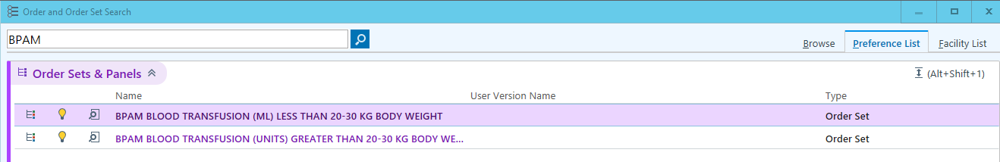
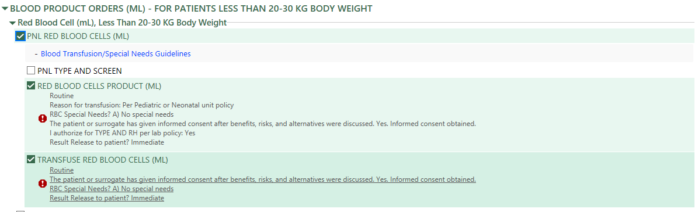

# Hematology & Oncology

## Neonatal Indirect Hyperbilirubinemia

<br/>

### Transcutaneous bilirubin (TCB) {#sec-tcb}

#### Timing

* qAM first 10 days of life
* Clinically indicated

#### Threshold for follow-up blood test

<style type="text/css">
.tg  {border-collapse:collapse;border-spacing:0;}
.tg td{border-color:black;border-style:solid;border-width:1px;font-family:Arial, sans-serif;font-size:14px;
  overflow:hidden;padding:10px 5px;word-break:normal;}
.tg th{border-color:black;border-style:solid;border-width:1px;font-family:Arial, sans-serif;font-size:14px;
  font-weight:normal;overflow:hidden;padding:10px 5px;word-break:normal;}
.tg .tg-fymr{border-color:inherit;font-weight:bold;text-align:left;vertical-align:top}
.tg .tg-0pky{border-color:inherit;text-align:left;vertical-align:top}
.tg .tg-0lax{text-align:left;vertical-align:top}
</style>
<table class="tg" style="undefined;table-layout: fixed; width: 607px">
<colgroup>
<col style="width: 218px">
<col style="width: 188px">
<col style="width: 201px">
</colgroup>
<thead>
  <tr>
    <th class="tg-fymr">Gestational Age</th>
    <th class="tg-fymr">TCB threshold</th>
    <th class="tg-fymr">Notify MD if:</th>
  </tr>
</thead>
<tbody>
  <tr>
    <td class="tg-0pky">&lt; 28 weeks CGA</td>
    <td class="tg-0pky">&ge;2 mg/dl</td>
    <td class="tg-0pky">&ge;5 mg/dl</td>
  </tr>
  <tr>
    <td class="tg-0pky">28-29 weeks CGA</td>
    <td class="tg-0pky">&ge;3 mg/dl</td>
    <td class="tg-0pky">&ge;6 mg/dl</td>
  </tr>
  <tr>
    <td class="tg-0pky">30-31 weeks CGA</td>
    <td class="tg-0pky">&ge;5 mg/dl</td>
    <td class="tg-0pky">&ge;8 mg/dl</td>
  </tr>
  <tr>
    <td class="tg-0pky">32-33 weeks CGA</td>
    <td class="tg-0pky">&ge;7 mg/dl</td>
    <td class="tg-0pky">&ge;10 mg/dl</td>
  </tr>
  <tr>
    <td class="tg-0pky">34 weeks CGA</td>
    <td class="tg-0pky">&ge;9 mg/dl</td>
    <td class="tg-0pky">&ge;12 mg/dl</td>
  </tr>
  <tr>
    <td class="tg-0lax" colspan="3">For &ge;35 weeks CGA, use www.bilitool.org (up to 146 hrs) or www.peditool.org (for &gt; 146 hrs):<br>If TCB in high-intermediate risk zone (&gt;75%ile of Bhutani nomogram) or TCB &ge;13, draw stat TSB and notify MD if TSB is high-risk zone or &ge;13 mg/dl</td>
  </tr>
</tbody>
</table>

#### Additional TCB screening for DAT+

```{mermaid}
flowchart TD
  A["DAT+ and GA ≥ 32wks"] --> B["Check TCB at 6 hrs"]
  B --> C["If TCB <4, continue regular screening"]
  B --> D["If TCB 4-5, repeat TCB at 12 hrs"]
  B --> E["If TCB ≥ 5, draw TSB. Notify MD if TSB ≥ 5"]
  D --> E
```

[dotPhrase](#sec-dotphrase-tcbiliprotocol)

<br/>

### Phototherapy for preterm infants

|                            |          **Phototherapy**         |      **Exchange transfusion**     |
|----------------------------|:---------------------------------:|:---------------------------------:|
| **Gestational age (week)** | **Total serum bilirubin (mg/dl)** | **Total serum bilirubin (mg/dl)** |
| < 28 0/7                   |                5-6                |               11-14               |
| 28 0/7 - 29 6/7            |                6-8                |               12-14               |
| 30 0/7 - 31 6/7            |                8-10               |               13-16               |
| 32 0/7 - 33 6/7            |               10-12               |               15-18               |
| 34 0/7 - 34 6/             |               12-14               |               17-19               |

<br/>

### IVIG for ABO incompatibility

* Dose: 1g/kg/dose
* Administration instruction: 1mg/kg/min for the first 30 min; if tolerated, increase gradually to a maximum of 8mg/kg/min. Total administration time: 6 hrs.

<br/>
<br/>




## Alpha-fetoprotein (AFP) Reference Range

<br/>

### Term infants (GA ≥ 37wks) without additional risk factors for AFP elevation


<br/>

### Preterm infants (GA < 37wks) without additional risk factors for AFP elevation


<style type="text/css">
.tg  {border-collapse:collapse;border-spacing:0;}
.tg td{border-color:black;border-style:solid;border-width:1px;font-family:Arial, sans-serif;font-size:14px;
  overflow:hidden;padding:10px 5px;word-break:normal;}
.tg th{border-color:black;border-style:solid;border-width:1px;font-family:Arial, sans-serif;font-size:14px;
  font-weight:normal;overflow:hidden;padding:10px 5px;word-break:normal;}
.tg .tg-fymr{border-color:inherit;font-weight:bold;text-align:left;vertical-align:top}
.tg .tg-0pky{border-color:inherit;text-align:left;vertical-align:top}
</style>
<table class="tg">
<thead>
  <tr>
    <th class="tg-fymr">Age (days)</th>
    <th class="tg-fymr">AFP mean (ng/mL)</th>
    <th class="tg-fymr">AFP 95% confidence interval (ng/mL)</th>
  </tr>
</thead>
<tbody>
  <tr>
    <td class="tg-0pky">0</td>
    <td class="tg-0pky">158,125</td>
    <td class="tg-0pky">31,261-799,834</td>
  </tr>
  <tr>
    <td class="tg-0pky">1</td>
    <td class="tg-0pky">140,605</td>
    <td class="tg-0pky">27,797-711,214</td>
  </tr>
  <tr>
    <td class="tg-0pky">2</td>
    <td class="tg-0pky">125,026</td>
    <td class="tg-0pky">24,717-632,412</td>
  </tr>
  <tr>
    <td class="tg-0pky">3</td>
    <td class="tg-0pky">111,173</td>
    <td class="tg-0pky">21,979-562,341</td>
  </tr>
  <tr>
    <td class="tg-0pky">4</td>
    <td class="tg-0pky">98,855</td>
    <td class="tg-0pky">19,543-500,035</td>
  </tr>
  <tr>
    <td class="tg-0pky">5</td>
    <td class="tg-0pky">87,902</td>
    <td class="tg-0pky">17,378-444,631</td>
  </tr>
  <tr>
    <td class="tg-0pky">6</td>
    <td class="tg-0pky">77,625</td>
    <td class="tg-0pky">15,346-392,645</td>
  </tr>
  <tr>
    <td class="tg-0pky">7</td>
    <td class="tg-0pky">69,183</td>
    <td class="tg-0pky">12,589-349,945</td>
  </tr>
  <tr>
    <td class="tg-0pky">8-14</td>
    <td class="tg-0pky">43,401</td>
    <td class="tg-0pky">6,039-311,889</td>
  </tr>
  <tr>
    <td class="tg-0pky">15-21</td>
    <td class="tg-0pky">19,230</td>
    <td class="tg-0pky">2,667-151,356</td>
  </tr>
  <tr>
    <td class="tg-0pky">22-28</td>
    <td class="tg-0pky">12,246</td>
    <td class="tg-0pky">1,164-118,850</td>
  </tr>
  <tr>
    <td class="tg-0pky">29-45</td>
    <td class="tg-0pky">5,129</td>
    <td class="tg-0pky">389-79,433</td>
  </tr>
  <tr>
    <td class="tg-0pky">46-60</td>
    <td class="tg-0pky">2,443</td>
    <td class="tg-0pky">91-39,084</td>
  </tr>
  <tr>
    <td class="tg-0pky">61-90</td>
    <td class="tg-0pky">1,047</td>
    <td class="tg-0pky">19-21,878</td>
  </tr>
  <tr>
    <td class="tg-0pky">91-120</td>
    <td class="tg-0pky">398</td>
    <td class="tg-0pky">9-18,620</td>
  </tr>
  <tr>
    <td class="tg-0pky">121-150</td>
    <td class="tg-0pky">193</td>
    <td class="tg-0pky">4-8,318</td>
  </tr>
  <tr>
    <td class="tg-0pky">151-180</td>
    <td class="tg-0pky">108</td>
    <td class="tg-0pky">3-4,365</td>
  </tr>
  <tr>
    <td class="tg-0pky">181-270</td>
    <td class="tg-0pky">47</td>
    <td class="tg-0pky">8-2,630</td>
  </tr>
  <tr>
    <td class="tg-0pky">271-360</td>
    <td class="tg-0pky">18</td>
    <td class="tg-0pky">4-832</td>
  </tr>
  <tr>
    <td class="tg-0pky">361-720</td>
    <td class="tg-0pky">4</td>
    <td class="tg-0pky">0-372</td>
  </tr>
</tbody>
</table>

<br/>

### Reference

* M. E. G. Blohm, D. Vesterling-Hörner, G. Calaminus & U. Göbel (1998) Alpha1-Fetoprotein (AFP) Reference Values in Infants up to 2 Years of Age, Pediatric Hematology and Oncology, 15:2, 135-142, DOI: <https://doi.org/10.3109/08880019809167228>{target="_blank"}  

<br/>
<br/>



## Anemia of Prematurity Management for ELGAN/ELBW

### Background

Extremely low gestational age neonates (ELGAN) / extremely low birth weight (ELBW) infants are born with lower hematocrit and hemoglobin levels.

#### Reference Ranges at Birth

| Week of GA | RBC (×10¹²/L) | Hemoglobin (g/dL) | Hematocrit (%) | Mean Corpuscular Volume (fL) |
|------------|---------------|-------------------|----------------|------------------------------|
| 18–21      | 2.85 ± 0.36   | 11.7 ± 1.3        | 37.3 ± 4.3     | 131.11 ± 10.97               |
| 22–25      | 3.09 ± 0.34   | 12.2 ± 1.6        | 38.6 ± 3.9     | 125.1 ± 7.84                 |
| 26–29      | 3.46 ± 0.41   | 12.9 ± 1.4        | 40.9 ± 4.4     | 118.5 ± 7.96                 |
| >36        | 4.70 ± 0.40   | 16.5 ± 1.5        | 51.0 ± 4.5     | 108.0 ± 5.00                 |

Anemia of prematurity is an earlier and more dramatic physiologic anemia that occurs in preterm infants, often around 4–6 weeks of age, with hemoglobin nadirs of **7–10 g/dL** (hematocrit **21–30%**).

**Common symptoms** (when present): tachycardia, pallor, poor feeding, reduced weight gain.  
Most infants remain asymptomatic.

#### Key Evidence Notes

- Early high-dose EPO is safe in GA ≤ 26 weeks but does not improve short- or long-term outcomes (Juul et al. 2020).
- pRBC transfusions may be associated with transfusion-related acute lung injury (TRALI) and transfusion-associated necrotizing enterocolitis (ta-NEC), although evidence remains limited and inconsistent (Maria et al. 2017; Khashu et al. 2022).


<br/>

### Management

#### General Measures to Optimize Blood Volume and Reduce Iatrogenic Loss
- Deferred cord clamping for up to 60 seconds in infants with good tone in the delivery room (NRP 9th edition).
- Correlate serum electrolytes with ABG electrolytes (Na, K, iCa) and trend using ABG when frequent monitoring is required.  
  *Attempt daily correlation during the acute phase.*
- Combine laboratory tests whenever possible to minimize blood draws.

#### Epogen (EPO) Therapy
- May be started earlier than 7 days of life if there is a rapid drop in hematocrit (at the discretion of the neonatologist) or if Hct < 32%.
- From the PENUT trial: Safe to administer from birth. No significant benefit in short- or long-term outcomes, but associated with fewer pRBC transfusions (2 [0–5] vs 4 [2–7]).
- **Dose**: 400 U/kg on Monday, Wednesday, and Friday.

#### Iron Therapy
- Begin once the infant tolerates **100 mL/kg/day** of enteral feeds.
- **Dose**: 3 mg/kg/day divided twice daily.


<br/>

### Packed Red Blooc Cell (pRBC) Transfusion

**For non-urgent transfusions**: The outgoing and incoming neonatologists should discuss and agree on the necessity prior to proceeding.

#### 1. Determine if Infant is Acutely Ill

| Category              | Not Acutely Ill                                                                 | Acutely Ill                                                                 |
|-----------------------|----------------------------------------------------------------------------------|-----------------------------------------------------------------------------|
| **Respiratory**       | FiO₂ < 30% on invasive ventilation with adequate support<br>FiO₂ < 40% on non-invasive ventilation with adequate support | FiO₂ ≥ 30% on invasive ventilation despite adequate support<br>FiO₂ ≥ 40% on non-invasive ventilation despite adequate support |
| **Metabolic**         | No acute severe metabolic acidosis                                               | Acute severe metabolic acidosis (pH < 7.2, BE < -6, or HCO₃ < 12)          |
| **Clinical Status**   | Not on NEC watch<br>Not undergoing sepsis evaluation<br>No upcoming surgery<br>No recent major bleeding<br>Asymptomatic | On NEC watch<br>Being evaluated for sepsis<br>Upcoming surgery<br>Major bleeding (e.g., Grade 3 IVH, pulmonary hemorrhage) within 3 days<br>Symptomatic |

#### 2. Transfusion Thresholds

| Time Period     | Hemoglobin (g/dL) – Not Acutely Ill | Hemoglobin (g/dL) – Acutely Ill | Hematocrit (%) – Not Acutely Ill | Hematocrit (%) – Acutely Ill |
|-----------------|-------------------------------------|---------------------------------|----------------------------------|------------------------------|
| DOL 0–7         | 10                                  | 11                              | 30                               | 33                           |
| DOL 8–14        | 8.5                                 | 10                              | 25                               | 30                           |
| DOL ≥ 15        | 7                                   | 9                               | 21                               | 27                           |

#### 3. Transfusion Volume
- **Standard**: 10–15 mL/kg over 4 hours.
- If 20 mL/kg is required: Consider splitting into two 10 mL/kg aliquots, each over 4 hours (total 8 hours).

#### 4. NPO Practice
- Keep NPO for **1 hour before and 1 hour after** transfusion.

#### 5. Transfusion Routes
- UVC
- UAC
- PIV
- IO

### References

- Juul, Sandra E., et al. 2020. “A Randomized Trial of Erythropoietin for Neuroprotection in Preterm Infants.” *The New England Journal of Medicine* 382 (3): 233–43.
- Khashu, Minesh, et al. 2022. “Current Understanding of Transfusion-Associated Necrotizing Enterocolitis: Review of Clinical and Experimental Studies and a Call for More Definitive Evidence.” *Newborn* 1 (1): 201–8.
- Maria, Arti, Sheetal Agarwal, and Anu Sharma. 2017. “Acute Respiratory Distress Syndrome in a Neonate Due to Possible Transfusion-Related Acute Lung Injury.” *Asian Journal of Transfusion Science* 11 (2): 203–5.


<br/>

### Consent

Refer to @sec-blood-transfusion.

<br/>

### Procedure

* Transfuse over 4 hours with 1 hour NPO before and after transfusion.  
* 15 (10-18) ml/kg per aliquot. If needing 20ml/kg, consider splitting into 2 aliquots.

<br/>

### Order Blood for Transfusion {#sec-order-prbc}

* The **BPAM BLOOD TRANSFUSION (ML) LESS THAN 20-30 KG BODY WEIGHT** Order Set should be used when ordering any blood product and will automatically prompt you to enter all the information needed, so you should not have to write a separate "transfuse" order. 





* In the case of emergency blood, we are still able to obtain uncross matched O- PRBCs from blood bank WITHOUT an order, within 20 minutes.
* Please remember to document “Yes” under the Informed Consent Obtained section (unless it is an emergency transfusion and/or there was a reason that informed consent was not obtained). This is the section that the nurses reference to ensure that this has been done prior to beginning the transfusion and they document acknowledgement of that as well in their Flowsheet.

Click [Here](files/90867 BPAM.MDWorkflow.JA.2.22.21.pdf){target="_blank"} to view and download the workflow PDF.  
Click [Here](BPAM_Provider Practice Alert- Patient Education Requirements.pdf){target="_blank"} to view and download the Provider Practice Alert PDF.

</br>

### Emergency Blood Release {#sec-emergency-blood-release}

TWO FORMS TO FILL OUT:  

1. Emergency Blood Release/Waiver Form (<a href='files/Emergency Blood Release Waiver Form.pdf' target='_blank'>Download here</a>)  
2. Blodo Order/Release During Hemorrhage Protocol Form (<a href='files/Blood Order Release HP v9.pdf' target='_blank'>Download here</a>)  

#### Emergency Blood Release/Waiver Form

This needs a patient sticker and is walked down to blood bank by a member of the nursing team. This doesn’t need to be filled out completely or signed initially. There IS an expectation that it is completely filled out when we are able (when baby is more stable).  

#### Blood Order/Release Hemorrhage Protocol Form

This is more of a prompt that the nurse will need to follow when calling blood blank. It gives them all the information they need to initiate preparing blood/blood products.

#### Procedures
* Physician decide baby needs blood/blood products, calculates the amount and tells the nurse.
* Nurse collects/fills out Blood Order/Release Hemorrhage Protocol Form. Follow process instructions. (Once blood bank is notified prbc should be at bedside w/n 30 minutes, plt and FFP w/n 40 minutes).
* Nurse obtains Emergency Blood Release/Waiver, places patient sticker on form and **walks it down** to blood blank.
* Physician to place orders/fill out appropriate forms after patient stable enough to do so.

<br/>
<br/>


## Hypercoagulability Work-Up

<br/>

### Blood tests

* Protein C/S
* Antithrombin III
* PT/INR
* aPTT
* Anti-cardiolipin IgG/IgM 
* Factor V Leiden
* $\beta_{2}$ Glycoprotein IgG/IgM 



## Vitamin K Administration at Birth {#sec-vitK}

### AAP policy statement summary

[Click to open the policy statment](https://doi.org/10.1542/peds.2021-056036){target="_blank"}

**Summary and Recommendations** 

* Vitamin K Deficiency Bleeding (VKDB) remains a significant concern in newborn and young infants. Parenteral vitamin K has been shown to be the most effective way to prevent VKDB of the newborn and young infant, and the AAP recommends the following:

* Vitamin K should be administered to all newborn infants weighing >1500 g as a single, intramuscular dose of 1 mg within 6 hours of birth.

* Preterm infants weighing ≤1500 g should receive a vitamin K dose of 0.3 mg/kg to 0.5 mg/kg as a single, intramuscular dose. A single intravenous dose of vitamin K for preterm infants is not recommended for prophylaxis.

* Pediatricians and other health care providers must be aware of the benefits of vitamin K administration as well as the risks of refusal and convey this information to the infant’s caregivers.

* VKDB should be considered when evaluating bleeding in the first 6 months of life, even in infants who received prophylaxis, and especially in exclusively breastfed infants.

<br/>

### Dosing table

|     >1500g        |     1 mg (0.5 mL)       |
|-------------------|-------------------------|
|     1000-1500g    |     0.5 mg (0.25 mL)    |
|     600-999g      |     0.3 mg (0.15 mL)    |
|     400-599g      |     0.2 mg (0.1 mL)     |
|     <400g         |     0.1 mg (0.05 mL)    |