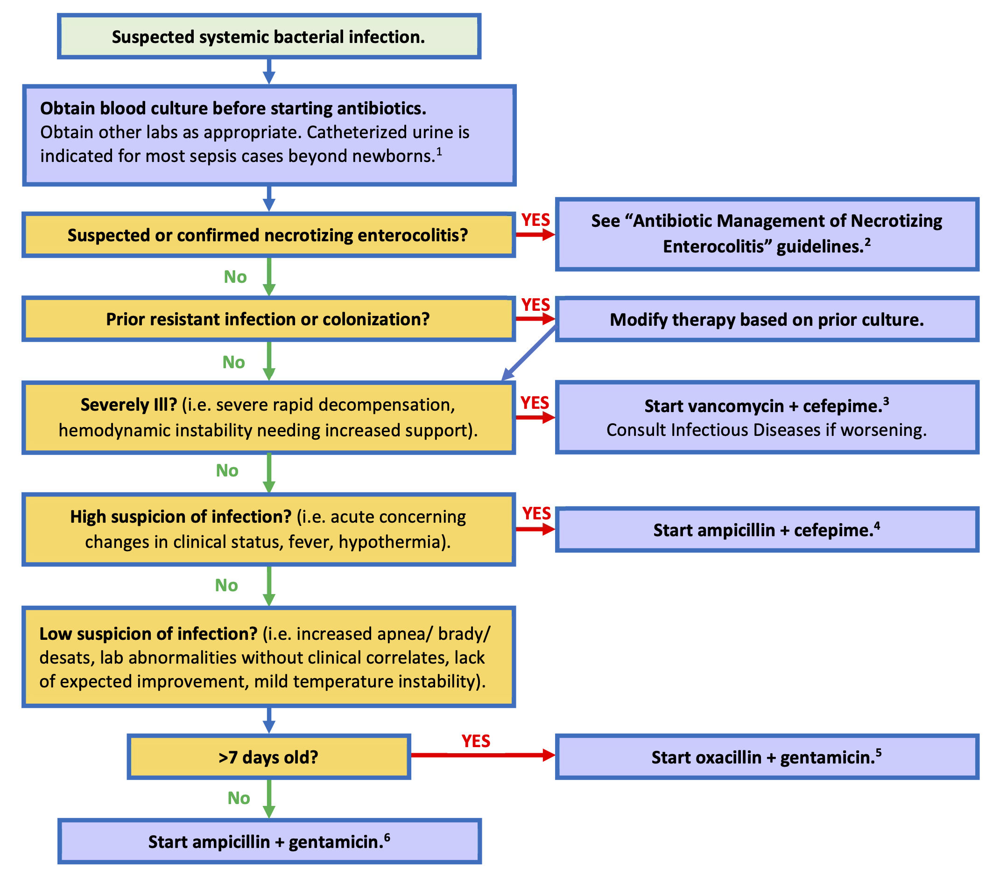
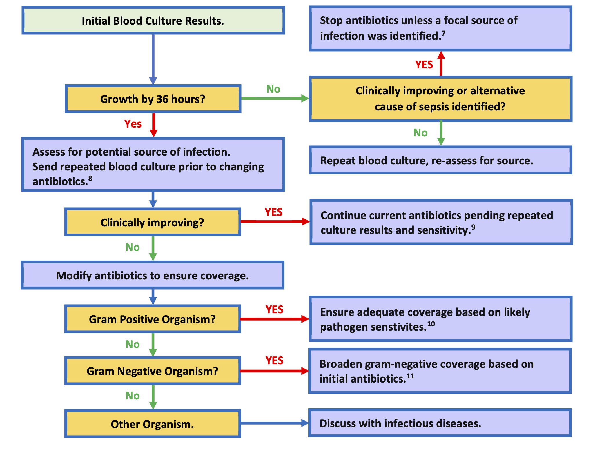
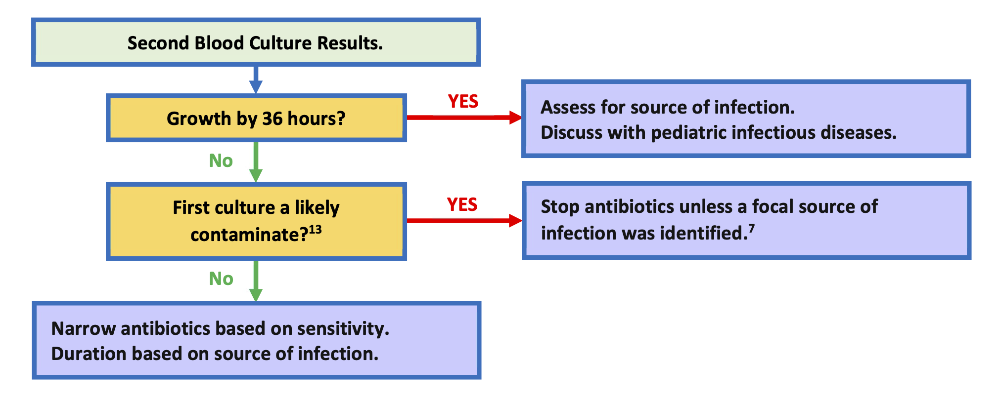
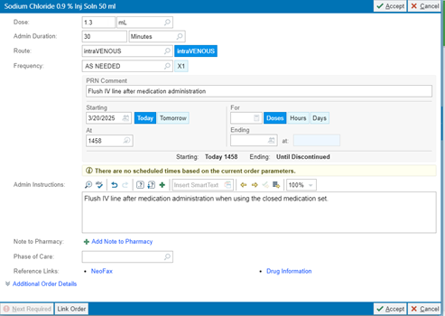

# Infectious Disease

## Antibiotic Management of Suspected Sepsis in the NICU {#sec-antibiotics-sepsis}

**Region Guidelines, Kaiser Permanente Southern California**  
**Pediatric Infectious Diseases**

**Updated 12/2025 by Sean Fitzwater**  
**Approved by regional Pediatric Infectious Diseases and NICU leadership 12/2025**  
**Questions or Comments? Please contact sean.p.fitzwater@kp.org**

### Background
Starting antibiotics for suspected bacterial sepsis is common in patients in the Neonatal Intensive Care Unit. Symptoms of bacterial sepsis are quite variable in NICU patients, ranging from poor improvement and isolated abnormal labs to fulminant shock. When antibiotics are started, the choice of antibiotics often varies between providers and among centers. Ultimately, most sepsis work ups are negative. When infections do occur, the bacteria that are likely to cause infections vary based on age, and not all bacteria are equally pathogenic. Furthermore, culture contamination is common, and the decision to treat likely contamination is based primarily on which antibiotic was initially started.

To address these concerns, these guidelines were developed to help prioritize antibiotic choice based on the patient’s age, illness severity, and overall suspicion of an active infection with the ultimate goal to ensure that critically ill infants are covered broadly, while limiting antibiotic exposure in lower risk infants to preserve antibiotics for the future and decreasing the number of contaminants that are treated needlessly.

### Flowchart: Antibiotic Management in NICU Suspected Bacterial Sepsis



### Flowchart: Interpretation of Primary Blood Culture Results




### Flowchart: Interpretation of Follow-up Blood Culture Results




### Further Considerations

1. Assessment for a urinary tract infection is indicated in most patients beyond the newborn period, as a high proportion of severe bacterial infections are caused by urinary tract infections. If a urinary tract infection is suspected obtain catheterized urinalysis with urine culture; bagged urines are not acceptable. If intubated or with a tracheostomy, consider a respiratory culture with gram-stain. If wounds are present and appear infected, consider cultures of the wound and drainage of any abscess. For severely ill infants, meningitis should be considered, and CSF studies obtained as appropriate. For infants < 30 days old herpes simplex virus (HSV) should be considered in severely ill infants. If HSV is suspected obtain HSV surface, blood, and CSF PCRs with ALT.

2. These guidelines are available on the Kaiser Permanente Pediatric Care SharePoint [https://sp-cloud.kp.org/sites/KaiserPermanentePediatricCare](https://sp-cloud.kp.org/sites/KaiserPermanentePediatricCare){target='_blank'}.

3. Cefepime and vancomycin provide broad coverage for gram-negative and gram-positive infection in NICU infants. Very few bacteria are not covered by this combination. Of note: HSV infections and Candida should be considered for severe infections, and, if suspected, started on treatment while the work is under way. Dosing medications for meningitis should be considered in severely ill patients unless meningitis has been ruled out.

4. Cefepime provides broader coverage of gram-negative rods when compared to gentamicin, as well as providing coverage for MSSA, and resistant Streptococci. Ampicillin provides coverage for Listeria, Enterococci, and most Streptococci.

5. MSSA, gram-negative rods, and Streptococci make up the majority of concerning infections in NICU infants older than 7 days. Risk of Staphylococcal infection is independent of if a central line is present.

6. Gram-negative rods, Streptococci, and Enterococci make up most infections in NICU infants 7 days and younger.

7. Based data from >22,000 blood culture sent for KP SoCal NICU patients, >93% of likely pathogens will grow from blood cultures by 36 hours, and the likelihood of a positive culture resulting after 36 hours is 0.12%.  
   Treating a patient for culture negative sepsis with 5 days of antibiotic may be reasonable in select patients where infection is highly suspected, but appropriately drawn cultures were negative.

8. CSF testing should be considered for all severely ill infants, those with gram-negative bacteremia, group B strep bacteremia, candidemia, or with concern for HSV. Coagulase negative Staphylococci typically do not cause CNS infection except if there is hardware in the CNS or through direct inoculation via CNS injury. Atypical organisms may require specific treatment and diagnostics. These include Candida and other fungal infections and HSV.

9. There is no benefit in using broader spectrum antibiotics once a pathogen is isolated, and in some cases broader spectrum antibiotics may lead to worse outcomes. Typically, the narrowest spectrum beta lactam is the preferred treatment.

10. The addition to vancomycin is sufficient coverage for most gram-positive infections, as nearly all Streptococci and coagulase negative Staphylococcus are vancomycin sensitive. Vancomycin can be substituted in place of ampicillin while final sensitivities and speciation are pending for these organisms. For instance changing a combination of ampicillin and cefepime to vancomycin plus cefepime is typically sufficient. For Listeria and Enterococci infections ampicillin should be continued.  
    *S. aureus* is difficult to treat and often leads to severe and complicated infections, so antibiotics should be optimized quickly after diagnosis. Cefepime and oxacillin have excellent activity against MSSA and are appropriate while final cultures are pending. Vancomycin has activity against *S. aureus*, but less so than oxacillin or cefepime for susceptible isolates. MRSA infections are rare in the NICU outside of outbreak settings. In non-improving patients with *S. aureus* infections vancomycin should be added in addition to oxacillin or cefepime until MRSA has been ruled out.

11. This would typically involve broadening from gentamicin to cefepime. In severely ill children who are clinically worsening, broadening from cefepime to meropenem would be a consideration in discussion with Pediatric Infectious Diseases. Meropenem escalation is not needed in patients with GNR infections who are stable or improving. The gram-negative coverage of antibiotics in the NICU is as follows: gentamicin 84%, cefepime 96%, meropenem 99%.

12. Neonates are at high risk of contaminated blood cultures given the difficulty obtaining blood samples. Contaminants typically include skin or gut flora, such as coagulase negative Staphylococcus species (*S. epidermidis*, *S. capitis*, *S. haemolyticus*, *S. hominis*, *S. warneri*.), low pathogenicity streptococci species, Aerococcus, Coryneforms, Micrococcus, etc. Contamination is likely if repeated blood cultures are negative while not on an antibiotic that covers the organisms, or poly microbial culture results.

### Table 1: Dosing of Empiric Intravenous Antibiotic Dosing for Suspected Bacteremia

| Antibiotic     | Gestational age       | Postnatal age      | Dose                          |
|----------------|-----------------------|--------------------|-------------------------------|
| **Ampicillin** | <35 weeks            | ≤ 7 days          | 50 mg/kg q12h                |
|                |                      | 8-28 days         | 75 mg/kg q12h                |
|                |                      | ≥ 29 days         | 50 mg/kg q6h     |
|                | ≥35 weeks            | < 29 days         | 50 mg/kg q8h                 |
|                |                      | ≥ 29 days         | 50 mg/kg q6h     |
| **Cefepime**   | All                  | < 14 days         | 30 mg/kg q12h                |
|                |                      | 14 to 29 days     | 50 mg/kg q12h                |
|                |                      | ≥ 29 days         | 50 mg/kg q8h                 |
| **Gentamicin***| <30 weeks PMA<sup>¥</sup>       | ≤ 7 days          | 5 mg/kg q48h                 |
|                |                      | 8-28 days         | 4 mg/kg q36h                 |
|                |                      | ≥ 29 days         | 4 mg/kg q24h                 |
|                | 30 to 34 weeks PMA<sup>¥</sup>  | ≤ 7 days          | 4.5 mg/kg q36h               |
|                |                      | ≥8 days           | 4 mg/kg q24h                 |
|                | ≥ 35 weeks PMA<sup>¥</sup>      | All               | 4 mg/kg q24h                 |
| **Oxacillin**  | <30 weeks PMA<sup>¥</sup>       | < 29 days old     | 25 mg/kg q12h                |
|                |                      | ≥ 29 days         | 25 mg/kg q8h                 |
|                | 30 to 36 weeks PMA<sup>¥</sup>  | < 15 days old     | 25 mg/kg q12h                |
|                |                      | ≥ 15 days         | 25 mg/kg q8h                 |
|                | 37 to 44 weeks PMA<sup>¥</sup>  | < 8 days          | 25 mg/kg q12h                |
|                |                      | ≥ 8 days          | 25 mg/kg q8h                 |
|                | ≥ 45 weeks PMA<sup>¥</sup>      | All               | 25 mg/kg q6h                 |
| **Meropenem**  | <32 weeks            | < 14 days         | 20 mg/kg q12h over 4 hours   |
|                |                      | ≥ 14 days         | 20 mg/kg q8h over 4 hours    |
|                | ≥32 weeks            | All               | 20 mg/kg q8h over 4 hours    |
| **Vancomycin***| Dosing and monitoring per pharmacy | | |

*Levels should be monitored in discussion with pediatric pharmacy if on gentamicin or vancomycin > 48 hours.  

¥PMA – Postmenstrual age (gestational age plus postnatal age)

### Table 2: Dosing of Empiric Intravenous Antibiotic Dosing for Suspected Meningitis

| Antibiotic     | Gestational age | Postnatal age     | Dose                              |
|----------------|-----------------|-------------------|-----------------------------------|
| **Ampicillin** | All            | ≤ 7 days old     | 100 mg/kg q8h                    |
|                |                | ≥ 8 days         | 75 mg/kg q6h                     |
| **Cefepime**   | All            | < 14 days        | 30 mg/kg q12h                    |
|                |                | ≥ 14 to 29 days  | 50 mg/kg q12h                    |
|                |                | ≥ 29 days        | 50 mg/kg q8h                     |
| **Meropenem**  | <32 weeks      | <14 days         | 40 mg/kg q12h over 4 hours       |
|                |                | ≥ 14 days        | 40 mg/kg q8h over 4 hours        |
|                | ≥32 weeks      | All              | 40 mg/kg q8h over 4 hours        |
| **Vancomycin***| Dosing and monitoring per pharmacy | | |

*Levels should be monitored in discussion with pediatric pharmacy if on gentamicin or vancomycin > 48 hours.

### References
a. KP SoCal NICU Bacteremia sensitivities analysis 2019-2023.  
b. NeoFax / Micromedex 12/2025.  
c. Red Book 2024–2027 Report of the Committee on Infectious Diseases.


<br/>
<br/>



## Early-Onset Sepsis (Old)

<br/>

### Early-onset sepsis calculator

<https://neonatalsepsiscalculator.kaiserpermanente.org/>

<br/>

### Screening

* All infants admitted to the NICU following birth should have a CBC/D and a blood culture drawn.
* Empiric antibiotics administration at the admitting neonatologist's discretion.

<br/>

### Sepsis algorithm for GA ≥ 32 weeks

:::{.column-screen-right}

```{mermaid}
flowchart TD
  A["Preterm delivery GA≥32 wks"] --> B["<ul><li>PROM</li><li>Preterm labor</li><li>Maternal fever/chorioamnionitis</li><li>Decreased fetal movement</li></ul>"]
  B --> C["32 to 33 6/7 wks"]
  B --> D["&ge;34 wks"]
  C --> E["Blood Cx<br/>Empiric Amp/Gent"]
  D --> F["EOS Calculator"]
  A --> G["Maternal indication"]
  G --> H["Clinically stable"]
  G --> I["Non-invasive respiratory support"]
  G --> J["Invasive respiratory support ±<br/>hemodynamic instability"]
  H --> K["Routine care"]
  I --> L["Monitor up to 4 hours"]
  L --> M["Consider routine care"]
  L --> N["No imporvement or worsening"]
  J --> O["Blood Cx<br/>Empiric Amp/Gent"]
  N --> O["Blood Cx<br/>Empiric Amp/Gent"]
  
style B text-align:left
```

:::

<br/>

### Empiric anbiotics (non-meningitic dosing)

#### Ampicillin 

* GA > 34 weeks
  - 50mg/kg/dose q8hrs (*alternative: 75mg/kg/dose q12hrs*)
* GA ≤ 34 weeks
  - 50mg/kg/dose q12hrs
  
  
#### Gentamicin

* GA < 30 weeks
  - 5mg/kg/dose q48hrs
* GA 30-34 weeks
  - 4.5mg/kg/dose q36hrs
* GA > 34 weeks
  - 4mg/kg/dose q24hrs
  
<br/>
<br/>



## Late Onset Sepsis (Old)

<br/>

### Evaluation

* Obtain **two** blood cultures from separate sites to rule out contamination  
* Obtain urinalysis and urine culture

:::{.callout-important}
PICC line should not be used for blood culture draw
:::

<br/>
<br/>


## CLABSI Reduction Bundle {#sec-clabsi-bundle}

<br/>

### Closed Medication Administration {#sec-close-medication-administration}

* Order: PRN 0.9%NS flush 1.3mL (#59883)

{width=100%}

<br/>
<br/>



## Urinary Tract Infection  {#sec-urinary-tract-infection}

<br/>

### Lab studies

* CBC/D
* (optional) CRP
* Blood culture
* Urinalysis (straight cath)
* Urine culture (straight cath)

### Empiric antibiotics

* Ampicillin and gentamicin

### Consensus guides

* do not need to repeat urine culture for test of cure
* repeat of urine culture may be considered if clinical symptoms/signs do not subside
* consult ID if recurrent UTI

### CPQCC resources

<iframe width="560" height="315" src="https://www.youtube.com/embed/S1wXm8dXICo?si=uWxX5d0dyzbk403F" title="YouTube video player" frameborder="0" allow="accelerometer; autoplay; clipboard-write; encrypted-media; gyroscope; picture-in-picture; web-share" referrerpolicy="strict-origin-when-cross-origin" allowfullscreen></iframe>

[Right-click to download slides](files/LS19 Didactic Zangwill Slides.pdf){target="_blank"}

<br/>
<br/>


## Hepatitis C Virus

<br/>

### Screening for vertical transmission

* Hepatitis C RNA at 2-6 months of age
* Anti-Hepatistic C Antibody at 18 months of age

### Brastfeeding

* Encouraged provided mother's nipples do not bleed or become cracked.

  
<br/>
<br/>



## Policy for neonate with HIV-infected mother {#sec-hiv-management}

Per protocol SC.RIV.MCH.2342. 

<br/>

### Neonate handling

* Universal precautions including eye covers/face shields
* Do NOT handle unwashed neonate
*Wash neonate immediately after initial stabilization
* Hold all injections until infant is bathed

<br/>

### Breastfeeding

* All pregnant persons with HIV will be refer to Pediatric Infectious Disease for counseling about breast/chestfeeding option, ideally prior to the third trimester.   
* While avoidance of breastfeeding is the only infant feeding option with 0% risk of HIV transmission, the AAP acknowledges that people with HIV may express a desire to breastfeed, and pediatricians should be prepared to offer a family-centered, nonjudgmental, harm reduction approach to support people with HIV *on ART* with *sustained viral suppression below 50 copies per mL* who desire to breastfeed. 

#### References

* [Recommendations for the Use of Antiretroviral Drugs During Pregnancy and Interventions 
to Reduce Perinatal HIV Transmission in the United States](https://clinicalinfo.hiv.gov/sites/default/files/guidelines/documents/perinatal-hiv/infant-feeding-individuals-hiv-united-states-perinatal.pdf){target="_blank"}
* [AAP Clinical Report May 20, 2024](https://doi.org/10.1542/peds.2024-066843){target="_blank"}

<br/>

### Neonate HIV screening and prophylaxis

* Order set: 3532 INFANT of HIV INFECTED MOTHER PEDS IP SCAL
* Send off HIV PCR from babies blood, start on retrovir to administer by 6-8hrs of life. 
* Depending on mother's viral load, if uncontrolled, will add nevirapine and lamivudine (details available in the order set)