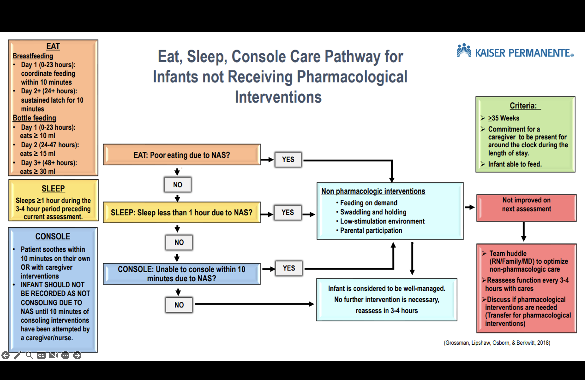
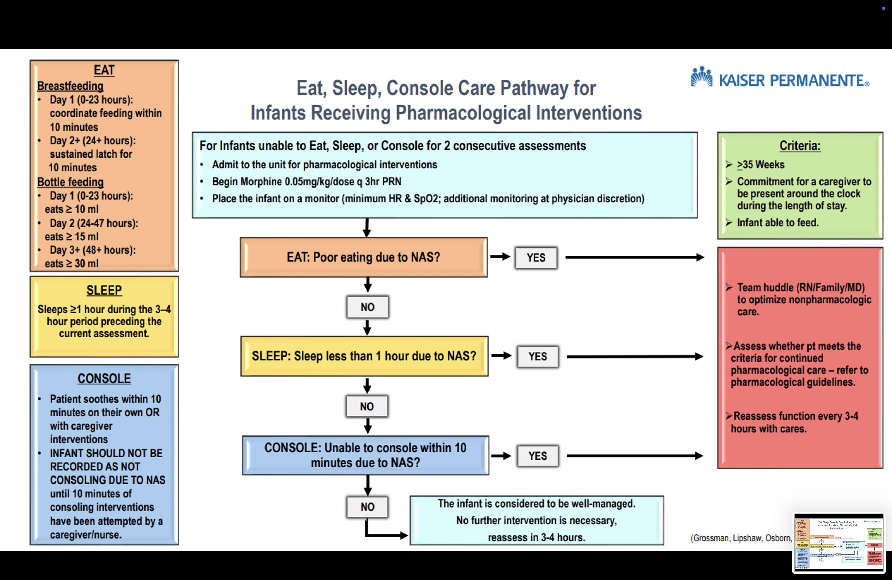
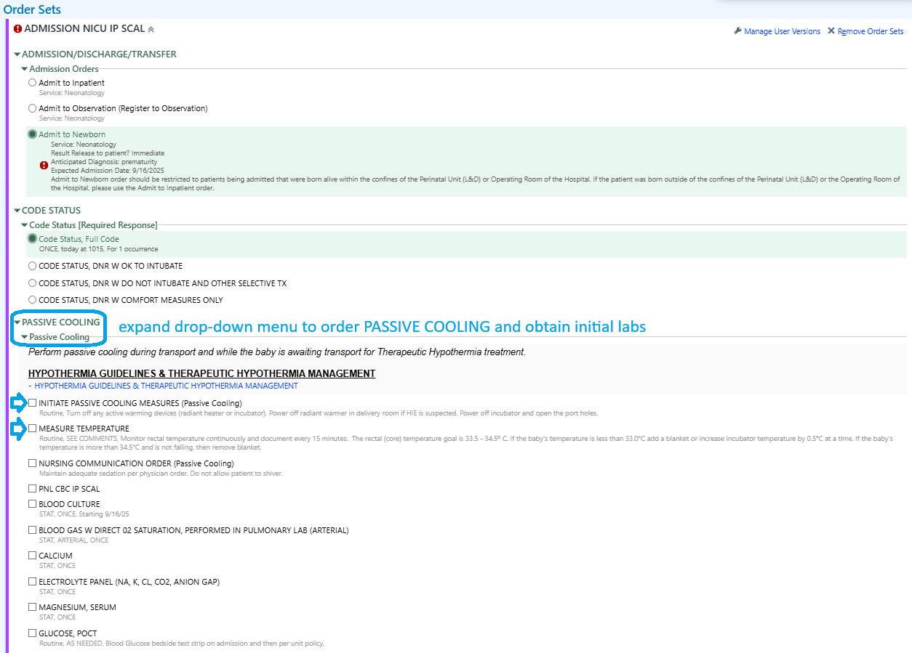
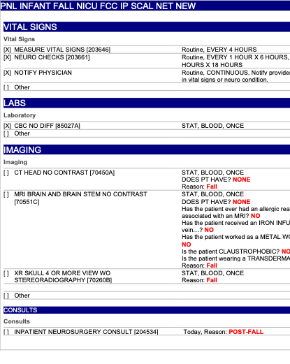

# Neurology

## Neonatal Abstinence Syndrome - Eat, Sleep, Console {#sec-nas-esc}

Source: [Clinical Library](https://cl.kp.org/scal/cpg/neonatal/neonatal-abstinence-syndrome-esc.html?q=eat%20sleep%20console&context=searchkp){target="_blank"}


### Eat Sleep Console (ESC) Inpatient Protocol for Neonatal Abstinence Syndrome (NAS) - SCAL Regional Guidance

**Date:** May 2024  
**Current Version Issued:** June 2024  

---

#### Patient Eligibility

Infants born at ≥35 weeks with maternal opioid exposure in the month prior to birth, including but not limited to:

- Morphine
- Methadone
- Buprenorphine (Subutex or Suboxone)
- Heroin
- Fentanyl
- Prescription pain-control opioids including Tramadol

**Note:** All infants with recent opioid exposure should have a urine toxicology screen performed.

---

#### Non-Pharmacologic Care

**THE FIRST AND MOST IMPORTANT STEP OF NON-PHARMACOLOGIC CARE IS CAREGIVER EMPOWERMENT.**

Caregivers should be encouraged to be champions for their child's NAS care. Caregivers/family are the best treatment for the NAS patient. Nurses should review the caregivers' role in supporting **Eat, Sleep, and Console** by:

- Skin-to-skin contact
- Swaddling/holding
- Maintaining a low-stimulation environment
- Responding early to feeding cues

Caregivers should identify additional support if needed. For mothers compliant with a drug treatment program and no history of illicit drugs, breastfeeding is strongly recommended.

##### Low-Stimulation Environment (Starting at Birth)

- Parental/Caregiver presence
- Cluster cares
- Uninterrupted sleep
- Dim lights
- Limit background noise (e.g., TV, phone)
- Limit visitors
- Swaddling to lessen stimulation and promote sustained sleep
- Early response to infant signals before agitation amplifies
- Kangaroo care and pacifiers to calm infants
- Prevent diaper dermatitis with petrolatum-based ointments or zinc oxide barriers at every diaper change
- Teach appropriate positioning and comforting techniques (swaying, rocking)
- Frequent small-volume feeds for adequate growth (special feeding plan if weight gain is inadequate)
- Consider partially hydrolyzed low-lactose formula for severe diarrhea
- Promote rooming-in while assessing NAS severity
- Transfer to NICU/private pediatric room if pharmacologic treatment is needed

**Key Point:** Active maternal participation, especially breastfeeding (for compliant mothers), is the best non-pharmacologic care.

---

#### ESC Assessment

**Start:** 6-8 hours of age  
**Frequency:** Score every 3-4 hours AFTER feeding, preferably while held  

##### Observation Periods Before Discharge

Based on maternal substance exposure:

- **Pain Control Opioids Alone (e.g., Norco, no co-exposures):** 2-3 days
- **Heroin or Fentanyl:** 3 days
- **Buprenorphine or Methadone:** 3-5 days
- **Opioids + Co-Exposures (SSRI, amphetamines, cocaine, smoking/vaping, benzodiazepines):** 3-5 days

##### Discharge Breastfeeding Guidance

- **Methadone or Buprenorphine:** Continue breastfeeding
- **Pain Control Opioids (Taper Plan):** Continue breastfeeding
- **Pain Control Opioids (No Taper Plan):** Wean off breastmilk at 1 month

**Important:** Use ESC scoring only—do NOT use Finnegan scoring for NICU admission or opioid treatment decisions.

##### ESC Definitions

Score only after ruling out other causes (e.g., prematurity, tongue-tie, post-circumcision).

###### *Eat*
- **Breastfeeding:**
  - Day 1 (0-23 hours): Coordinate feeding within 10 minutes
  - Day 2+ (24+ hours): Sustained latch for 10 minutes
- **Bottle Feeding:**
  - Day 1 (0-23 hours): ≥10 ml
  - Day 2 (24-47 hours): ≥15 ml
  - Day 3+ (48+ hours): ≥30 ml

**Note:** Offer a bottle if feeding cues persist after breastfeeding to avoid hunger-related agitation.

###### *Sleep*
- Sleeps ≥1 hour during the 3-4 hour period preceding assessment

###### *Console*
- Soothes within 10 minutes on own or with caregiver interventions
- Do not score as "not consoling" due to NAS until 10 minutes of consoling attempts have been made

##### Escalation Steps
If unable to eat, sleep, OR console:
1. Notify physician
2. Team huddle (caregiver/parent, RN, physician) to optimize non-pharmacologic measures
3. If still unable, discuss NICU/Pediatrics transfer for pharmacologic intervention

---

#### Pharmacologic Care

**Initial Treatment:** Morphine rescue doses  
**Avoid:** Phenobarbital (except for seizures)

##### Morphine PRN
- **Dose:** 0.05 mg/kg/dose every 3 hours PRN if unable to eat, sleep, or console
- **Escalation:** If ≥6 doses in 24 hours, start methadone taper

##### Methadone Taper
For infants failing morphine PRN dosing:

| Step | Dose (mg/kg) | Frequency          | Duration       |
|------|--------------|--------------------|----------------|
| A  | 0.1          | Every 6 hours      | 4 doses        |
| **1***    | **0.07**         | **Every 12 hours**     | **2 doses**  (start here)        |
| 2    | 0.05         | Every 12 hours     | 2 doses        |
| 3    | 0.04         | Every 12 hours     | 2 doses        |
| 4    | 0.03         | Every 12 hours     | 2 doses        |
| 5    | 0.02         | Every 12 hours     | 2 doses        |
| 6    | 0.01         | Every 12 hours     | 2 doses        |
| 7    | 0.01         | Every 24 hours     | 1 dose         |

_*\*Start at Step 1. If Step 1 fails (unable to eat, sleep, or console ×2 assessments), go to Step A. Then resume Step 1.*_

**Notes:**
- Methadone may prolong QTc interval; obtain ECG if family history is positive
- Adjust doses explicitly in mg for small babies in KPHC
- Rescue Morphine (0.05 mg/kg) if unable to eat, sleep, or console at any step
- Change methadone dose only once daily

###### *Daily Methadone Algorithm*
- **Escalation:** If ≥2 morphine rescue doses on Step 1, move to Step A and consider clonidine
- **Weaning:** Proceed to next step if <50% of ESC assessments show issues in prior 24 hours
- **Hold Wean:** If ≥50% of ESC assessments show issues, hold until <50%, then resume
- **Discontinue:** If no ESC issues after Step 7

##### Adjunct Clonidine
- **When:** If Step 1 fails and escalates to Step A (e.g., polysubstance exposure)
- **Dose:** 1.5 mcg/kg/dose every 6 hours
- **Weaning:** After methadone discontinuation—50% dose Day 1, 25% dose Day 2, then off
- **Monitoring:** Consult Pediatric Nephrology/Cardiology for BP checks (clonidine may lower BP, though not clinically significant at these doses)

---

#### Discharge Criteria

##### Non-Pharmacologic Treatment
- Admitted ≥72 hours from birth
- ESC successful for 24 hours without additional nursing support (caregiver independent)

##### Pharmacologic Treatment
- Admitted ≥72 hours from birth
- **PRN Morphine Only:** Observe 24 hours from last dose
- **Methadone Only:** Observe 36-48 hours from last dose
- **Methadone + Clonidine:** Observe 24-48 hours from last clonidine dose

**Additional Consideration:** Adequate weight gain as a proxy for withdrawal severity  
**Follow-Up:** Primary care visit within 48 hours post-discharge to monitor weight and withdrawal signs

---

#### Algorithm



<br/>



#### About This Resource

**Adapted From:** Eat Sleep Console (ESC) Inpatient Protocol for NAS - NCAL Regional Guidance  
**Modified By:** SCAL Eat, Sleep, Console Regional Workgroup  
**Audience:** Inpatient Maternal-Child Health clinicians (Family Centered Care, NICU, Pediatrics)  
**Contributors:**
- Kerri L. Covert, RN - Maternal Child Health Clinical Consultant V (Kerri.L.Covert@kp.org)
- Sarah E. Ceja, RN - Maternal Child Health Clinical Consultant V (Sarah.E.Cejagkp.org)

<br/><br/>


## Neonatal Abstinence Syndrome - Old Management {#sec-nas-old}

<br/>

### Purpose  

The purpose of this document is to help reduce neonatal length of stay and treatment by increasing the reliability of Neonatal Abstinence Syndrome (NAS) scoring, optimizing family- and patient-centered care with non-pharmacologic treatments, and standardizing pharmacologic management of the neonate. NAS is a drug-withdrawal syndrome most commonly occurring after *in utero* drug exposure resulting from the abrupt discontinuation of opioids at birth after a fetus has become physically dependent through exposure in the womb or as a result of postnatal opioid exposure resulting in tolerance and dependence. Characteristics of NAS include signs and symptoms indicating CNS hyperirritability and dysfunction of the autonomic nervous system, gastrointestinal tract, and respiratory system.  Factors that contribute to the severity of NAS include: genetics, gestation of the infant, polydrug or polysubstance abuse, smoking, combination with antidepressants, combination with benzodiazepines, separation of mother and baby, and environmental stimuli. The Neonatal Abstinence Scoring System (NASS) assists in the detection of the onset of withdrawal symptoms and charts the progression and response to therapeutic intervention.  

<br/>

### General care  

* Infants with suspected withdrawal symptoms are to be cared for in a quiet room or area in the unit. Encourage mother and family members to provide care whenever possible. Rooming-in will be encouraged. Infants should be placed away from entrance (for security reasons) and are to remain within the secured area until discharged or cleared by physician/social services. Security sensors are recommended.  
  - All infants born to mothers with suspected or known substance use will have the first void sent for toxicology screening.  
  - If unable to send the first urine, send the earliest urine possible.  
  - If urine screen is positive, refer to Social Services so that they can contact Department of Children’s Family Services (DCFS).  
* An approved Neonatal Abstinence Scoring Tool (Finnegan Neonatal Abstinence Scoring) is to be used on all infants with maternal history of substance use within the pregnancy, including opiates, amphetamines, cocaine, SSRI, benzodiazepines, and symptomatic infants of known or suspected maternal substance(s) use.  
  - Treatments of withdrawal symptoms are based on infant’s total score (Scores greater than or equal 8 for three consecutive screens will be reported to physician).  
  - All symptoms exhibited during the entire scoring interval, not just a single point in time, should be included.  
  - Infants at risk for NAS (whose screens are positive on admission for opioids or benzodiazepines or who are symptomatic) should be observed for a minimum of **72 hours** of age before discharge home. There is no clearly defined maternal opioid intake below which a fetus is not at risk for NAS. If there is a question about need for observation in the setting of low dose maternal opioid use, a neonatology consult should be considered.  
* The NASS (scores) is a permanent part of the medical record.  
* Infants requiring pharmacotherapy will be cared for in the NICU or Pediatrics.  

<br/>

### Specific procedures

#### Admission assessment  

* Review maternal history for no/late prenatal care, history of drug abuse, suspected maternal drug abuse, placenta abruption, and preterm labor.
* Assess the infant for birth defects, decreased birth weight, decreased head circumference, decreased length, intrauterine growth restriction (IUGR), small for gestational age (SGA), and/or dysmorphic features.   
* Assess and record vital signs according to provider order.  
* Request physician order for toxicology screen.  
* Assess the infant for suspected drug effects and withdrawal symptoms.   

#### Safety / comfort 

* DO NOT administer naloxone (Narcan®) to an infant with known withdrawal symptoms, drug exposure, or suspected drug exposure. In these cases, naloxone can cause immediate, severe withdrawal including seizures and death.  
* Maintain Neutral Thermal Environment (NTE).  

#### Sensory  

* Respond early to infant cues.
* Monitor the environment and decrease sensory overload by:  
  - Decreasing noise and light.  
  - Silencing equipment alarms quickly.  
  - Decreasing excessive tactile stimulation.  
* Place boundaries snugly around the infant using rolled blanket or other developmentally supportive supplies with hands available for sucking.  
* Use containment of upper and lower extremities (gently hold infant’s hands against their chest and feet while flexing the legs) when providing care when the infant is unwrapped.  
* A relaxed hold and rocking is recommended against a parent’s body for irritability or crying. Encourage and assist with skin to skin (Kangaroo Care).  
* Do not overdress; consider using a shirt, diaper and light blanket without other clothing.  
* Consider tub bath to calm an irritable or stiff infant.  
* Offer pacifier for non-nutritive sucking to an irritable or frantic infant.  

<br/>

#### Skin  

* Apply skin barrier ointment to buttocks as ordered.  
* Apply transparent or Mepilex® dressing to pressure areas (e.g. knees, bony prominences, etc.) as needed.  

#### Nutrition

* Support and encourage breastfeeding and/or pumping whenever possible and not contraindicated.  
* <span style=color:red;>Offer small, frequent feedings (every 2 hours instead of every 3-4 hours). Do not overfeed.</span>  
* If infant takes greater than 20 minutes to bottle feed, consider gavage feeding.  
* Collaborate with physician to initiate 22 or 24 calorie breastmilk/formula if not gaining weight.  
* Consider a low lactose formula if infant is having feeding intolerance.  

#### Abstinence score

* Start Finnegan Neonatal Abstinence Scoring **after feeds every 3 to 4 hours when the newborn is 12 hours of age**. Finnegan Neonatal Abstinence Scoring can also be used for infants who have received iatrogenic opioids or benzodiazepines for a significant amount of time (greater than 7 days) or are exhibiting withdrawal symptoms. (Note: physician order is not required to initiate NAS scoring.)  
* If, after cessation of pharmacotherapy the score is less than 8 for 3 days from the last weaning dose, scoring may be discontinued.  

#### Parent and family education

* Establish a trusting, non-judgmental relationship with mother and family.  
* Determine who the primary caregiver will be.  
* Determine what special fears or concerns parents have.  
* Instruct parents/care giver on comfort and coping mechanisms which meet infant’s specific needs.  
* Discuss that infant may be less responsive to visual stimulation and that some symptoms of withdrawal may persist for 2-6 months.  
* Promote parents and/or significant other demonstration of positive parenting behavior as related to bonding and the “taking hold” phase as described below.  
  - Hold infant while feeding.  
  - Presence of eye-to-eye contact between caregiver and infant.  
* Provide community resources to assist with parenting, foster care and drug rehabilitation; give phone numbers and names of contact individuals if possible.  

#### Discharge

* All infants receiving pharmacologic treatment for NAS will be referred to the High Risk Infant follow up program/ clinic.  

<br/>

### Pharmacologic treatment guidelines

Opioids – Pharmacologic treatment of NAS is indicated for NASS scores of 8 or higher for three consecutive scoring sessions or 12 for two consecutive scoring sessions despite non-pharmacologic measures (before the third week of life). In addition to treating infant for abstinence syndrome related to maternal use, pharmacologic treatment can be used for infants who have received iatrogenic opioids.  

#### General principles

* [Methadone](#sec-methadone) dosing steps are listed below.   
* Escalate (by adding an extra dose of methadone at the current step or return to the previous step) if the average Finnegan score is greater than 12.  
* If the average Finnegan score is 8 to 12, do not wean. Stay on the current step.  
* Wean down to the next step if the average Finnegan score is less than 8 for the past 24 hours.  
* Discharge – Observe for 72 hours from the last dose of step 8 if methadone is the only treatment agent.  

#### Methadone dose {#sec-methadone}  

1. Initial – Step 1 – 0.1 mg/kg orally every 6 hours times 4.  
    i) If sufficient response (average score is less than 8 for the past 24 hours), wean directly to Step 2.  
    ii) If insufficient response (average score remains greater than 12),  
        A.    Consider raising the dose to 0.1 mg/kg orally every 4 hours times 6. If increased dose is insufficient, consider adding [clonidine](#sec-clonidine).    
        B.    Once stabilized (if the average Finnegan score is less than 8 for the past 24 hours), wean 0.1 mg/kg orally every 8 hours times 3.  
        C.    If remains stable, wean to 0.1 mg/kg orally every 12 hours times 2.  
        D.    If remains stable, wean to Step 2.  
2. Step 2 – 0.07 mg/kg/dose orally every 12 hours times 2.  
3. Step 3 – 0.05 mg/kg/dose orally every 12 hours times 2.  
4. Step 4 – 0.04 mg/kg/dose orally every 12 hours times 2.  
5. Step 5 – 0.03 mg/kg/dose orally every 12 hours times 2.  
6. Step 6 – 0.02 mg/kg/dose orally every 12 hours times 2.  
7. Step 7 – 0.01 mg/kg/dose orally every 12 hours times 2.  
8. Step 8 – 0.01 mg/kg/dose orally every 24 hours times 1.  

:::{.column-page-inset-right}

```{mermaid}

%%| figure-align: center

flowchart TD
  A[Step 1. 0.1 mg/kg orally every 6 hours times 4] --> B(insufficient)
  B --> C[0.1 mg/kg orally every 4 hours times 6]
  C --> D[Clonidine]
  C --> E[wean 0.1 mg/kg orally every 8 hours times 3]
  E --> F[wean to 0.1 mg/kg orally every 12 hours times 2]
  A --> G(sufficient)
  G --> H[Step 2. 0.07 mg/kg/dose orally every 12 hours times 2]
  F --> H
  H --> I[Step 3. 0.05 mg/kg/dose orally every 12 hours times 2]
  I --> J[Step 4. 0.04 mg/kg/dose orally every 12 hours times 2]
  J --> K[Step 5. 0.03 mg/kg/dose orally every 12 hours times 2]
  K --> L[Step 6. 0.02 mg/kg/dose orally every 12 hours times 2]
  L --> M[Step 7. 0.01 mg/kg/dose orally every 12 hours times 2]
  M --> N[Step 8. 0.01 mg/kg/dose orally every 24 hours times 1]
```

:::



#### Use of clonidine{#sec-clonidine}

* Inpatient Pharmacy will prepare clonidine oral suspension.  
* If escalation dose (Step 1->ii->A above – methadone dose at 0.1 mg/kg/dose every 4 hours) is still insufficient with persistent Finnegan score of greater than 12, consider supplementing methadone with clonidine.  
* Start clonidine at 1 mcg/kg/dose orally every 6 hours.  
* If clonidine is used, start weaning clonidine 24 hours after the methadone is completely weaned off.  
* Decrease dose to 0.5 mcg/kg/dose every 6 hours.  
* Next day decrease clonidine dose to 0.25 mcg/kg/dose every 6 hours and then discontinue.  
* Consider more frequent blood pressure checks during initiation and weaning of clonidine.  
* Delay discharge for 1 to 2 days after clonidine is discontinued.  

#### Use of phenobarbital

* Phenobarbital is not recommended at this time.  

<br/>

### Reference

1.	Bagwell, G. (2016). NICU Currents: Continuing Education for Nurses and Dieticians. Neonatal abstinence syndrome: an escalating problem for newborns, families and nurses. 6(1), p.2.
2.	Core Curriculum For Neonatal Intensive Care Nursing (5th ed., 2015), pp. 50-53.
3.	D’Apolito, Karen and Finnegan, Loretta (2nd ed., 2010). Assessing Signs and Sumptoms of Neonatal Abstinence Using the Finnegan Neonatal Abstinence Scoring Scoring Tool; An Inter-Observer Reliability Program Instructional Manual.
4.	Gardner, Sandra L. and Merenetein, Gerald B. (8th Ed., 2016). Handbook of Neonatal Intensive Care.
5.	Hall, E., Meinzen-Derr, J. and Wexelblatt, S. (2015). Cohort analysis of a pharmacokinetic-modeled metadone weaning optimization for Neonatal Abstinence Sydrome. Journal of Pediatrics, 167:1221 – 1225. 
6.	Mark L. Hudak, MD and Rosemarie C. Tan, MD,, PhD (2012), Neonatal drug withdrawal, Pediatrics, 129(2).
7.	Southern California Kaiser Permanente Medical Group (2017) Neonatal Abstinence Syndrome White Paper.

<br/><br/>


## Passive Cooling for Hypoxic Ischemic Encephalopathy (HIE) {#sec-passive-cooling}

[Click to Download Policy](files/HIE-2025.pdf){target='_blank'}

### Purpose
To standardize the care of infants who meet criteria for therapeutic hypothermia. This policy addresses passive cooling measures by outlining the process for initiating and monitoring passive therapeutic hypothermia for the treatment of hypoxic-ischemic encephalopathy (HIE) of the newborn.

### Scope/Coverage

Infants greater than or equal to 35 weeks gestation diagnosed with Hypoxic-Ischemic Encephalopathy (HIE) are treated with whole-body cooling to a core temperature of 33.5 degrees Celsius, as a neuroprotective therapy. Initiation of active cooling should occur ideally before 6 hours of age, at a designated cooling center. The cool body temperature is maintained for 72 hours and then the infant is re-warmed over a 6-hour period (re-warming period may be extended due to instability).

This procedure will take place in the Neonatal Intensive Care Unit (NICU) with licensed physicians and nurses, who are trained and competent in this process. Decision to proceed with active therapeutic hypothermia will be at the discretion of the designated cooling center/receiving medical center.

Infants will not be actively cooled. Only passive cooling will be done while the baby is waiting transport to appropriate facility.

### Definitions
- **Hypoxic Ischemic Encephalopathy (HIE):** Birth asphyxia
- **Neonatal Encephalopathy (NE):** A "clinically defined syndrome of disturbed neurologic function in the earliest days of life in the full-term infant, manifested by difficulty with initiating and maintaining respiration, depression of tone and reflexes, subnormal level of consciousness and often seizures".

### Policy Statement

#### A. Eligibility
*See  @sec-th-protocol  Hypothermia Protocol and information outlined below*

Neonatologist to determine whether the infant meets criteria to initiate therapeutic hypothermia. If therapeutic hypothermia is being utilized outside of the set criteria, the risks and benefits will be discussed with the family prior to using this treatment modality.

1. **Infants will be evaluated for therapeutic hypothermia therapy based on inclusion criteria of:**
   a. Gestational age greater than or equal to 35 weeks
   b. Birth weight equal to or greater than 1800 grams
   c. Equal to or less than six hours of age - infants older than six hours of age based on the neonatologist's discretion
   d. Absence of an obvious and apparent disorder incompatible with survival
   e. Physiologic criteria including a major perinatal event - Refer to @sec-clinical-biochem-eval
   f. Neurologic exam criteria - Refer to @sec-ne

2. **Exclusion Criteria for initiating therapeutic hypothermia includes:**
   a. Inability to initiate therapeutic hypothermia by 6 hours of age, or per neonatologist's discretion.
   b. Gestational age less than 35 weeks.
   c. Birth weight less than 1,800 grams.
   d. Presence of known chromosomal anomalies or severe congenital anomalies/syndromes/known metabolic disorders, as determined by the neonatologist.
   e. Evidence of head trauma or skull fracture causing major intracranial hemorrhage.
   f. Intractable coagulopathy with active bleeding.
   g. Parent refusal.

#### B. Management of Infants Eligible for Passive Cooling born at Non-Cooling Medical Centers

#### Calling for Transport
Transports for potential/actual therapeutic hypothermia are emergent. Inform the transport team whether the neonatologists have decided to begin passive cooling or whether the baby is being transported only for consultation purposes.

1. Call the identified Kaiser Permanente cooling center for any infant that has a history of acute perinatal event / at risk for HIE according to the hypothermia protocol sheet (refer to @sec-clinical-biochem-eval). The referring Neonatologist will speak directly to the receiving Neonatologist to explain in detail the condition of the baby.
   a. Kaiser Downey - Phone (562) 657-7550, Tie Line 8-327
   b. Kaiser LAMC - Phone (323) 783-9411, Tie Line 8-363
   c. Kaiser Panorama City - Phone (818) 375-2822, Tie Line 8-350
   d. SDMC - Phone (858) 266-2400, Tie Line 6340
   e. OCA - Phone (714) 644-7040, Tie Line 8-215
   f. Hawaii - Phone (808) 432-8540

2. Document core (rectal/esophageal) temperature every 15 minutes. The temperature goal is 33.5°C–34.0°C. Continuous rectal/esophageal monitoring can be performed with a soft probe inserted into the patient and attached to the monitor.

   **Core probe placement**  
   
      i. **Esophageal probe**
      
         1. Measure from nares, to earlobe, to xiphoid process; then subtract 3 cm
         2. Insert to desired depth
         3. Confirm esophageal probe placement via X-ray
            a. Mark probe at nares once placement is confirmed via X-ray
            b. Probe should terminate in the distal third of esophagus
            
      ii. **Rectal probe**
      
          1. Insert lubricated 5 cm into the rectum
          2. Tape to infant's upper inner thigh to secure
         
      iii. Monitor core probe (esophageal or rectal) placement Q1 hour

3. For passive cooling measures: once resuscitation measures are complete, the heat source should be adjusted to achieve the core temperature goal of 33.5°C–34.0°C. Ensure continuous temperature monitoring is in place via rectal/esophageal core probe and document every 15 minutes. Active warming devices (radiant heater or incubator) can be turned off to maintain temperature between 33.5°C–34.0°C.

4. If the patient temperature is <33.0°C, add a blanket or increase set temperature by 0.5°C at a time. If the patient temperature is >34°C and is not falling, remove any blankets and ensure heat source is off.

5. Do not let patients shiver. Counter-warm extremities as needed by wrapping the extremities with a cloth blanket. Consider the use of morphine for individual babies who continue to shiver or who are uncomfortable/agitated.

6. Obtain IV access. UAC/UVC or PAL access preferred.

7. **Laboratory / blood work:** ABG (corrected for temperature), CBC with Diff, Electrolytes, Calcium, Magnesium, Glucose, Blood culture, ALT, AST, BUN, Creatinine, APTT, INR, PT, Lactic Acid, Ammonia, Troponin, and Fibrinogen.

8. **Respiratory support:** Many babies on morphine drip or receiving morphine boluses need some form of respiratory support. This can be obtained through nasal continuous positive airway pressure (with or without a rate) or through invasive mechanical ventilation. Maintain humidity & temperature of respiratory circuit as standard.

9. **Medical management as needed:** Including normal saline bolus, vasopressors, acidosis management, blood products, ventilator management, antibiotics, seizure control (1st choice agent is Phenobarbital).

10. **Required documentation, in addition to routine charting:**
    a. Identify on the hypothermia flow sheet, the time when passive cooling is implemented.
    b. Identify in the vital sign flow sheet the exact time that the baby reaches 33.5°C, if applicable.

#### Pre-cooling lab reference guide {#sec-cooling-lab-ref}

[Click here to download the pre-cooling labs reference guide](files/pre-cooling-lab-ref.pdf){target="_blank"}
    
<br/><br/>

### Orderset {#sec-passive-cooling-orderset}

Inside **ADMISSION NICU IP SCAL**



## Practice Guideline: Therapeutic Hypothermia {#sec-th-protocol}

### **Passive Cooling Prior to the Initiation of Therapeutic Hypothermia (e.g., within Labor and Delivery)**
   a. Begin passive cooling process as equipment and supplies are obtained and assembled.
   b. Begin passive cooling after heart rate and airway have been stabilized. This includes turning off/down the radiant warmer and closely monitoring infant's core temperature (esophageal/rectal probe) every 15 minutes. Goal temperature is 33.5°C–34.0°C.

**Caution:** Cooled babies have depressed metabolism, so generate less heat. Avoid overcooling.

### Eligibility Criteria

Neonatologist to determine whether the infant meets criteria to initiate therapeutic hypothermia. If therapeutic hypothermia is being utilized outside of the set criteria, the risks and benefits will be discussed with the family prior to using this treatment modality.

#### Inclusion Criteria
- Eligible infants must meet both physiologic and neurologic criteria, without meeting exclusion criteria.
- Infants must meet either criteria A1 OR A2, AND criteria B to be eligible for therapeutic hypothermia.

#### Exclusion Criteria
- Inability to initiate therapeutic hypothermia by 6 hours of age, or per neonatologist's discretion.
- Gestation age less than 35 weeks.
- Birth weight less than 1800 grams.
- Presence of known chromosomal anomaly or severe congenital anomalies/syndromes/known metabolic disorders, as determined by the neonatologist.
- Evidence of head trauma or skull fracture causing major intracranial hemorrhage.
- Intractable coagulopathy with active bleeding.
- Parent refusal.

#### All infants will be evaluated for the following: {#sec-cooling-assessment}
1. **History of an acute perinatal event**
   - Abruptio placenta
   - Cord prolapse
   - Severe FHR abnormality: variable or late decelerations

2. **Apgar score**
   - ≤ 5 at 10 minutes.

3. **Cord pH or first postnatal blood gas pH at <1 hour**
   - pH ≤ 7.0.

4. **Base deficit on cord gas or first postnatal blood gas at <1 hour**
   - ≥-16 mEq/L (Negative 16 or more).

5. **Continued need for ventilation initiated at birth and continued for at least 10 minutes.**

#### Criteria A: Clinical and Biochemical Evaluation {#sec-clinical-biochem-eval}


**IF BLOOD GAS IS AVAILABLE:**

##### A1 - Infant should have:
#3 or #4 from above that is:
- Cord pH or first postnatal blood gas within 1 hour with pH ≤ 7.0, OR  
- Base deficit on cord gas or first postnatal blood gas within 1 hour at ≥-16 mEq/L

**IF BLOOD GAS IS NOT AVAILABLE OR pH between 7.01 and 7.15, OR BASE DEFICIT -10 to -15.9 mEq/L**

##### A2 - Infant should have:
#1 & 2, or #1 & 5, from above that is:
- Acute perinatal event
AND
- An Apgar score <5 at 10 minutes OR
- Continued need for ventilation initiated at birth and continued for at least 10 minutes

#### Criteria B: Neurologic Examination {#sec-ne}
- Presence of electrical (noted on EEG) or clinical seizures.
OR
- Moderate to severe encephalopathy - presence of one or more signs in 3 of 6 categories of moderate to severe encephalopathy (Table 1 - Neurological Examination Criteria).

| Table 1. Neurological Examination Criteria |  |  |
|-----------------------------|--------------------------|--------------------------|
| **Category**                | **Moderate Encephalopathy** | **Severe Encephalopathy** |
| 1. Level of consciousness   | Lethargic                | Stupor or coma           |
| 2. Spontaneous Activity     | Decreased activity       | No activity              |
| 3. Posture                  | Distal flexion, complete extension | Decerebrate     |
| 4. Tone                     | Hypotonia (focal or general) | Flaccid             |
| 5. Primitive Reflexes       |                          |                          |
| - Suck                      | Weak                     | Absent                   |
| - Moro                      | Incomplete               | Absent                   |
| 6. Autonomic System         |                          |                          |
| - Pupils                    | Constricted              | Deviated, dilated, non-reactive to light |
| - Heart rate                | Bradycardia              | Variable HR              |
| - Respirations              | Periodic breathing       | Apnea                    |

### References

1. California Perinatal Quality Care Collaborative. (2015). *Early Screening and Identification of Candidates for Neonatal Therapeutic Hypothermia Toolkit*.
2. Department of Health Care Services, State of California-Health and Human Services Agency. (2016, November 17). *Numbered Letter: 06-1116: Program Requirements for Providing Neonatal Therapeutic Hypothermia*.

<br/><br/>


## Hypotonia Work-Up

<br/>

### Physical exam

#### Cranial Nerves: 

* CN II: red reflex bilaterally 
* CN III, IV, VI: pupil response to light, EOM, nystagmus 
* CN V: facial expression
* CN VII: facial strength 
* CN VIII: conversational hearing 
* CN IX & X: gag reflex 
* CN XI 
* CN XII: tongue movement

#### Muscle strength: 

* Upper Extremities
* Lower Extremities

#### Muscle Tone

* Central 
* Appendicular - Upper extremities, lower Extremities

#### Sensation

#### Deep Tendon Reflexes

#### Primitive Reflexes

* Moro
* Rooting
* Sucking
* Grasping

#### Back

* Spine alignment
* Sacral dimple

<br/>

### Blood tests

* Serum amino acids
* Urine organic acid
* Lactate
* Pyruvate
* Carnitine total and free
* Acylcarnitine profile
* TSH
* Creatine Kinase
* Chromosome methylation study for Angelman syndrome and Prader Willi syndrome
* Congenital myopathy panel
* Microarray (Constitutional Genetics )

<br/>

### Imaging

* Head ultrasound
* Brain MRI without contrast


<br/><br/>


## Management of Infant Fall {#sec-infant-fall}

<br/>

This is a clinical practice guideline.  While the guideline is useful in approaching care of the infant who has experienced a fall during hospitalization after birth, clinical judgment and/or new evidence may favor an alternative plan of care.  

<br/>
<a href="files/Infant Falls -HC panel and recommendations.pptx" target="_blank">Click Here to Download the PowerPoint File</a>
<br/>

### Background

Though newborn falls are uncommon, it is a serious adverse event for patients, parents, and hospital staff when they do occur.   The Agency for Healthcare Research and Quality (AHRQ) defines a fall as: an unplanned descent to the floor with or without injury to the patient.

<br/>

### Purpose

To apply evidence-based practice and to standardize the process of evaluation and management of neonates who experience a fall or drop to the ground during hospitalization after birth.  

<br/>


### Procedure

Upon discovery of an infant fall:

1. Transfer infant to the nursery radiant warmer and place pulse oximetry on baby to initiate monitoring.
2. Notify physician on call.
3. Physician on call will decide appropriate level of care  (ie, FCC, NICU, Peds)  required for infant after obtaining history and physical/neurological exam.  Infant may be admitted to NICU for observation for minimum of 24 hours continuous cardiovascular monitoring.

<br/>

### Clinical assessment and management

#### Neurology
*	Neurological check on admission, every 1 hour x 6 hours, then every 3-4 hours for a minimum of 24 hours.  
*	Head circumference measurement hourly x 12-24
*	Complete Neurological Examination Encephalopathy 


#### Imaging
*	Significant abnormal physical exam: STAT Head CT Scan and Neurosurgical consult
*	Less severe cases, MRI can be attempted in lieu of CT scan to avoid radiation exposure. MRI to be completed within 24 hours.
*	Consider skeletal x-rays and head ultrasound as needed on case by case basis.


#### Nutrition/IV fluids
*	PO feedings if normal neurological examination and vital signs.
*	If any alteration in vital signs or neurological exam, IV will be inserted and maintenance IV fluids will be started.


#### Blood works
*	On admission:  Type/Screen and CBC
*	Repeat Hct every 12 hours x 24 hours
*	Other labs as clinically indicated, i.e., blood gas


#### Consults
*	Pediatric neurosurgery for abnormal physical findings and/or imaging
*	Consider pediatric neurology for non-traumatic MRI findings
*	Ophthalmology for retinal exam if concern for non-accidental trauma

#### Order panel



<br/>

### References

1. The Joint Commission. Quick Safety Issue 40: Preventing newborn falls and drops.  March 2018
2. The Joint Commission.  Sentinel Event Alert Issue 55:  Preventing falls and fall-related injuries in health care facilities.  September 28, 2015.
3. Kahn DJ, Fisher PD, Hertzler DA.  Variation in management of in-hospital newborn falls:  a single-center experience.  J Neurosurg Pediatr 20: 176-182, 2017
4. Management of a Neonatal Fall During Initial Hospitalization.  Brigham and Women’s Hospital Department of Pediatric Newborn Medicine, 2016.
5, Driscoll CAH, Pereira N, Lichenstein.  In-hospital Neonatal Falls: An unintended consequence of efforts to improve breastfeeding. Pediatrics 143(1),e20182488, 2019.

