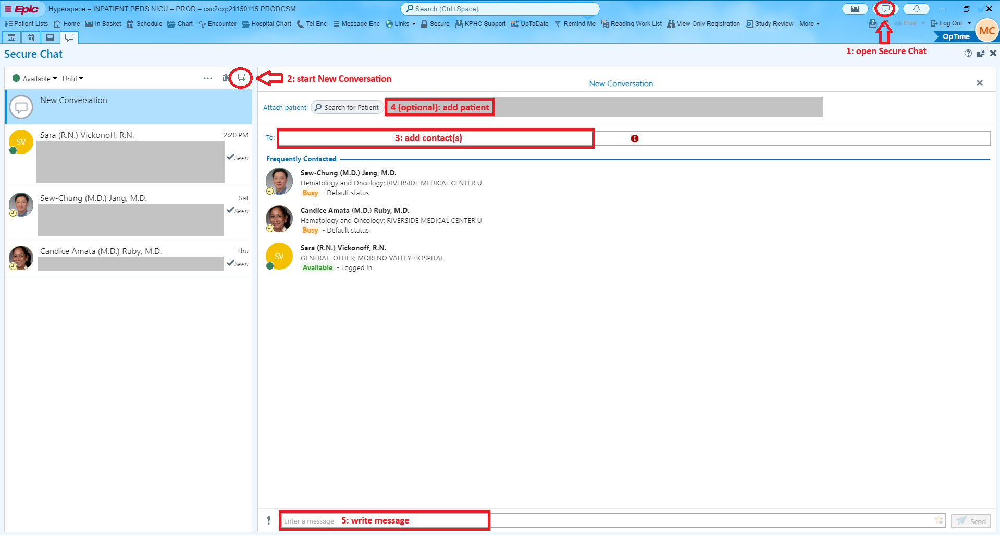
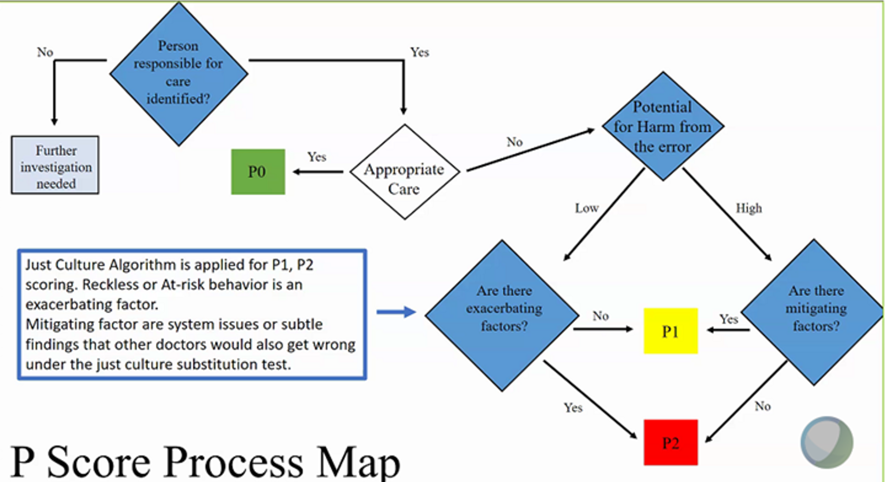

# Physician Operations

## Launch remote session

* Click on the Epic pull-down menu on the left upper corner
* Select **Launch Sessions**
* Click on the magnification glass to select the session to launch

Each session has a designated two-letter code. Use the following table to find the session for the hospital to launch:

| Hospital ID | Hospital Location | Session Code |
|-------------|-------------------|--------------|
| 954         | Downey            | TC           |
| 197         | LAMC              | ML           |
| 200         | SDMC              | SD           |
| 337         | OCMC - Anaheim    | OC           |
| 393         | Panorama City     | VA           |
| 391         | Baldwin Park      | TC           |
| 199         | Fontana           | IE           |
| 338         | West LA           | ML           |
| 201         | Wooden Hill       | VA           |
| 392         | Riverside         | IE           |
| 400         | South Bay         | TC           |
| 893         | OC - Irvine       | OC           |
| 1072        | Ontario           | IE           |
| 1433        | MoVal             | IE           |

  


## Census and extra duty

* < 7 patients: no extra duty
* 8-11 patients: 0.5W
* &ge;12 patients: 1W

  


## Secure Chat {#sec-secure-chat}

Secure Chat can be accessed inside Health Connect. Instructions as follows:

:::{.column-page-right}
{width=100%}
:::

  


## Daily Rounds Process

Checklist

* NICU accordion summary
* Review labs
* Review meds
* Review growth and flowsheet
* Revise the problem list
* Orders
* E&M coding
* [Progress note](#sec-daily-progress-note)
* Call parents to provide update, or update at bedside

  


## Quality Management {#sec-quality-management}

### P-score process map

 

### Important notes:

1. P scoring is based on POTENTIAL FOR HARM. 
2. P2 is the serious and will require corrective actions. 
3. If you receive P2, you can appeal and ask for independent review. 
4. Standard for care = is the COMMUNITY STANDARD, not department standard.
5. It’s ok to discuss the case with the physician under review to get their thought process. 
6. Any learning experience will be shared to the Neo group without naming the physician under review. 
7. Any request for case review can be submitted to me or directly to QM regardless of department, e.g radiology, nursing, peds etc.

 

### References

[Click to Download Peer Preview Training Slides](https://shiny.nicugrowth.app/rmc-nicu-manual/www/QM_slides.pptx){target="_blank"}  

[Click to Download Level 3 Audits Pearls & Tips](https://shiny.nicugrowth.app/rmc-nicu-manual/www/QM-level-3-audits-pearls-tips.docx){target="_blank"}  

  


## Moreno Valley NICU {#sec-moval-nicu}

 

### Family care center coverage

* Do admission H&P for infants born between 11AM and 8PM.
* Do the circumcision consent if circ is requested when seeing infant for admission H&P. The nurses have a checklist they follow to prepare for circs the following morning and if not done, it delays the circumcision because we are rounding on the discharges first as that is priority then getting the consent and ordering the meds for circ. 
  * Remember the nurse needs to be in the room at the time of the consent.
* Add appropriate diagnosis codes to the hospital problem list such as:
  * SGA (10%ile of smaller)
  * LGA (90%ile or larger)
  * Infant of a diabetic mother
  * ABO incompatibility
* Use the handoff notes section to communicate if anything happened overnight (such as were sent to obs for resp distress) or if something needs to be followed up on in the morning.

 

### Outpatient (Great Starts) bili level follow-up

* If a bili is signed out to the on call Neo, please call the parents with the result, even if to tell them it is normal.
* Write a note with what was communicated to the parent (whether they need follow up the following day, no repeat needed, etc.).
* Message Pediatric Med Advice (type **PED M** to find the pediatric Med Advice pool) to schedule a TAV or in person appt as needed.
* If a repeat bili is needed, a total serum bili STAT needs to be ordered and the parents instructed to do this by noon (or whatever earlier time you prefer) at the Iris location as this is the only lab in our area that does STAT labs.
  * It can take 2-3 hours to get this lab back so account for that with the appointment time scheduled

 

### Problem List

* Create an overview for the "LIVE BORN......" problem to include the following information:
  * GA
  * Birth weight
  * GBS status
  * Maternal/Infant blood type
  * Coombs status

