# Respiratory

## Least Invasive Surfactant Administration

<br/>

### Indication

* FiO~2~ &ge; 30%  
* Increased work of breathing

### Procedure

1. Remove the stylet and needle  
2. With the help of laryngoscope insert the catheter 2 cm past the Vocal cords  
3. Attach Capnometer via 3.0 ETT adapter and wait for color change, once color change confirmed proceed to remove the ETT adapter/ capnometer 
4. Attach syringe with Surfactant and administer it over 2-3 minutes  
5. After completion give 1 ml of air slowly than remove the catheter

<br/>

<video with="600" height = "360" controls>
  <source src="Figures/LISA_video.mp4" type="video/mp4">
</video>

<br/>
<br/>



## Respiratory Support Guide

<br/>

### Bubble CPAP (bCPAP) {#sec-bCPAP}

#### Guide

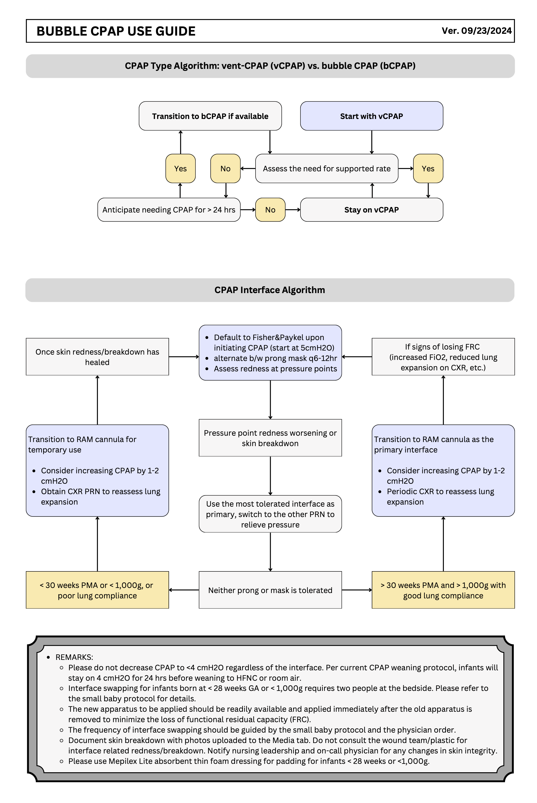

#### Resources

<a href='files/CPAP_guide.pdf' target='_blank'>Download CPAP Guide PDF</a>

<a href='files/bCPAP-presentation.pptx' target='_blank'>Download CPAP Presentation Slides</a>

<br/>

### ELGAN/ELBW Respiratory Support Protocol for the First 72 Hrs {#sec-elgan-elbw-resp-protocol}

#### Protocol 

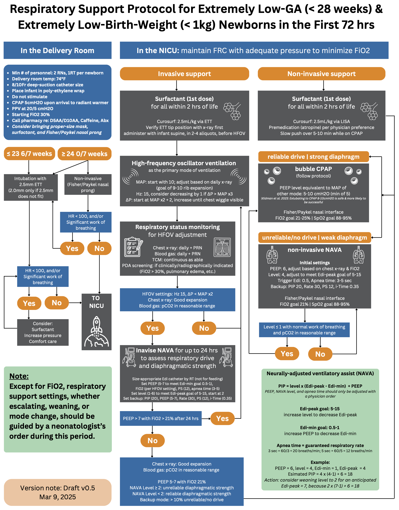

<br/>

#### Resource

<a href='files/ELBW-ELGAN-Respiratory-Protocol.pdf' target='_blank'>Download Protocol in PDF</a>

<br/>
<br/>



## Neurally adjusted ventilatory assist (NAVA) {#sec-nava}

#### NAVA Terminology
- **Edi**: The electrical activity of the diaphragm, considered a respiratory vital sign.
- **Edi-peak**: The highest value of the Edi signal during a single breath.
- **Edi-min**: Represents the spontaneous tonic activity of the diaphragm, preventing derecruitment of alveoli during expiration.
- **NAVA level**: A gain factor converting the Edi signal into proportional pressure.  
  - Higher NAVA level = more work of breathing provided by the ventilator.  
  - Lower NAVA level = more work of breathing done by the patient.

#### Edi Catheter Insertion and Positioning
1. Connect the Edi module and cable.
2. Perform the Edi module function check.
3. Measure NEX (nose-ear and xiphoid) distance in cm.
4. Determine the insertion distance.
5. Dip the Edi catheter in water and insert.
6. Connect the Edi cable to catheter.
7. Verify the position in the catheter positioning screen.
8. Check the position of the Edi catheter as a feeding tube according to hospital routines.
9. Secure it to the patient, and make a note of the insertion distance.
10. Verify the position regularly.

**Note**: For neonates below 1000 g, use Edi catheter 6 Fr/49 cm.

---

#### Positioning Window
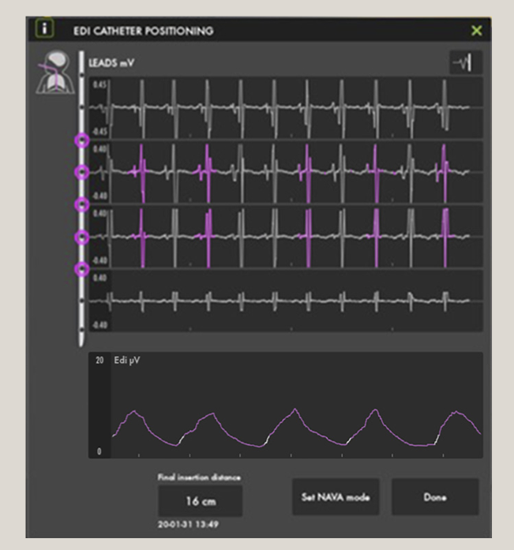

- **Correct position**:  
  - Look for a diminishing ECG waveform progressing from the 1st to the 4th waveform.  
  - Presence of a pink color in the 2nd and 3rd waveforms (may fluctuate to the 1st and 4th waveforms at times).

#### Re-Positioning
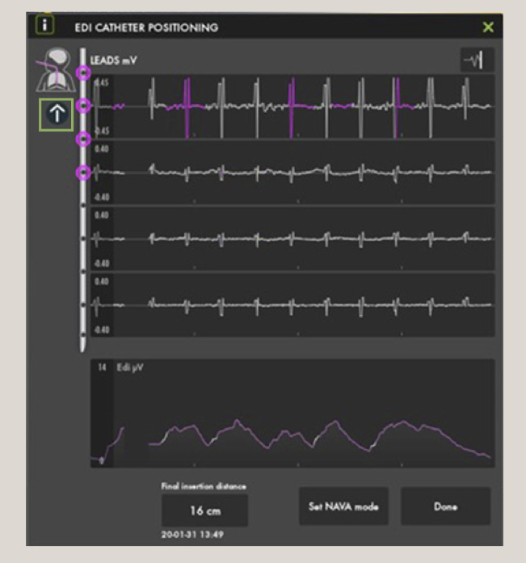

- **Too deep**:  
  - Pull out slightly.  
  - P waves gradually decrease and disappear in the lower leads.  
  - Dampened QRS.


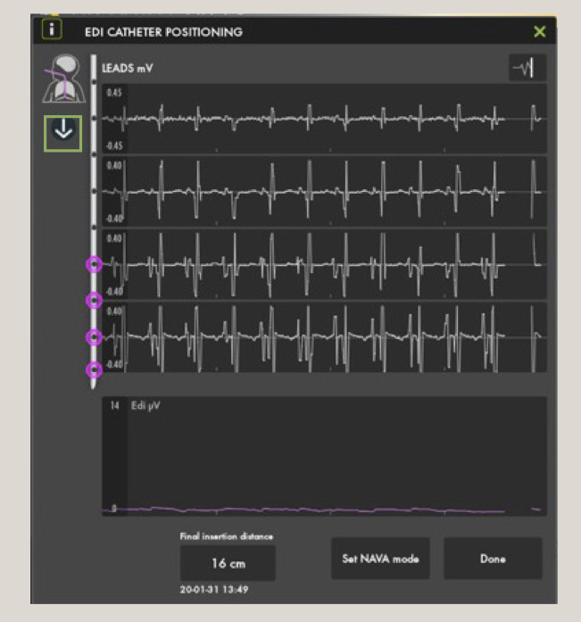

- **Too shallow**:  
  - Insert slightly further.  
  - QRS gets bigger from the top to bottom leads.


---

### Initial NAVA Set-Up

| **Parameters**       | **NAVA/NIV NAVA**                  | **Management**                                                                                   |
|----------------------|------------------------------------|--------------------------------------------------------------------------------------------------|
| **NAVA Level**       | Start with a low NAVA level (1.0-2 cmH~2~O/μV) | - Titrate to neonates’ comfort and Edi peak 10-15 μV. <br> - If comfortable and Edi peaks <5 μV, decrease NAVA Level in steps of 0.5 until Edi peak values are 5-15 μV. <br> - If increased WOB and Edi peak >20 μV, increase NAVA level in 0.5 increments until comfortable and Edi peaks <15 μV. |
| **Edi trigger**       | 0.5 μV                            | Avoid "artifact self-triggering" (lower number = more sensitive).                                |
| **Apnea time**       | 3-5                                 | Adjust as clinically indicated (minimum rate: 2 seconds = 30 bpm; 1 second = 60 bpm).           |
| **Ppeak**            | 35-40 cmH~2~O <br> **NOTE**: Pressure limited 5 cmH~2~O below Ppeak alarm limit (blue alarm). | Set Ppeak high enough for recruiting breaths. Increase if pressure limited alarm is constant.   |
| **Backup**           | Activates Pressure Control mode after apnea time if patient is apneic. | Set PC level and RR to assure adequate ventilation.                                              |

**NOTE**: Set appropriate PEEP for the patient and backup settings: PC above PEEP and RR.

---

#### Weaning in NAVA
- Decrease the NAVA level in steps of 0.3-0.5 cmH~2~O/μV.
- Decrease backup settings if in backup frequently.
- If intubated, extubate to CPAP vs. NIV-NAVA depending on NAVA level, PEEP, and MAP

---

#### Troubleshooting

| **Parameter**            | **Investigate the Reason**      | **Management**                              |
|--------------------------|---------------------------------|---------------------------------------------|
| **High Edi-peak >20 μV**  | - WOB increased                | - Increase NAVA level, increase Ppeak alarm limit |
|                          | - Insufficient backup support  | - Increase backup pressure                  |
|                          | - Failing NIV treatment        | - Intubate and use NAVA                     |
|                          | - Discomfort and Pain          | - Consider light analgesics                 |
|                          | - Edi catheter dislocated      | - Reposition Edi catheter                   |
| **Low Edi-peak <5 μV**    | - Over-assist                  | - Decrease NAVA level                       |
|                          | - Poor respiratory drive       | - Decrease backup support                   |
|                          | - Sedation too high            | - Decrease sedation                         |
| **Edi-min consistently >5 μV** | Atelectasis               | - FiO~2~ high: increase PEEP by 1 <br> - Patient stable: no change |

---

#### Additional Information
Refer to the **SERVO-u/n User’s Manual** for operation of the ventilator.

> **Disclaimer**: The assertions stated by physicians are strictly those of the physician and do not necessarily reflect the views of Getinge. Refer to product labeling for current indications, warnings, contraindications, and precautions.  
> + MCV00106173 REVA EXP11/22 + MX-7334

**Source**: Modified from  [this online document](https://www.getinge.com/dam/hospital/documents/english/mcv00106173_nava_neonatal_flowchart-en-us.pdf){target="_blank"} (Click [here](files/mcv00106173_nava_neonatal_flowchart-en-us.pdf){target="_blank"} if the online link is not working).

<br/>
<br/>



## High-Frequency Jet Ventilator (HFJV)

### Indications

HFJV is indicated for neonates with specific conditions requiring gentle, high-frequency support:

- Pulmonary interstitial emphysema (PIE)
- Respiratory distress syndrome complicated by pneumothorax
- Meconium aspiration syndrome
- Atelectatic pulmonary disease due to secretions or intrapulmonary inflammatory processes
- Respiratory failure (RF) with hemodynamic compromise while on HFOV
- Evolving bronchopulmonary dysplasia (BPD) in extremely immature infants

**Note:** At the initial roll-out stage, HFJV will **not** be used as a primary-intention mode of ventilation for extremely preterm infants unless a heterogeneous disease process is evident since birth.

<br/>

### Initial Settings

HFJV operates in tandem with a conventional mechanical ventilator (CMV), which provides PEEP, sigh breaths for recruitment, and bias flow for spontaneous breathing. Use the LifePort ETT adapter for delivery of tiny tidal volumes (<1–2 mL/kg). Start with gentle pressures to avoid injury.

#### Jet Settings (HFJV - Amplitude/Ventilation for CO₂ Control)

- **PEEP**: Typically 6–10 cmH₂O, or +1 cmH₂O above prior CMV settings; adjust to maintain MAP and oxygenation.
- **PIP**: Typically starting at 22–24 cmH₂O, may reach high 30’s to low 40’s in immature/sick lungs. PIP controls tidal volume and thus PaCO₂. Due to pressure attenuation in small airways, the lungs only see a small percentage of the set pressure.

**Rate (bpm) and I:E Ratio:**

| Rate (bpm) | I:E Ratio |
|------------|-----------|
| 420        | 1:6       |
| 360        | 1:7       |
| 300        | 1:9       |
| 240        | 1:12      |

- **RR**: 240–660 bpm
  - 420 bpm for non-extremely preterm or term infants
  - 300–360 bpm for extremely preterm infants
  - 240 bpm for PIE/air leak
  - Rate is chosen based on pathophysiology to optimize I:E ratio and minimize air trapping.
  - *Note:* In HFJV, rate does **not** affect tidal volume, but may influence minute ventilation and MAP.
- **i-Time**: 0.02 sec (affects tidal volume). Do not change unless maxed out on PIP and RR and CO₂ remains elevated. Increase by 0.002 sec if necessary to a maximum of 0.03 sec (caution: dramatically affects CO₂ and may cause lung injury).

#### Sigh Breath Settings (For Lung Recruitment; Contraindicated in Active Air Leaks)

- **PIP**: Use low ΔP <5–10 cmH₂O above PEEP for gentle recruitment.
- **RR**: Typically 0–6 bpm; temporary use only (no more than 30 min if ≥4 bpm) to avoid overdistension. Set to 0 if air leaks are present.
- **I-Time**: Typically 0.4–0.6 sec; extend for recruitment if needed.

#### Backup SIMV + PS Support Mode (During HFJV Alarm/Malfunction)

Switch to this CMV mode temporarily if HFJV fails:

- **PEEP**: Match the same setting while on HFJV
- **PIP**: Typically matching or 2 cmH₂O below HFJV PIP
- **RR**: 20–40 bpm based on patient needs
- **I-Time**: 0.3–0.4 sec based on RR
- **Pressure Support**: 10–12 cmH₂O for 2.5 ETT

<br/>

### Oxygenation Management

- Titrate FiO₂ (on both CMV and Jet ventilator) to maintain target SpO₂.
- Consider increasing PEEP/MAP or performing recruitment maneuvers to improve lung volume.
- Notify MD if FiO₂ > 60% acutely.

<br/>

### Additional Initiation Steps

- Ensure servo pressure stabilizes at 1.5–4.0 psi (auto-adjusts flow to maintain PIP).
- Perform **"Rule of 5's" Recruitment Maneuver** if indicated (e.g., for atelectasis): 5 breaths at PIP 5 cmH₂O above PEEP, i-Time 0.5 sec, every 5 minutes. Consider q-shift for ongoing recruitment (avoid in active air leaks).
- Monitor changes in lung dynamics via servo pressure trends.

<br/>

### Management and Titration

Adjust settings based on blood gases, chest X-ray, and clinical status.  
**Primary goals:**
- Control CO₂ with Jet PIP/RR
- Maintain oxygenation/lung volume with PEEP/MAP
- Minimize sigh breaths in air leak-prone conditions

#### General Titration Guidelines

- **CO₂ Management**: Increase Jet PIP by 1–2 cmH₂O if PaCO₂ is high; decrease if low. If PIP is maxed, consider lowering RR for air trapping.
- **Oxygenation**: Adjust PEEP by 1–2 cmH₂O. Use sigh breaths sparingly for recruitment.
- **Weaning**: Decrease PIP as CO₂ improves; reduce PEEP/FiO₂ as oxygenation stabilizes. Transition back to HFOV when heterogeneous lung pathology is resolved, or to CMV (invasive NAVA) when ready for extubation (to bubble CPAP or non-invasive NAVA).
- **Monitoring**: Trend servo pressure (rises with decreased compliance/obstruction; falls with leaks/improved compliance). Check ETT position and suction as needed. Obtain ABG 15–30 min after changes.

<br/>

### Disease-Specific Strategies

Adapt based on primary diagnosis:

- **BPD or evolving BPD**: Minimize air trapping/hyperinflation. Use low Jet PIP/RR (e.g., 240–300 bpm), low PEEP, minimal sigh breaths (low ΔP <5 cmH₂O, short i-Time). Consider q-shift Rule of 5's.
- **PIE or Air Leaks**: Promote healing. Initiate early; use low Jet RR (240 bpm) for extended expiratory time; optimize PEEP for MAP; avoid sigh breaths.
- **MAS**: Promote airway clearance via sweeping exhalation. Use low RR; may consider increasing i-Time for term infants; consider sigh breaths.

<br/>

### Troubleshooting

Use servo pressure trends and alarms to identify issues.

| Issue                          | Possible Causes                                      | Actions                                                                 |
|--------------------------------|------------------------------------------------------|-------------------------------------------------------------------------|
| Low Servo Pressure (<1.5 psi)  | Decreased lung compliance, ETT obstruction/kink, secretions, worsening disease | Suction ETT, check tube position, reassess (X-ray/ABG), decrease PIP if overventilating |
| High Servo Pressure (>4.0 psi) | Improved compliance, air leak, tube malposition, disconnect | Check connections/ETT seal, increase PIP if underventilating, notify MD for potential ETT upsizing |
| High PaCO₂ (Hypercapnia)       | Inadequate ventilation, air trapping                 | Increase Jet PIP by 1–2 cmH₂O; if maxed, decrease RR or increase i-Time (caution); ensure adequate expiratory time |
| Low PaCO₂ (Hypocapnia)         | Overventilation                                      | Decrease Jet PIP; increase RR if needed                                 |
| Hypoxemia (High FiO₂)          | Atelectasis, low MAP                                 | Increase PEEP by 1 cmH₂O; perform recruitment maneuver (if no air leaks); optimize position |
| Alarms (High/Low Pressure)     | Circuit disconnect, obstruction, patient agitation   | Inspect circuit/patient box; reset ventilator; switch to backup SIMV+PS if persistent |
| No Improvement/Failure         | Wrong rate for pathophysiology, active air leaks     | Reassess diagnosis; consider switch to HFOV; notify MD                  |

**Note on HFJV vs HFOV**: HFJV has passive exhalation, variable I:E ratio, and low flow. HFOV has active exhalation and fixed I:E ratio.

<br/>

### Dot-phrases

- `.JETSETTINGS`
- `.JETSETTINGSHINT`

<br/>
<br/>



## Extubation Workflow for ELGAN/ELBW {#sec-extubation}

### Background
- Assessing extubation readiness in ELGAN/ELBW babies is challenging.
- Higher extubation failure rates are tolerated in small babies compared to those born at a higher gestational age (GA) or birth weight (BW).
- Early successful extubation correlates with better outcomes, but failure may increase morbidity and mortality.
- Creating a standardized workflow for extubation decision-making and procedures can reduce mental burden for the multidisciplinary care team.

<br/>

### Timing of successful extubation in ELGAN/ELBW from Different Studies
| **_GA_**      | **APEX Study** | **Norway Study** | **Canada Study** | **Iowa City, USA** | **Kanagawa, Japan** | **Uppsala, Sweden** |
| ------------- | -------------- | ---------------- | ---------------- | ------------------ | ------------------- | ------------------- |
| _22-23 weeks_ | 28 [27-29.3]   | 28 [27-29]       | 29.4 [27.4-31.1] | 31 [29-33]         | 36.1 [35-37.2]      | 29                  |
| _24 weeks_    | 27 [25-29]     | 27 [25-29]       | 29.1 [26.9-31.0] | N/A                | N/A                 | N/A                 |
| _25 weeks_    | 27 [25-29]     | 26 [26-28]       | 28.1 [25.9-30.3] | N/A                | N/A                 | N/A                 |
| _26 weeks_    | 27 [26-29]     | N/A              | 27.3 [26.3-29.7] | N/A                | N/A                 | N/A                 |
| _27 weeks_    | 27 [27-28]     | N/A              | 27.6 [27.3-29.1] | N/A                | N/A                 | N/A                 |
*Seminars in Fetal and Neonatal Medicine, 2023-10-01, Vol 28, Issue 5, Article 101489*

#### Consensus
- Adhere to the respiratory protocol for infants on invasive NAVA, testing for up to 24 hours before extubation.
- Extubation decisions require agreement between incoming and outgoing neonatologists.
- Perform extubation in the morning as possible with both neonatologists present in the hospital.
- Ensure at least one neonatologist is present during extubation to evaluate the immediate need for reintubation.
- Keep supplies ready at the bedside.
- Maintain a low threshold for reintubation and restarting HFOV.
- Consider administering a loading dose of caffeine (20 mg/kg) prior to extubation.

<br/>

### Checklist

[Click to Download Extubation Checklist](files/extubation-checklist.pdf){target='_blank'}

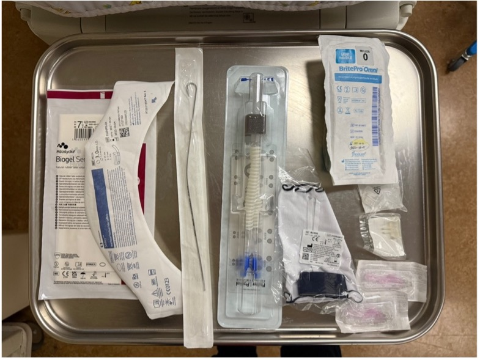

#### Interface choice
- Fisher & Paykel Flexitrunk interface
  - Prong / mask
  - Bonnet / Tortle cap  
  *even if extubating to Non-Invasive NAVA, Fisher & Paykel interface should still be used, with the goal of weaning to bubble CPAP as soon as the infant is ready*

#### Non-invasive mode selection
- Bubble CPAP, pressure level: ________
- Non-invasive NAVA (e.g., high MAP, high NAVA level, etc.)
  - Edi catheter inserted and depth verified on Servo vent screen
  - NAVA and backup settings entered in the Servo machine
  - Starting pressure and FiO2

#### Resuscitation equipment
- T-piece set to 20/5 cmH~2~O
- ET tube 2.5 and 3.0; stylet
- Laryngoscope size 0 and 00
- Suction catheter 8 and 10 Fr

#### Medication
- Racemic epinephrine
- Caffeine

### Procedures
1. Set up resuscitation equipment  
  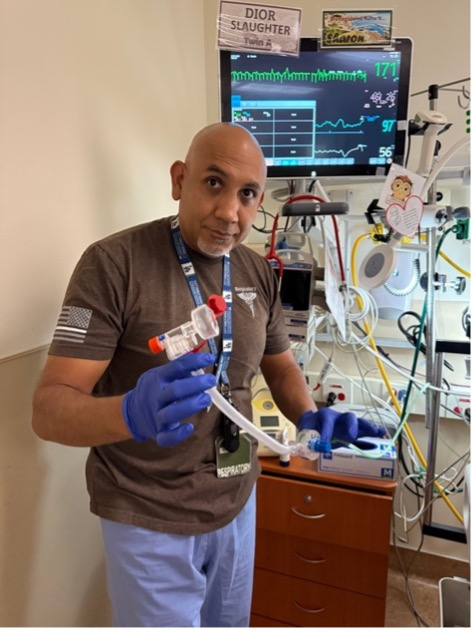{width="300px"}
  
2. Attach non-invasive interface to the infant.  
  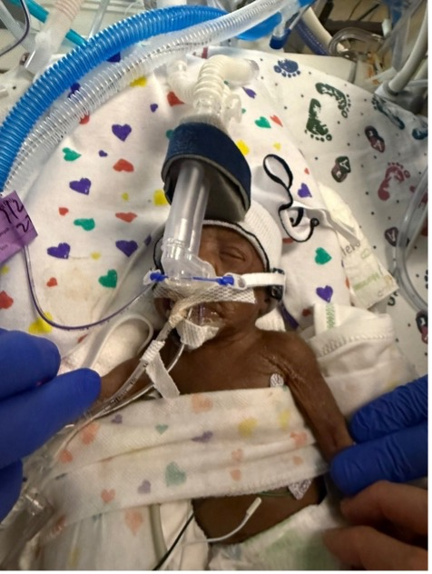{width="300px"}

    *If planning to extubate to bubble CPAP, disconnect one limb first (either incoming or outgoing) before attaching the Flexitrunk and nasal interface to the infant.*  
      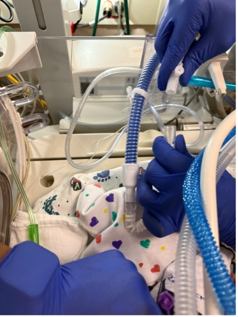{width="300px"}

    *In order for the F/P prong to fit in the nose, ETT tapes may need to be removed first, depending on whether the nostrils are partially obstructed by the tape or not.*  
      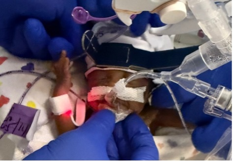{width="300px"}
3. Suction the ET tube  
  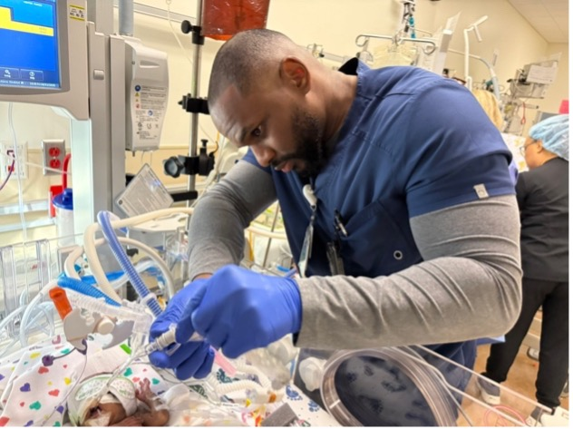{width="300px"}
4. Untape and remove the ET tube while connecting the previously disconnected limb to the bubble CPAP device, **or** switching the vent mode to NON-INVASIVE NAVA

### What to expect after extubation
Due to fluid shift, the lung fields are expected to **white out** following extubation for up to 24-48 hrs.

#### Pre-extubation / Post-extubation Timeline
- **Pre-extubation**  
  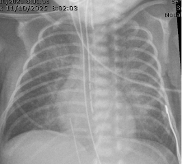{width="300px"}
- **Post-extubation 12 hrs**  
  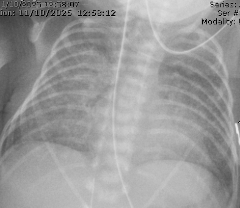{width="300px"}
- **24 hrs**  
  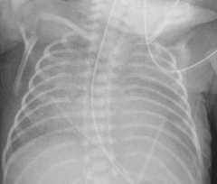{width="300px"}
- **36 hrs**  
  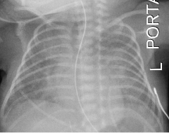{width="300px"}
- **Four days later**  
  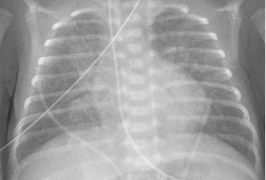{width="300px"}

Adjust pressure and FiO~2~ accordingly to compensate during fluid shift, allowing time to recover.

- Serial chest x-ray and blood gas assessment as needed.  
- Fluid management.  
- Low threshold to re-intubate if having significant work of breathing and/or respiratory acidosis (e.g., pCO~2~ > 75, pH < 7.1, etc.)

<br/>
<br/>



## Cardiopulmonary Events - Spells

<br/>

### Regional Definition


#### Apnea {#sec-apnea}

* Pause in breathing for 20 seconds, or
* Pause in breathing with heart rate < 80bpm and/or SpO~2~ < 80% for &ge; 10 seconds.

#### Bradycardia {#sec-bradycardia}

* Does not meeting criteria for Apnea;
* Any drift in HR < 80bpm for &ge; 10 sec requiring intervention other than removing the bottle if during feeding.

#### Desaturation {#sec-desaturation}

*	Does not meeting criteria for Apnea or Bradycardia;
*	SpO2 < 80% for &ge; 10 sec requiring intervention other than removing the bottle if during feeding.

<br/>

### Types of B/D spells

#### Feeding-related spells (feeding spells)  

* [Apnea](#sec-apnea) or [bradycardia](#sec-bradycardia) occurred during oral feeding and/or up to 30 min after completion of feeding.

#### Sleep spells

* Spells that are not considered feeding-related.

<br/>

### Bedside Practice Update

#### Update 1:  

*Do not intervene in the first 10 sec of a spell, unless:*  

*	Life-threatening (e.g. aspiration, airway compromise, etc.).  
*	Heart rate progress to < 60/min.  

#### Update 2:  

*Do not document events where lowest HR ≥ 80/min and lowest SpO~2~ ≥ 80% in the flowsheet Apnea/Bradycardia tab:*  

*	These are not A/B/D events by definition.  
*	If persistent/recurrent SpO~2~ 80-89% and intervention (e.g. stimulation, flow/O~2~) is needed, please notify MD and document in the notes.  

<br/>

### Sleep spells monitoring {#sec-protocol-sleep-spells-monitoring}

<style type="text/css">
.tg  {border-collapse:collapse;border-spacing:0;}
.tg td{border-color:black;border-style:solid;border-width:1px;font-family:Arial, sans-serif;font-size:14px;
  overflow:hidden;padding:10px 5px;word-break:normal;}
.tg th{border-color:black;border-style:solid;border-width:1px;font-family:Arial, sans-serif;font-size:14px;
  font-weight:normal;overflow:hidden;padding:10px 5px;word-break:normal;}
.tg .tg-r28n{font-size:18px;text-align:center;vertical-align:middle}
.tg .tg-mjre{color:#f56b00;font-size:18px;text-align:center;vertical-align:middle}
.tg .tg-13pz{font-size:18px;text-align:center;vertical-align:top}
.tg .tg-9apd{background-color:#c0c0c0;font-size:18px;text-align:center;vertical-align:top}
</style>
<table class="tg" style="undefined;table-layout: fixed; width: 480px">
<colgroup>
<col style="width: 80px">
<col style="width: 80px">
<col style="width: 160px">
<col style="width: 160px">
</colgroup>
<thead>
  <tr>
    <th class="tg-mjre" colspan="2" rowspan="2">Requiring intervention</th>
    <th class="tg-13pz" colspan="2">Heart rate</th>
  </tr>
  <tr>
    <th class="tg-13pz"><span style="font-weight:400;font-style:normal;text-decoration:none">≥ 80/min</span></th>
    <th class="tg-13pz">&lt; 80/min</th>
  </tr>
</thead>
<tbody>
  <tr>
    <td class="tg-r28n" rowspan="2">SpO~2~</td>
    <td class="tg-13pz"><span style="font-weight:400;font-style:normal;text-decoration:none">≥</span> 80%</td>
    <td class="tg-9apd">Not a spell</td>
    <td class="tg-r28n" rowspan="2">3 days</td>
  </tr>
  <tr>
    <td class="tg-r28n">&lt; 80%</td>
    <td class="tg-r28n">1 day</td>
  </tr>
</tbody>
</table>

<style type="text/css">
.tg  {border-collapse:collapse;border-spacing:0;}
.tg td{border-color:black;border-style:solid;border-width:1px;font-family:Arial, sans-serif;font-size:14px;
  overflow:hidden;padding:10px 5px;word-break:normal;}
.tg th{border-color:black;border-style:solid;border-width:1px;font-family:Arial, sans-serif;font-size:14px;
  font-weight:normal;overflow:hidden;padding:10px 5px;word-break:normal;}
.tg .tg-r28n{font-size:18px;text-align:center;vertical-align:middle}
.tg .tg-mjre{color:#f56b00;font-size:18px;text-align:center;vertical-align:middle}
.tg .tg-15qn{background-color:#c0c0c0;font-size:18px;text-align:center;vertical-align:middle}
</style>
<table class="tg" style="undefined;table-layout: fixed; width: 640px">
<colgroup>
<col style="width: 80px">
<col style="width: 80px">
<col style="width: 240px">
<col style="width: 240px">
</colgroup>
<thead>
  <tr>
    <th class="tg-mjre" colspan="2" rowspan="2">Self-resolved</th>
    <th class="tg-r28n" colspan="2">Heart rate</th>
  </tr>
  <tr>
    <th class="tg-r28n"><span style="font-weight:400;font-style:normal;text-decoration:none">≥ 80/min</span></th>
    <th class="tg-r28n">&lt; 80/min</th>
  </tr>
</thead>
<tbody>
  <tr>
    <td class="tg-r28n" rowspan="2">SpO~2~</td>
    <td class="tg-r28n"><span style="font-weight:400;font-style:normal;text-decoration:none">≥</span> 80%</td>
    <td class="tg-15qn">Not a spell</td>
    <td class="tg-r28n">No color change: insignificant  <br>With color change: 1 day</td>
  </tr>
  <tr>
    <td class="tg-r28n">&lt; 80%</td>
    <td class="tg-r28n">No color change: insignificant  <br>With color change: 1 day  </td>
    <td class="tg-r28n">1 day</td>
  </tr>
</tbody>
</table>

:::{.callout-tip}

* This algorithm is meant for preterm infants whose baseline SpO~2~ is within normal range not requiring any respiratory support who are otherwise taking full or near-full PO and are close to NICU discharge.  
*	This algorithm may not be applicable to term infants who respiratory control and suck-swallow-breath coordination are mature at birth. Spells in these infants are usually due to maternal influence, airway abnormalities, or ongoing pulmonary pathologies.  
*	This algorithm should not be applied to A/B/D events that occur in the delivery room or around time of admission.  
*	Isolated obstructive apnea is rare. Skin-to-skin-related spells are usually obstructive in nature. Clinical ruling of those events should be at the treating neonatologist’s discretion.  
*	**Isolated SpO~2~ in the 80-89% range on the day of hospital discharge, although not a spell by definition, is equal to a failed CCHD screening, and therefore should not be ignored if occurred within 1 day of discharge.**

:::

<br/>

### Feeding spells monitoring {#sec-protocol-feeding-spells-monitoring}  

<style type="text/css">
.tg  {border-collapse:collapse;border-spacing:0;}
.tg td{border-color:black;border-style:solid;border-width:1px;font-family:Arial, sans-serif;font-size:14px;
  overflow:hidden;padding:10px 5px;word-break:normal;}
.tg th{border-color:black;border-style:solid;border-width:1px;font-family:Arial, sans-serif;font-size:14px;
  font-weight:normal;overflow:hidden;padding:10px 5px;word-break:normal;}
.tg .tg-na62{font-size:18px;font-weight:bold;text-align:left;vertical-align:middle}
.tg .tg-axmw{font-size:18px;font-weight:bold;text-align:center;vertical-align:middle}
.tg .tg-r28n{font-size:18px;text-align:center;vertical-align:middle}
.tg .tg-ewmv{font-size:18px;text-align:left;vertical-align:middle}
</style>
<table class="tg" style="undefined;table-layout: fixed; width: 562px">
<colgroup>
<col style="width: 361px">
<col style="width: 201px">
</colgroup>
<thead>
  <tr>
    <th class="tg-na62">Intervention</th>
    <th class="tg-axmw">Monitoring period</th>
  </tr>
</thead>
<tbody>
  <tr>
    <td class="tg-ewmv">Remove bottle only, no color change</td>
    <td class="tg-r28n">insignificant</td>
  </tr>
  <tr>
    <td class="tg-ewmv">Remove bottle only, with color change</td>
    <td class="tg-r28n">1 day</td>
  </tr>
  <tr>
    <td class="tg-ewmv">Stimulation and/or flow/O~2~</td>
    <td class="tg-r28n">1 day</td>
  </tr>
</tbody>
</table>

:::{.callout-tip}

* Before discharge, designated primary home caregiver should be competent in identifying feeding-related distress and knowledge of timely intervention.  

:::

<br/>

### Spell watch after Hepatitis B vaccine administration

#### During spell watch

If Hepatitis B vaccine is administered during spell watch, the spell watch period will be modified to include 48 hrs of monitoring following vaccine administration.

* Example: if baby is being monitored from 2/10 to 2/13 (72 hrs), and Hepatitis B vaccine if administered on 2/12, the monitoring period will be extended to 2/14.

#### Not during spell watch

No need to monitor for spells after vaccine administration.

### Sleep study

When an infant is likely to need a sleep study, please contact the following people by starting a Teams group chat:  

* Eva Montoya
* Julie Dewitte
* Dennis Hwang
* Huy Truong
* Add any subspecialists for sleep study availability and consultation 

<br/>
<br/>


:::{.column-screen-right}


## Respiratory Support Weaning Algorithm

```{mermaid}

flowchart TD

a["<strong>Respiratory support at 32 weeks PMA</strong>"] --> b["<span style='color:red;'>SCENARIO 1:<br>CPAP 4cmH<sub>2</sub>O FiO<sub>2</sub> 21% for > 24hrs</span>"]
a --> c["<span style='color:red;'>SCENARIO 2:<br>CPAP 5cmH<sub>2</sub>O FiO<sub>2</sub> 21%</span>"]
a --> d["<span style='color:red;'>SCENARIO 3:<br>CPAP 5cmH<sub>2</sub>O FiO<sub>2</sub> &gt;21%</span>"]
a --> e["<span style='color:red;'>SCENARIO 4:<br>CPAP >5cmH<sub>2</sub>O</span>"]
c --> b
b --> f("Room air trial")
f --> g["Successful"]
f --> h["Failed"]
g --> j["Room air"]
h --> i("Wean to HFNC 2LPM for 24-72hrs")
i --> p["FiO2<sub>2</sub> remained at 21%"]
i --> q["FiO<sub>2</sub> increased to >21%"]
q --> s["Wean to 21%"]
s --> p
p --> r["Wean flow by 0.25-0.5PM q24-48hrs"]
d --> k("Wean FiO<sub>2</sub> to 21% by 33 weeks PMA")
k --> l["Successful"]
k --> m["Unsuccessful"]
l --> b
m --> o("Consider Diuretics algorithm")
e --> o
q --> o
r --> j
r --> t["Frequent desats during weaning/<br>FiO<sub>2</sub> increased to > 21%"]
t --> u("Consider microflow")
u --> j
o --> v["Able to wean to CPAP 5cmH<sub>2</sub>O FiO<sub>2</sub> 21%<br>by 33 weeks PMA?"]
v --> w["Yes"]
v --> x["No"]
x --> y("Echo for late PH assessment")
w --> c
```

:::

:::{.column-screen-right}

## Diuretics Algorithm

```{mermaid}

flowchart TD

a["Obtain baseline Chest X-Ray"] --> b("Pulmonary congestion/edema?")
b --> c("Yes")
b --> d("No")
d --> e["Empiric trial of diuretics"]
d --> f["No role of diuretics"]
c --> g["Lasix IV 1mg/kg/day or,<br/> PO 2mg/kg/day for 2 days<br/>(dosing up for discussion)"]
e --> g
g --> h("Improved?")
h --> i("Yes, FiO<sub>2</sub> 21%")
h --> j("Yes, but FiO<sub>2</sub> still >21%")
j --> m["Consider Aldactazide for long-term therapy"]

h --> k("No")
k --> m
k --> l["Consider further workup and/or<br>wean pressure/flow empirically"]
f --> l
l --> p["Consider repeating Chest X-Ray"]
l --> n["Echo for late PH assessment<br/>Especially if frequent desats clinically"]
l --> r["Consider CBC for Anemia"]
i --> o["<strong>Continue to wean<br/>respiratory support</strong>"]
m --> o
```


:::

<br/><br/>

## Bronchouplmonary dysplasia (BPD)

<br/>

### No-BPD prevention bundle (BPD Bundle){#sec-bpd-bundle}

#### General criteria

* GA < 32 weeks OR BW < 1,500g

#### Injection meds

* **Vitamin A**
  * Reserved for BW < 1,000g AND GA < 28 weeks requiring respiratory support after birth
  * Dose: 5,000 units 3 times per week for 12 doses (4 weeks)  
* **Epogen**
  * Dose: 250 units/kg/dose SQ Mon Wed Fr starting at DOL7

#### Enteral meds

When at 100ml/kg/day of enteral feeds:  

* **Ferrous sulfate** 3 mg/kg/dose PO twice daily
* **Vitamin E** 25 units oral twice daily

#### Duration

* Discontinue Epogen, Ferrous sulfate, and Vitamin E when infants reach 36 weeks PMA


<br/>

### DART protocol

10-day tapering course of dexamethasone sodium phosphate  

* 0.15 mg/kg/day for 3 days
* 0.10 mg/kg/day for 3 days
* 0.05 mg/kg/day for 2 days
* 0.02 mg/kg/day for 2 days

*Total of 0.89 mg/kg over 10 days*

<br/>
<br/>


## Pneumothorax

### Needle thoractocentesis

### Chest tube placement

#### Turkel<span>&#8482;</span>

* Size: 12-14 Fr
* Suction: -15 cmH~2~O with the Pleur-evac<span>&reg;</span> Chest Drainage System

<iframe width="560" height="315" src="https://www.youtube.com/embed/OlRUg7H1AGg" title="YouTube video player" frameborder="0" allow="accelerometer; autoplay; clipboard-write; encrypted-media; gyroscope; picture-in-picture; web-share" allowfullscreen></iframe>

#### Pigtail catheter

Video credit: Neoreviews

<iframe width="560" height="315" src='//players.brightcove.net/6056665225001/UxkvalZ0_default/index.html?videoId=6138641995001' allowfullscreen frameborder=0></iframe>

---

<br/>

Modified SELDINGER TECHNIQUE (credit: [MacDonald's Atlas of Procedures in Neonatology](https://shop.lww.com/MacDonald-s-Atlas-of-Procedures-in-Neonatology/p/9781496394255))

* GA:
  * <28 wks: 6Fr
  * \>28 wks: 8Fr

* Equipment:
  * Introducer and J shaped guidewire
  * Finder Needle 20-gauge with syringe
  * Dilator
  * Adapter for external end of the catheter to connect to suction apparatus. 

* Procedures (6 steps):
  1. Insert finder needle (introducer) on syringe 4^th^ ICS
  2. Remove the syringe while leaving the finder needle (introducer) & feed the guidewire through introducer (finder needle) to 10cm mark.
  3. Remove the introducer and finder needle while holding the guidewire steady and insert dilator over the guidewire 1-2cm skin and subcutaneous tissue (not chest wall).
  4. Remove the dilator and insert the chest tube catheter over the guidewire until all holes are the chest (measures at ~ 7cm).
  5. Maintain stability of the catheter and remove the guidewire.
  6. Attach the catheter to the suction drainage device via luer adapter.
  
* Details and tips:
  * Mount the finder needle syringe with inserting the tip of the needle into the skin at the <span style="color:red;">4^th^ intercostal space = nipple</span> between the <span style="color:red;">anterior and mid-axillary line <u>above the upper border of the 5^th^ rib</u></span>.
  
  * Advance the finder needle slowly, simultaneously applying negative pressure to the syringe. The needle should be advanced perpendicular to the chest wall generally in the direction of the opposite shoulder.  
  * Advance the needle until you feel the lack of resistance or “GIVE” and air entry is the syringe.  
    <span style="color:red;">Do not evacuate more than 1-2mL of air. </span> 
    
  * While stabilizing the needle with 1 hand remove the syringe and insert guidewire through the finder needle.  
  * Advance the guidewire until the depth marking at 10cm reaches the hub of the needle
    <span style="color:red;">Advanced the guidewire until 10cm mark that the needle hub</span>
  * Maintain stability of the wire, remove the finder needle.  
  * Feed the dilator over the wire and insert in a slow twisting motion to dilate the tract. Advanced the dilator only far enough to dilate the skin tract and parietal pleura. 
    <span style="color:red;">This is normally about 1cm in preterm or 2cm in term infants.</span>
  * Maintaining stability of the wire remove the dilator.
  * Insert the pigtail catheter over the wire and advanced it into the chest wall toward the apex of the lung (anteriorly and medially toward the 2^nd^ intercostal space and midclavicular line) until <span style="color:red;">all the side holes of the catheter are inside the chest wall.</span>
  * This requires uncoiling and holding the pigtail straight with 1 hand while advancing it onto the wire.
  * Maintaining stability of the catheter remove the guidewire. Catheter will spontaneously coil into a pigtail loop inside the pleural space.
  * Attach the luer adapter at the external end of the catheter and connect it the suction apparatus tubing.  
  * Secure the chest tube with semipermeable transparent dressing and surgical tape.  
  * Suture and the catheter in place is optional but typically not necessary as there is no skin incisions closed and the skin and trach will be snug against the counter.  
    <span style="color:red;">Warning: it is easy to inadvertently compressed catheter with suture if secured too tightly.</span>


## Airway Edema

<br/>

### Treatment

Method 1:  

* IV dexamethasone 0.25mg/kg/dose given ~4 hrs prior to scheduled extubastion then q8hrs for a total of 3 doses (Couser 1992).

Method 2:

* IV dexamethasone 0.5mg/kg/dose q8 hrs for 3 doses with last dose administered 1 hr prior to scheduled extubation (Davis 2001).


